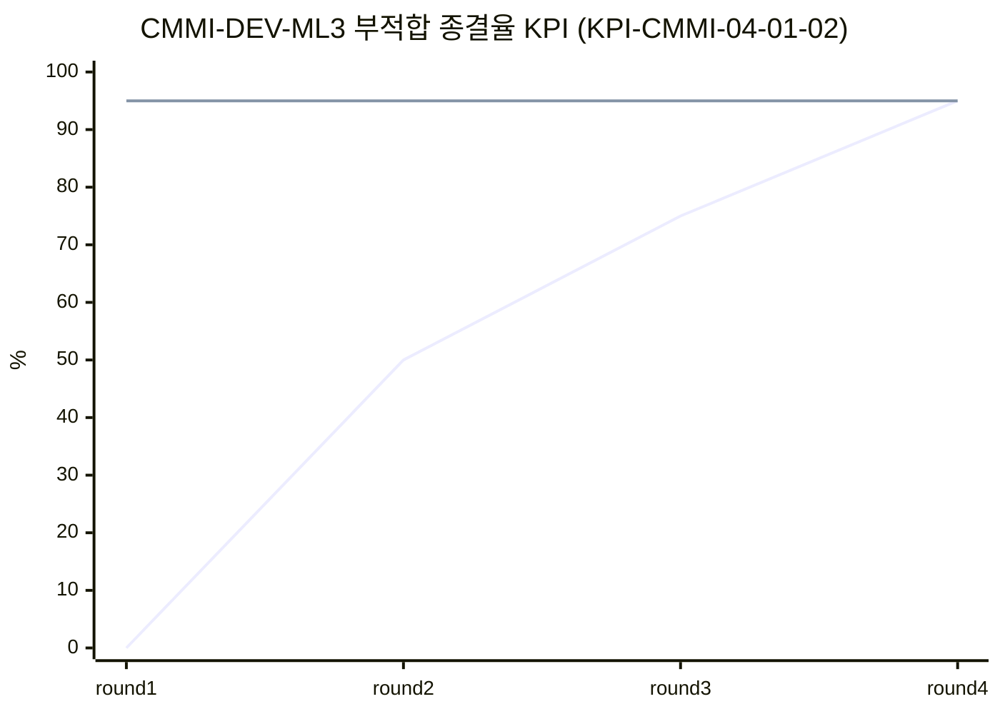
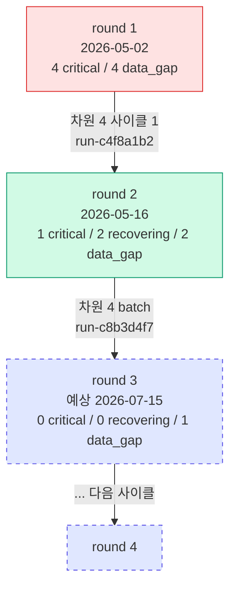

# 자동 트렌드 다이어그램 명세 (Phase 4.5)

> Phase 3 의 정적 Mermaid gantt (round 1 만) 을 round ≥ 2 부터 자동 트렌드 다이어그램으로 대체.
> kpi-analyzer 가 매 round 마다 MAT-008 §"시계열 시각화" 섹션을 자동 갱신.

## 1. 트렌드 다이어그램 종류

### 1-A. 라인 차트 (Mermaid xy-chart-beta)

목표 vs 측정값의 round 별 트렌드.

### 1-B. verdict 분포 변화 (stacked bar)

```mermaid
xychart-beta
    title "verdict 분포 변화 (round 1 → round 2)"
    x-axis [round1, round2]
    y-axis "건수" 0 --> 12
    bar [3, 6]
    bar [0, 0]
    bar [0, 2]
    bar [4, 1]
    bar [4, 2]
```

> 색상 매핑 (legend): healthy=🟢 / watch=🟡 / recovering=🟠 / critical=🔴 / data_gap=⚪

### 1-C. 사이클 흐름 (graph TD — round 별 NCR 흐름)

## 2. kpi-analyzer Phase 4.5 신규 동작

### Phase D-Trend (Phase 4.5 신규 단계)

D-Trend-1. round 번호 ≥ 2 일 때만 활성화.
D-Trend-2. MAT-008 §"시계열 시각화" 섹션 Read · 기존 Mermaid block 추출.
D-Trend-3. 본 round 의 KPI 별 측정값 + 직전 round baseline → 라인 차트 데이터.
D-Trend-4. verdict 분포 변화 → stacked bar 데이터.
D-Trend-5. 사이클 흐름 (round 간 차원 4 trace) → graph TD 데이터.
D-Trend-6. 3개 다이어그램을 §"시계열 시각화 (자동 트렌드)" 섹션으로 대체.
D-Trend-7. 기존 정적 Mermaid (Phase 3 PoC) 는 §"시계열 시각화 (PoC, Phase 3)" 으로 보존.
D-Trend-8. trace.jsonl 에 `trend_diagrams_generated` 이벤트.

## 3. 다이어그램 생성 규칙

### 3-1. 라인 차트 (KPI 별)
- 정의 KPI 6개 + 메타 KPI 5개 = 11개 라인 차트.
- 단 data_gap KPI 는 차트 생략 (Phase 4.5 — 사용자 옵션 `--show-data-gap` 으로 표시 가능).
- 단위 정규화 (% 0~100, 영업일 0~max) 자동 적용.
- 목표선 (target line) 함께 표시.

### 3-2. verdict 분포 (단일)
- 모든 round 의 verdict 분포 누적.
- 5개 카테고리 (healthy / watch / recovering / critical / data_gap) 각각 별 색상.

### 3-3. 사이클 흐름 (단일)
- round 노드 + 차원 4 사이클 (run-c*) edge 로 연결.
- predicted round (다음 측정 예상) 은 점선 + 점선 박스로 표시.

## 4. 성능·용량 고려사항

- MAT-008 의 라인 차트 11개 + bar 1개 + graph 1개 = 13 Mermaid block.
- Obsidian 의 Mermaid 렌더링은 round ≤ 8 까지 안정. round 9+ 부터는 3-1 의 KPI 별 차트를 카테고리별 통합 (line 1개에 multi-line) 권장.

## 5. 검증

| round | KPI 측정 | verdict 분포 | 사이클 그래프 노드 | 라인 차트 데이터 포인트 |
|---|---|---|---|---|
| 1 | 11 (정의 6 + 메타 5) | seed (회귀 비교 없음) | 1 노드 (run-k4f8d2a1) | 1 |
| 2 | 11 | round 1 → 2 비교 | 2 노드 + 1 edge (run-c4f8a1b2) | 2 |
| 3 (예정) | 11 | round 2 → 3 | 3 노드 + 2 edge | 3 |
| ... | ... | ... | ... | ... |

## 6. 외부 BI 연동 (Phase 5+)

- Mermaid 는 가독성 한계 (8 round 이상). Phase 5+ 외부 BI (Grafana, Metabase) 연동 검토.
- 데이터 소스: MAT-008 §회차 시계열 표 + .claude/runs/run-k*/kpi_data.yaml.
- 외부 BI hook: `extensions.external_bi` (policy.yaml 신규 섹션 — Phase 5).

## 7. PoC 적용 시점

- Phase 4.5 도입 후 첫 round (예: round 3) 에서 첫 자동 트렌드 다이어그램 생성.
- Phase 5 도입 시 외부 BI 로 마이그레이션.
