# 보건환경종합정보시스템 고도화 SI 프로젝트 — 업무 흐름 시각화

> 본 파일은 `business_flow.yaml` 의 시각화 동반본입니다. 정식 데이터는 YAML 을 기준으로 합니다.
>
> - **데이터**: `inputs/06_목표흐름/business_flow.yaml`
> - **시각화**: 본 파일 (Markdown + Mermaid)
> - **표준 기반**: `inputs/04_AsIs/SI_Project/` (RFP — 대구광역시 보건환경연구원)

---

## 1. 전체 라이프사이클 — 시나리오 그룹

6 그룹 / 17 시나리오. 핵심 단계는 좌→우, 횡단(프로젝트관리) 그룹은 점선으로 모든 단계에 결합.

```mermaid
flowchart LR
    classDef mainGroup fill:#dbeafe,stroke:#1e40af,stroke-width:1.5px,color:#1e3a8a
    classDef supportGroup fill:#fef3c7,stroke:#b45309,stroke-width:1.5px,color:#78350f
    classDef scenario fill:#ffffff,stroke:#475569,color:#0f172a

    subgraph SG1 ["SG-1 사업기획·착수"]
        SC001["SC-001<br/>사업 착수·계획 수립"]:::scenario
    end

    subgraph SG2 ["SG-2 분석·설계"]
        SC002["SC-002<br/>요구사항 분석·확정"]:::scenario
        SC003["SC-003<br/>아키텍처·DB 설계"]:::scenario
        SC004["SC-004<br/>화면·기능 설계"]:::scenario
    end

    subgraph SG3 ["SG-3 개발·구현"]
        SC005["SC-005<br/>LIMS 핵심 기능 개발"]:::scenario
        SC006["SC-006<br/>보안·인증 구현"]:::scenario
        SC007["SC-007<br/>데이터 마이그레이션"]:::scenario
        SC008["SC-008<br/>시스템 연계 구현"]:::scenario
    end

    subgraph SG4 ["SG-4 시험·검수"]
        SC009["SC-009<br/>단위·통합 테스트"]:::scenario
        SC010["SC-010<br/>보안 취약점 점검"]:::scenario
        SC011["SC-011<br/>사용자 인수·검수"]:::scenario
    end

    subgraph SG5 ["SG-5 안정화·이행"]
        SC012["SC-012<br/>시스템 오픈·이행"]:::scenario
        SC013["SC-013<br/>교육·기술이전"]:::scenario
        SC014["SC-014<br/>하자보수·운영전환"]:::scenario
    end

    subgraph SG6 ["SG-6 프로젝트 관리 (횡단)"]
        SC015["SC-015<br/>통제·진척"]:::scenario
        SC016["SC-016<br/>보안·인력 관리"]:::scenario
        SC017["SC-017<br/>품질보증·산출물"]:::scenario
    end

    SC001 --> SC002
    SC002 --> SC003
    SC002 --> SC004
    SC003 --> SC005
    SC003 --> SC007
    SC004 --> SC005
    SC004 --> SC008
    SC005 --> SC006
    SC005 --> SC009
    SC006 --> SC009
    SC007 --> SC009
    SC008 --> SC009
    SC009 --> SC010
    SC010 --> SC011
    SC011 --> SC012
    SC012 --> SC013
    SC012 --> SC014

    SG6 -.횡단 통제.-> SG1
    SG6 -.횡단 통제.-> SG2
    SG6 -.횡단 통제.-> SG3
    SG6 -.횡단 통제.-> SG4
    SG6 -.횡단 통제.-> SG5

    class SG1,SG2,SG3,SG4,SG5 mainGroup
    class SG6 supportGroup
```

---

## 2. 단계별 게이트 (간소 뷰)

180일 사업 기간 동안의 큰 게이트 흐름.

---

## 3. 카테고리(요구사항) 커버리지 매핑

11개 RFP 카테고리가 17 시나리오에 어떻게 분산되는지.

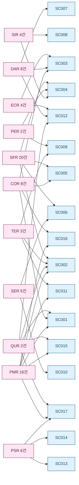

---

## 4. 시나리오별 상세 흐름

각 시나리오 내부 노드는 `business_flow.yaml` 의 `mermaid` 필드를 그대로 옮긴 것입니다.

### SC-001 · 사업 착수·계획 수립

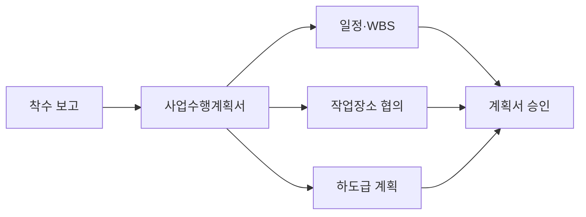

매핑 요구사항: PMR-001, PMR-013, PMR-014, PMR-015, QUR-001, COR-004, COR-005

### SC-002 · 요구사항 분석·확정

매핑 요구사항: QUR-002, PMR-016, TER-001, SFR-001~020

### SC-003 · 아키텍처·DB 설계

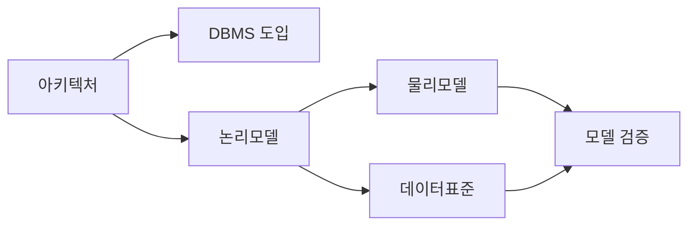

매핑 요구사항: COR-001, COR-002, COR-003, ECR-001~004, DAR-002, DAR-005, DAR-006, DAR-008, SIR-004

### SC-004 · 화면·기능 설계

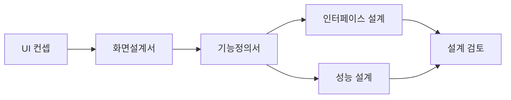

매핑 요구사항: SIR-001~004, SFR-001, SFR-002, SFR-014, SFR-015, PER-001, PER-002

### SC-005 · LIMS 핵심 업무 기능 개발

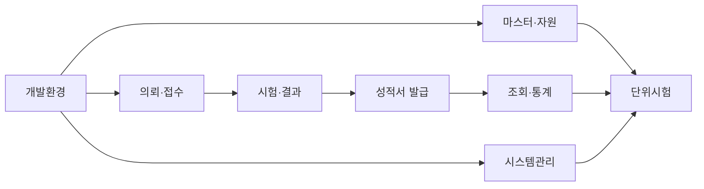

매핑 요구사항: SFR-003 ~ SFR-019

### SC-006 · 보안·인증 구현

매핑 요구사항: SFR-001, SFR-002, SER-001, SER-003, SER-005

### SC-007 · 데이터 마이그레이션

매핑 요구사항: DAR-001, DAR-003, DAR-004, DAR-007, ECR-001
> Oracle HEIS DB → 대구시 D-클라우드 오픈소스 DB

### SC-008 · 시스템 연계 구현

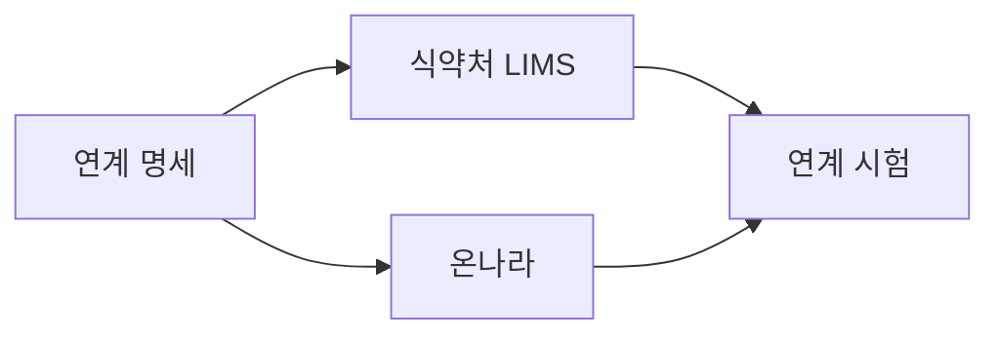

매핑 요구사항: SFR-020, SIR-003, SIR-004

### SC-009 · 단위·통합 테스트

매핑 요구사항: TER-001, TER-002, PER-001, PER-002

### SC-010 · 보안 취약점 점검

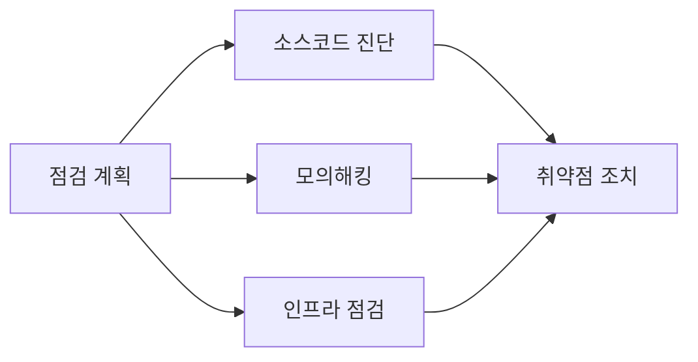

매핑 요구사항: SER-002, SER-003, SER-004, SER-005

### SC-011 · 사용자 인수 테스트·검수

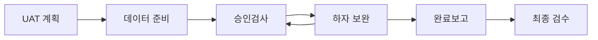

매핑 요구사항: TER-003, PMR-016
> 발주자 승인검사 후 완료보고 → 14일 이내 최종 검수

### SC-012 · 시스템 오픈·이행

매핑 요구사항: ECR-001~004, QUR-001, DAR-003, DAR-004

### SC-013 · 교육·기술이전

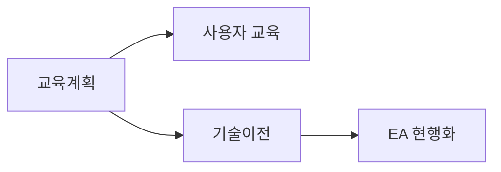

매핑 요구사항: PSR-003, PSR-004, PSR-005

### SC-014 · 하자보수·운영전환

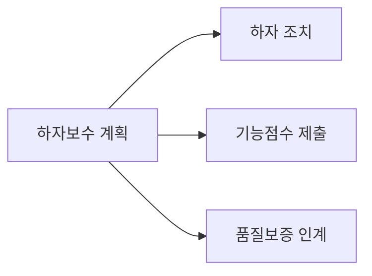

매핑 요구사항: PSR-001, PSR-002, PSR-006
> 1년 하자담보 운영 + 기능점수 산정자료 제출

### SC-015 · 프로젝트 통제·진척 관리 (횡단)

매핑 요구사항: PMR-001~004, PMR-013, PMR-016, QUR-002

### SC-016 · 보안·인력 관리 (횡단)

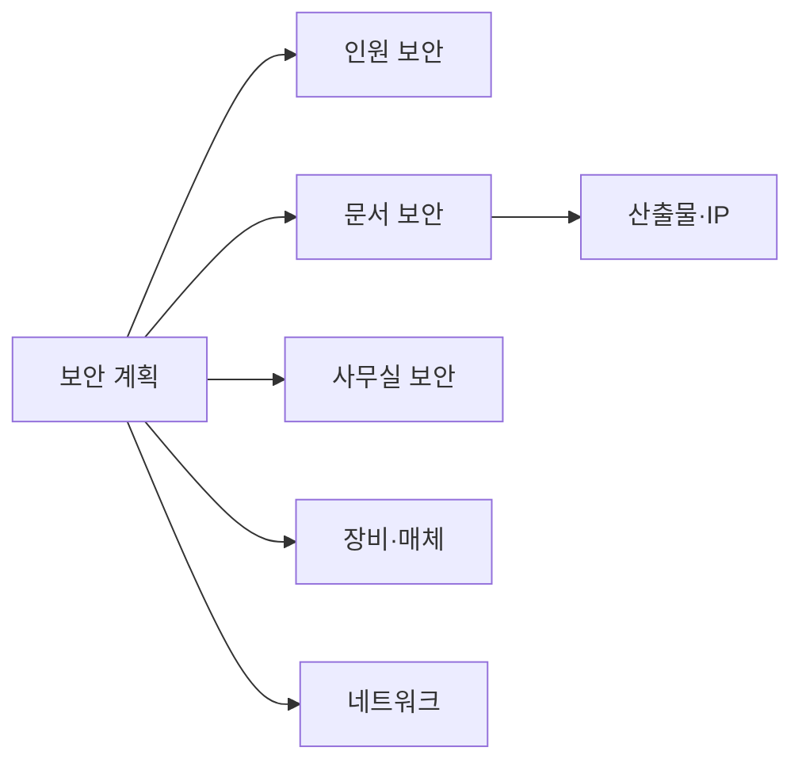

매핑 요구사항: PMR-006~012, COR-004~008

### SC-017 · 품질보증·산출물 관리 (횡단)

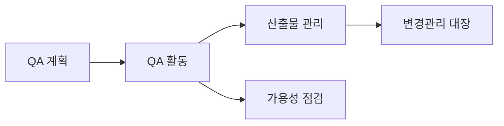

매핑 요구사항: QUR-001, QUR-002, PMR-005, PSR-001

---

## 5. 렌더링 방법

| 환경 | 방법 |
|---|---|
| GitHub | `.md` 파일 자동 렌더링 (네이티브 지원) |
| VS Code | "Markdown Preview Mermaid Support" 확장 설치 후 미리보기 (`Ctrl+Shift+V`) |
| Obsidian | 기본 지원 — 본 vault 안에서 그대로 렌더링 |
| 단일 다이어그램 추출 | mermaid 코드블록 내용을 [mermaid.live](https://mermaid.live) 에 붙여넣기 |

---

## 6. 다음 단계

- 본 흐름이 RFP 요구사항을 충분히 커버하면 → `/process-plan "SI_Project 보건환경종합정보시스템 고도화 사업 표준 프로세스"` 실행
- 시나리오 추가/수정이 필요하면 → `business_flow.yaml` 직접 편집 후 본 `.md` 파일 재생성 (또는 자동 동기화 도구 활용)
