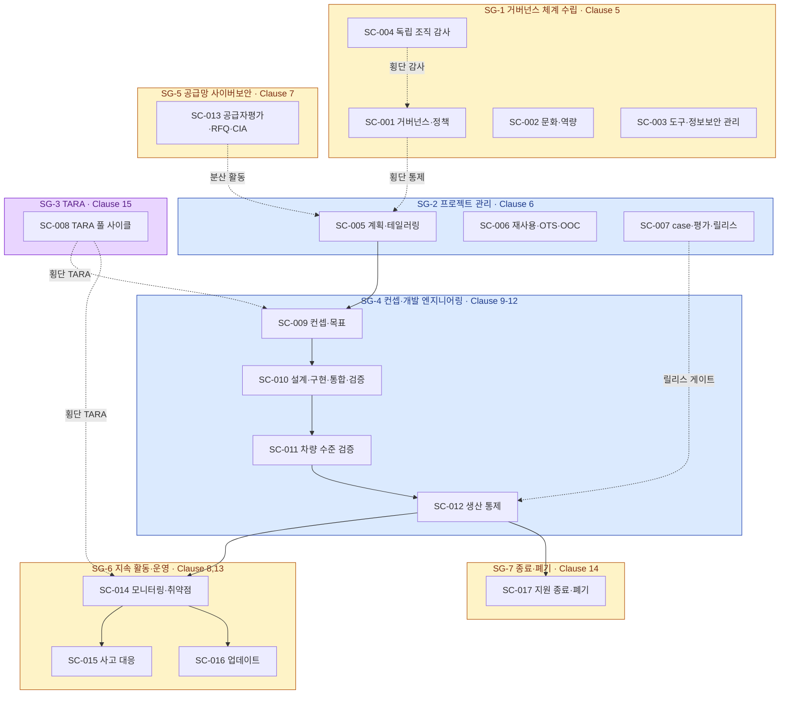
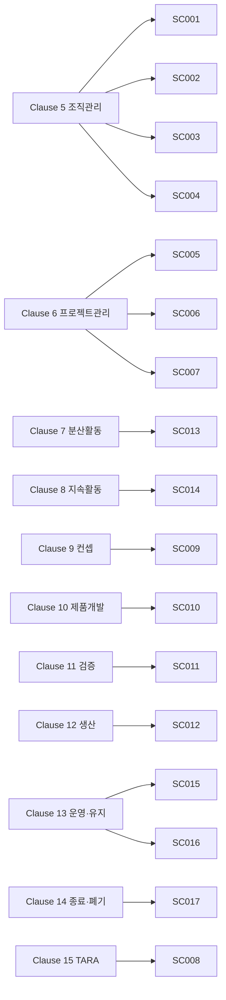
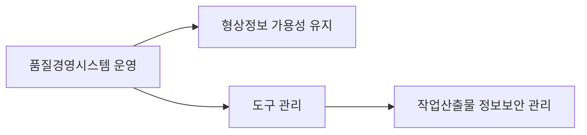
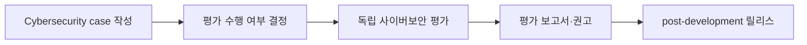
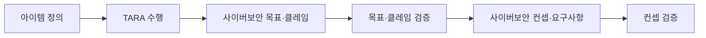
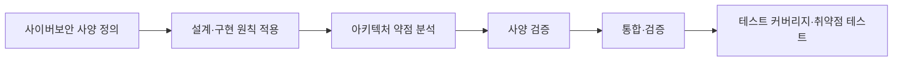

# ISO/SAE 21434:2021 — 자동차 사이버보안 엔지니어링 업무 흐름

> 본 파일은 `business_flow.yaml` 의 **시각화 동반본**입니다. 진실의 원천은 yaml 이며,
> 시나리오 ID·매핑 요구사항은 두 파일이 동일하게 유지됩니다. 사람이 직접 수정 가능합니다.

## 1. 메타 정보

| 항목 | 값 |
|---|---|
| 표준 기반 (standard_basis) | `AutoCyberSec` — ISO/SAE 21434:2021 Road vehicles — Cybersecurity engineering |
| 규범 조항 | Clause 5–15 (1–4 는 범위/참조/용어/일반) |
| 요건 / 작업산출물 | 요건 118건 (RQ 101 / RC 13 / PM 4), WP 42건 |
| 시나리오 총수 | 17 (확정 13 / 옵션 4) |
| 생성일 | 2026-06-14 |

핵심 구조: V-model 라이프사이클(컨셉 → 개발 → 검증 → 생산 → 운영) + 거버넌스(Clause 5–7) +
지속활동(Clause 8) + 횡단 분석 방법론 TARA(Clause 15).

---

## 2. 전체 라이프사이클 다이어그램

```mermaid
flowchart TB
  subgraph SG1[SG-1 거버넌스 체계 수립 · Clause 5]
    SC001[SC-001 거버넌스·정책]
    SC002[SC-002 문화·역량]
    SC003[SC-003 도구·정보보안 관리]
    SC004[SC-004 독립 조직 감사]
  end

  subgraph SG5[SG-5 공급망 사이버보안 · Clause 7]
    SC013[SC-013 공급자평가·RFQ·CIA]
  end

  subgraph SG2[SG-2 프로젝트 관리 · Clause 6]
    SC005[SC-005 계획·테일러링]
    SC006[SC-006 재사용·OTS·OOC]
    SC007[SC-007 case·평가·릴리스]
  end

  subgraph SG3[SG-3 TARA · Clause 15]
    SC008[SC-008 TARA 풀 사이클]
  end

  subgraph SG4[SG-4 컨셉·개발 엔지니어링 · Clause 9-12]
    SC009[SC-009 컨셉·목표]
    SC010[SC-010 설계·구현·통합·검증]
    SC011[SC-011 차량 수준 검증]
    SC012[SC-012 생산 통제]
  end

  subgraph SG6[SG-6 지속 활동·운영 · Clause 8,13]
    SC014[SC-014 모니터링·취약점]
    SC015[SC-015 사고 대응]
    SC016[SC-016 업데이트]
  end

  subgraph SG7[SG-7 종료·폐기 · Clause 14]
    SC017[SC-017 지원 종료·폐기]
  end

  SC005 --> SC009
  SC009 --> SC010 --> SC011 --> SC012
  SC008 -.횡단 TARA.-> SC009
  SC008 -.횡단 TARA.-> SC014
  SC007 -.릴리스 게이트.-> SC012
  SC013 -.분산 활동.-> SC005
  SC012 --> SC014
  SC014 --> SC015
  SC014 --> SC016
  SC012 --> SC017
  SC001 -.횡단 통제.-> SC005
  SC004 -.횡단 감사.-> SC001

  classDef mainGroup fill:#dbeafe,stroke:#1e40af,color:#1e3a8a;
  classDef supportGroup fill:#fef3c7,stroke:#b45309,color:#7c2d12;
  classDef crossGroup fill:#e9d5ff,stroke:#7e22ce,color:#581c87;
  class SG2,SG4 mainGroup;
  class SG1,SG5,SG6,SG7 supportGroup;
  class SG3 crossGroup;
```

---

## 3. 단계별 게이트 (간소 뷰)

```mermaid
flowchart LR
  G0[프로젝트 착수] --> G1[관련성 판정·계획]
  G1 --> G2[컨셉·목표 확정]
  G2 --> G3[개발 완료·검증]
  G3 --> G4[CS case·독립평가]
  G4 --> G5[post-dev 릴리스]
  G5 --> G6[생산]
  G6 --> G7[운영·모니터링]
  G7 --> G8[지원 종료·폐기]
```

---

## 4. 카테고리(조항군) 커버리지 매핑

```mermaid
flowchart LR
  C5[Clause 5 조직관리] --> SC001 & SC002 & SC003 & SC004
  C6[Clause 6 프로젝트관리] --> SC005 & SC006 & SC007
  C7[Clause 7 분산활동] --> SC013
  C8[Clause 8 지속활동] --> SC014
  C9[Clause 9 컨셉] --> SC009
  C10[Clause 10 제품개발] --> SC010
  C11[Clause 11 검증] --> SC011
  C12[Clause 12 생산] --> SC012
  C13[Clause 13 운영·유지] --> SC015 & SC016
  C14[Clause 14 종료·폐기] --> SC017
  C15[Clause 15 TARA] --> SC008
```

---

## 5. 시나리오별 상세 흐름

### SC-001 · 조직 사이버보안 거버넌스·정책 수립  (common, 확정)

```mermaid
flowchart LR
  A[사이버보안 정책 정의] --> B[규칙·프로세스 수립]
  B --> C[책임·권한 할당]
  C --> D[자원 제공]
  D --> E[인접 분야 소통채널]
  E --> F[지속적 개선]
  F --> G[정보공유 조건 정의]
```

> Clause 5.4.1/5.4.3, WP-05-01.
매핑 요구사항: RQ-05-01, RQ-05-02, RQ-05-03, RQ-05-04, RQ-05-05, RQ-05-08, RQ-05-09, RC-05-10

### SC-002 · 사이버보안 문화·역량 관리  (common, 확정)

```mermaid
flowchart LR
  A[사이버보안 문화 조성] --> B[역량·인식 보장]
  B --> C[역량 관리 증거화]
```

> Clause 5.4.2, WP-05-02.
매핑 요구사항: RQ-05-06, RQ-05-07

### SC-003 · 도구 관리·정보보안 관리  (common, 옵션)

```mermaid
flowchart LR
  A[품질경영시스템 운영] --> B[형상정보 가용성 유지]
  A --> C[도구 관리]
  C --> D[작업산출물 정보보안 관리]
```

> Clause 5.4.4/5.4.5/5.4.6, WP-05-03, WP-05-04.
매핑 요구사항: RQ-05-11, RQ-05-12, RC-05-13, RQ-05-14, RC-05-15, RC-05-16

### SC-004 · 독립 조직 사이버보안 감사  (common, 확정)

```mermaid
flowchart LR
  A[감사 계획·독립성] --> B[프로세스 적합성 감사]
  B --> C[감사 보고서]
```

> Clause 5.4.7, WP-05-05.
매핑 요구사항: RQ-05-17

### SC-005 · 프로젝트 사이버보안 계획·테일러링  (project, 확정)

```mermaid
flowchart LR
  A[프로젝트 책임 할당] --> B[관련성·신규/재사용 분석]
  B --> C[사이버보안 계획 수립]
  C --> D[테일러링·근거 검토]
  D --> E[계획 갱신·형상관리]
```

> Clause 6.4.1/6.4.2/6.4.3, WP-06-01.
매핑 요구사항: RQ-06-01~07, PM-06-08, RQ-06-09~12, PM-06-13, RQ-06-14

### SC-006 · 재사용·OTS·out-of-context 컴포넌트 분석  (project, 옵션)

```mermaid
flowchart LR
  A[재사용 분석] --> B[out-of-context 가정 검증]
  B --> C[OTS 문서 충족성 분석]
  C --> D[부족 시 추가 활동]
```

> Clause 6.4.4/6.4.5/6.4.6, WP-06-01.
매핑 요구사항: RQ-06-15, RQ-06-16, RQ-06-17, RQ-06-18, RQ-06-19, RQ-06-20, RQ-06-21, RQ-06-22

### SC-007 · Cybersecurity case·평가·post-development 릴리스  (project, 확정)

```mermaid
flowchart LR
  A[Cybersecurity case 작성] --> B[평가 수행 여부 결정]
  B --> C[독립 사이버보안 평가]
  C --> D[평가 보고서·권고]
  D --> E[post-development 릴리스]
```

> Clause 6.4.7/6.4.8/6.4.9, WP-06-02, WP-06-03, WP-06-04.
매핑 요구사항: RQ-06-23~28, PM-06-29, RQ-06-30~34

### SC-008 · TARA 풀 사이클  (project, 확정)

```mermaid
flowchart LR
  A[자산 식별] --> B[위협 시나리오 식별]
  B --> C[영향 평가 S/F/O/P]
  C --> D[공격 경로 분석]
  D --> E[공격 타당성 평가]
  E --> F[리스크값 결정 1-5]
  F --> G[리스크 처리 결정]
```

> Clause 15.3~15.9, WP-15-01~08. SC-009 및 SC-014 의 횡단 분석 방법론.
매핑 요구사항: RQ-15-01~06, PM-15-07, RQ-15-08, RQ-15-09, RQ-15-10, RC-15-11~14, RQ-15-15, RQ-15-16, RQ-15-17

### SC-009 · 아이템 정의·사이버보안 목표·컨셉 수립  (project, 확정)

```mermaid
flowchart LR
  A[아이템 정의] --> B[TARA 수행]
  B --> C[사이버보안 목표·클레임]
  C --> D[목표·클레임 검증]
  D --> E[사이버보안 컨셉·요구사항]
  E --> F[컨셉 검증]
```

> Clause 9.3/9.4/9.5, WP-09-01~07.
매핑 요구사항: RQ-09-01~11

### SC-010 · 보안 설계·구현·통합·검증 (V-model)  (project, 확정)

```mermaid
flowchart LR
  A[사이버보안 사양 정의] --> B[설계·구현 원칙 적용]
  B --> C[아키텍처 약점 분석]
  C --> D[사양 검증]
  D --> E[통합·검증]
  E --> F[테스트 커버리지·취약점 테스트]
```

> Clause 10.4.1/10.4.2, WP-10-01~07.
매핑 요구사항: RQ-10-01~05, RC-10-06, RQ-10-07~11, RC-10-12, RQ-10-13

### SC-011 · 차량 수준 사이버보안 검증  (project, 확정)

```mermaid
flowchart LR
  A[검증 활동 선정·근거] --> B[차량 수준 검증]
  B --> C[검증 보고서]
```

> Clause 11.4, WP-11-01.
매핑 요구사항: RQ-11-01, RQ-11-02

### SC-012 · 생산 통제 계획 수립·이행  (org, 확정)

```mermaid
flowchart LR
  A[생산 통제 계획 작성] --> B[무단 변경 방지 통제]
  B --> C[생산 통제 계획 이행]
```

> Clause 12.4, WP-12-01.
매핑 요구사항: RQ-12-01, RQ-12-02, RQ-12-03

### SC-013 · 공급자 역량평가·RFQ·인터페이스 합의(CIA)  (org, 확정)

```mermaid
flowchart LR
  A[공급자 역량 평가] --> B[RFQ 발행]
  B --> C[인터페이스 합의 CIA]
  C --> D[책임 분배·이슈 통지]
```

> Clause 7.4.1/7.4.2/7.4.3, WP-07-01.
매핑 요구사항: RQ-07-01, RC-07-02, RQ-07-03, RQ-07-04, RC-07-05, RQ-07-06, RQ-07-07, RC-07-08

### SC-014 · 지속적 모니터링·이벤트 평가·취약점 분석·관리  (common, 확정)

```mermaid
flowchart LR
  A[정보원 선정·트리거] --> B[수집·트리아지→이벤트]
  B --> C[이벤트 평가→약점]
  C --> D[약점 분석→취약점]
  D --> E[취약점 관리]
  E --> F[사고대응 연계]
```

> Clause 8.3/8.4/8.5/8.6, WP-08-01~06.
매핑 요구사항: RQ-08-01, RQ-08-02, RQ-08-03, RQ-08-04, RQ-08-05, RQ-08-06, RQ-08-07, RQ-08-08

### SC-015 · 사이버보안 사고 대응  (project, 확정, 예외흐름)

```mermaid
flowchart LR
  A[사고 대응 계획 작성] --> B[사고 대응 계획 이행]
  B --> C[진척 모니터링·종료]
```

> Clause 13.3, WP-13-01.
매핑 요구사항: RQ-13-01, RQ-13-02

### SC-016 · 업데이트 개발·배포  (project, 옵션)

```mermaid
flowchart LR
  A[업데이트 개발] --> B[업데이트 검증]
  B --> C[업데이트 배포]
```

> Clause 13.4.
매핑 요구사항: RQ-13-03

### SC-017 · 사이버보안 지원 종료·폐기  (org, 옵션, 예외흐름)

```mermaid
flowchart LR
  A[지원 종료 통보 절차] --> B[폐기 관련 요구사항 제공]
```

> Clause 14.3/14.4, WP-14-01.
매핑 요구사항: RQ-14-01, RQ-14-02

---

## 6. 렌더링 방법 + 다음 단계

**렌더링**: 본 파일의 Mermaid 다이어그램은 GitHub, VS Code(Markdown Preview Mermaid 확장),
Obsidian, 또는 https://mermaid.live 에서 확인할 수 있습니다.

**시나리오 조정**: 옵션(optional) 시나리오 SC-003 / SC-006 / SC-016 / SC-017 을 제외하려면
`business_flow.yaml` 의 해당 `selection: optional` 항목과 `summary` 카운트를 함께 수정하고,
본 md 의 대응 섹션을 삭제하십시오. (두 파일의 시나리오 ID·매핑 일치 유지)

**다음 단계**: `/process-plan` 을 실행하여 본 `business_flow.yaml` 을 입력으로 프로세스 계획을 생성합니다.
