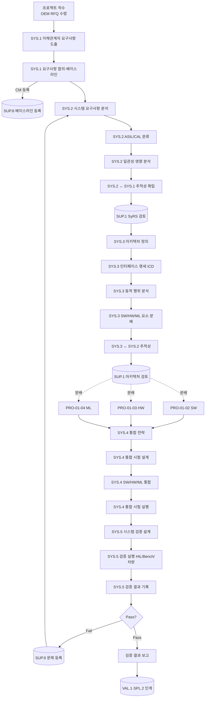

# 시스템공학 프로세스 (PRO-ASPICE-01-01)

> 상위 정책: [[POL-ASPICE-01_ASPICE역량거버넌스정책]]
> 적용요건: [[적용요건]] §1.2 (SYS.1~5)
> 입력: `inputs/06_목표흐름/business_flow.yaml` (SCN-001 ~ SCN-004)

---

## 1. 목적

본 절차는 OEM(고객) 으로부터 수령한 RFQ·사양서를 출발점으로 **이해관계자 요구사항(SYS.1) → 시스템 요구사항 분석(SYS.2) → 시스템 아키텍처 설계(SYS.3) → 시스템 통합(SYS.4) → 시스템 검증(SYS.5)** 의 V-모델 좌(요구·설계) 와 우(통합·검증) 사이클을 일관되게 수행하여, 제품이 이해관계자 의도를 충족함을 입증할 수 있는 증적을 산출하기 위한 통제된 작업 흐름을 정의한다.

## 2. 적용 범위

VWAY Motors 가 OEM 으로 인도하는 차량 ECU·도메인 컨트롤러·ADAS 시스템의 모든 신규 개발·중대 변경에 적용한다. 단순 BOM 변경, 라벨 변경 등 시스템 아키텍처에 영향이 없는 경미 변경은 [[PRO-ASPICE-01-08_문제및변경관리프로세스]] (SUP.10) 만 적용한다.

## 3. 역할과 책임 (RACI)

| 단계 | System Engineer | SW/HW/ML Lead | QA (SUP.1) | CM (SUP.8) | Project Manager | Customer (OEM) |
|---|---|---|---|---|---|---|
| 이해관계자 요구사항 도출 (SYS.1) | **R** | C | I | I | A | C |
| 요구사항 합의·베이스라인 (SYS.1) | **R** | C | I | R | **A(PM)** | C |
| 시스템 요구사항 분석 (SYS.2) | **R** | C | C | I | A | I |
| 추적성 확립 (SYS.2.BP5) | **R** | C | C | I | I | - |
| 시스템 아키텍처 설계 (SYS.3) | **R** | C | C | I | A | I |
| SW/HW/ML 분배 (SYS.3.BP4) | **R** | **R** | C | I | A | - |
| 시스템 통합 (SYS.4) | **R** | C | C | C | A | I |
| 시스템 검증 (SYS.5) | **R** | C | **A(QA)** | I | I | C |
| 검증 결과 보고 + 이슈 이관 (→ SUP.9) | **R** | I | C | I | A | I |

> Accountable 는 단계당 1인. SYS.5 의 A 는 QA Lead (독립성 원칙).

## 4. 절차 흐름



## 5. 단계별 상세

| # | 단계 | ASPICE BP | 설명 | 담당 | 입력 | 출력 |
|---|---|---|---|---|---|---|
| 1 | 이해관계자 식별 | SYS.1.BP1 | OEM·내부·규제기관 식별 + 의사소통 채널 확정 | System Engineer | RFQ, 조직도 | 이해관계자 대장 |
| 2 | 요구사항 도출·문서화 | SYS.1.BP2/3 | 워크숍·인터뷰·표준 분석을 통한 요구사항 elicitation | System Engineer | RFQ, 표준(ISO 26262 등) | Stakeholder Requirements Spec |
| 3 | 요구사항 합의·베이스라인 | SYS.1.BP5 | 변경관리 가능 상태로 baseline + CM 등록 | System Engineer + CM | StRS draft | StRS baseline (v1.0) |
| 4 | 시스템 요구사항 정제 | SYS.2.BP1 | 기능/비기능 SyRS 명세화 | System Engineer | StRS | System Requirements Spec |
| 5 | ASIL/CAL/속성 부여 | SYS.2.BP2 | 안전성·보안성 등급 분류 | System Engineer + Safety | SyRS | ASIL 분배표 |
| 6 | 영향·일관성 분석 | SYS.2.BP3 | 모순·중복·시험가능성 검토 | System Engineer | SyRS, ASIL 분배 | 분석 보고서 |
| 7 | SyRS↔StRS 추적성 | SYS.2.BP5 | 양방향 link 확립 | System Engineer | SyRS, StRS | 추적성 매트릭스 |
| 8 | 아키텍처 정의 | SYS.3.BP1 | 시스템 요소·계층 구조 도출 | System Engineer | SyRS | System Architecture Description |
| 9 | 인터페이스 명세 | SYS.3.BP2 | CAN/Ethernet/SOME-IP 등 ICD | System Engineer | 아키텍처 | Interface Control Document |
| 10 | 동적 행위 분석 | SYS.3.BP3 | 시퀀스·상태 머신·타이밍 정의 | System Engineer | 아키텍처 | 동적 행위 명세 |
| 11 | SW/HW/ML 요소 분배 | SYS.3.BP4 | 요구사항 → 구현 도메인 할당 | System Engineer + Domain Lead | SyRS, 아키텍처 | Allocation Matrix |
| 12 | 아키텍처↔SyRS 추적성 | SYS.3.BP5 | 요구사항 ↔ 아키텍처 요소 link | System Engineer | 아키텍처, SyRS | 추적성 매트릭스 |
| 13 | 통합 전략 수립 | SYS.4.BP1 | bottom-up/top-down 전략·순서 | System Engineer | 아키텍처 | Integration Strategy |
| 14 | 통합 시험 설계 | SYS.4.BP2 | 통합 단계별 verification measure | System Engineer + QA | 전략 | Integration Test Spec |
| 15 | 요소 통합 + 시험 실행 | SYS.4.BP3/4 | 단계적 결합·시험·결과 기록 | System Engineer | SW/HW/ML 산출물 | Integration Test Report |
| 16 | 시스템 검증 설계 | SYS.5.BP2 | SyRS 대비 verification scenario | System Engineer + QA | SyRS, 통합 결과 | Verification Test Spec |
| 17 | 시스템 검증 실행 | SYS.5.BP3 | HIL/Bench/차량 검증 + 결과 기록 | System Engineer | Verification Spec | Verification Report |
| 18 | 결과 보고·이슈 이관 | SYS.5.BP4 | Pass/Fail 보고 + 결함은 SUP.9 | System Engineer | Verification Report | 결과 보고 + Problem Tickets |

## 6. 연계 업무지침 (WI)

- [[WI-ASPICE-01-01-01_이해관계자요구사항도출]] — SYS.1 elicitation·합의 절차
- [[WI-ASPICE-01-01-02_시스템요구사항분석]] — SYS.2 SyRS 작성·ASIL 분류
- [[WI-ASPICE-01-01-03_시스템아키텍처설계]] — SYS.3 아키텍처·ICD·분배
- [[WI-ASPICE-01-01-04_시스템통합및검증]] — SYS.4 통합 시험 운영
- [[WI-ASPICE-01-01-05_시스템요구사항검증]] — SYS.5 HIL/Bench/차량 검증
- [[WI-ASPICE-01-01-06_추적성매트릭스관리]] — 추적성 매트릭스 작성·유지

## 7. 통제점 / KPI

| 통제점 | 지표 | 목표 | 주기 |
|---|---|---|---|
| 요구사항 추적성 | StRS↔SyRS↔Arch 양방향 커버리지 | ≥ 95% | 마일스톤 |
| 시스템 검증 통과율 | SYS.5 첫 실행 Pass 비율 | ≥ 98% | 빌드별 |
| 설계 리뷰 완료율 | SyRS·Arch·ICD 리뷰 종결율 | 100% | 마일스톤 |
| 통합 결함 밀도 | SYS.4 통합 시험 결함 / KLOC | 추세 감소 | 분기 |
| 변경 영향 분석 적시성 | StRS 변경 → 영향분석 완료 | ≤ 5 영업일 | 변경 건별 |

## 8. 표준 매핑 (Traceability)

| ASPICE 조항 | Req-ID | 반영 |
|---|---|---|
| SYS.1 Purpose | ASPICE-SYS1-R-001 | §4 절차흐름 A1·A2 / §5 단계 1~3 |
| SYS.1.BP1 (이해관계자 식별) | ASPICE-SYS1-R-002 | §5 단계 1 |
| SYS.1.BP3 (변경 합의) | ASPICE-SYS1-R-003 | §5 단계 3, §7 변경 영향 KPI |
| SYS.2 Purpose | ASPICE-SYS2-R-001 | §4 B1~B4 / §5 단계 4~7 |
| SYS.2.BP1 (기능/비기능 명세) | ASPICE-SYS2-R-002 | §5 단계 4 |
| SYS.2.BP5 (양방향 추적성) | ASPICE-SYS2-R-003 | §5 단계 7, §7 추적성 KPI |
| SYS.3 Purpose | ASPICE-SYS3-R-001 | §4 C1~C5 / §5 단계 8~12 |
| SYS.3.BP1 (요소·인터페이스 식별) | ASPICE-SYS3-R-002 | §5 단계 8~9 |
| SYS.3.BP5 (양방향 추적성) | ASPICE-SYS3-R-003 | §5 단계 12 |
| SYS.4 Purpose | ASPICE-SYS4-R-001 | §4 D1~D4 / §5 단계 13~15 |
| SYS.4.BP3 (검증 측정치 실행) | ASPICE-SYS4-R-002 | §5 단계 14~15 |
| SYS.5 Purpose | ASPICE-SYS5-R-001 | §4 E1~E3 / §5 단계 16~18 |
| SYS.5.BP3 (검증 결과·이슈 이관) | ASPICE-SYS5-R-002 | §5 단계 18 |

## 9. 출처 (source_citation)

```yaml
- type: standard_original
  file: "inputs/01_표준원문/VWAY_Motors/requirements.yaml"
  locator: "VWAY-SYS.1-* / VWAY-SYS.2-* / VWAY-SYS.3-* / VWAY-SYS.4-* / VWAY-SYS.5-*"
  retrieved_at: "2026-05-06"
  license: "ASPICE 4.0 © VDA QMC — paraphrase only"
  paraphrase_only: true
- type: standard_original
  file: "inputs/06_목표흐름/business_flow.yaml"
  locator: "SCN-001 ~ SCN-004 (SG-1-1 시스템 엔지니어링)"
  retrieved_at: "2026-05-06"
```

## 10. 개정 이력

| 버전 | 일자 | 변경내용 | 승인자 |
|---|---|---|---|
| 0.1 | 2026-05-06 | 최초 초안 — SYS.1~5 V-모델 통합 절차 정의 | (대기) |
