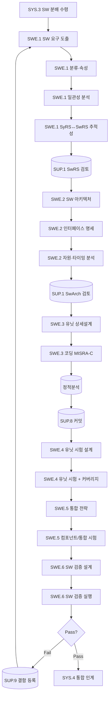

# 소프트웨어공학 프로세스 (PRO-ASPICE-01-02)

> 상위 정책: [[POL-ASPICE-01_ASPICE역량거버넌스정책]]
> 적용요건: [[적용요건]] §1.4 (SWE.1~6)
> 입력: business_flow.yaml SCN-005~008 (SG-1-2 소프트웨어 개발)

---

## 1. 목적

시스템 아키텍처에서 분배된 SW 책임을 출발점으로 **SW 요구사항 분석(SWE.1) → SW 아키텍처(SWE.2) → 상세설계·유닛 구현(SWE.3) → 유닛 검증(SWE.4) → 컴포넌트/통합 검증(SWE.5) → SW 검증(SWE.6)** 의 V-모델 SW 사이드를 통제된 흐름으로 수행한다. AUTOSAR Classic/Adaptive 환경, MISRA-C 코딩 표준, 코드 커버리지 의무화를 전제로 한다.

## 2. 적용 범위

VWAY Motors 가 자체 개발하는 ECU 임베디드 SW, AUTOSAR 컴포넌트, ADAS 미들웨어에 적용한다. 외주 SW(공급사 OEM SW) 는 [[PRO-ASPICE-01-06_구매및공급망프로세스]] 적용 후 인수 검증 단계에서 본 절차의 SWE.5/SWE.6 만 적용한다.

## 3. 역할과 책임 (RACI)

| 단계 | SW Engineer | SW Architect | QA (SUP.1) | CM (SUP.8) | SW Lead |
|---|---|---|---|---|---|
| SW 요구사항 분석 (SWE.1) | **R** | C | C | I | A |
| SW 아키텍처 설계 (SWE.2) | C | **R** | C | I | A |
| 상세설계·유닛 구현 (SWE.3) | **R** | C | C | C | A |
| 유닛 검증 (SWE.4) | **R** | I | C | I | A |
| 컴포넌트/통합 검증 (SWE.5) | **R** | C | C | I | A |
| SW 검증 (SWE.6) | **R** | I | **A(QA)** | I | C |

## 4. 절차 흐름



## 5. 단계별 상세

| # | 단계 | ASPICE BP | 설명 | 입력 | 출력 |
|---|---|---|---|---|---|
| 1 | SW 요구사항 도출 | SWE.1.BP1 | SyRS·아키텍처에서 SW 요구사항 분해 | SyRS, System Arch | SW Requirements Spec |
| 2 | 분류·속성 부여 | SWE.1.BP2 | ASIL 상속·시험가능성 | SwRS draft | SwRS v1.0 |
| 3 | SyRS↔SwRS 추적성 | SWE.1.BP5 | 양방향 link | SwRS, SyRS | 추적성 매트릭스 |
| 4 | SW 아키텍처 정의 | SWE.2.BP1 | AUTOSAR 컴포넌트 구조 | SwRS | SW Arch Description |
| 5 | 인터페이스/자원/타이밍 | SWE.2.BP2/3 | RTE·시간 거동 | SW Arch | Interface Spec, Resource Analysis |
| 6 | 유닛 상세설계 | SWE.3.BP1 | 모듈·함수 시그니처 | SW Arch | Detailed Design |
| 7 | 유닛 코딩 | SWE.3.BP3 | MISRA-C 준수 코드 + commit | Detailed Design | Source Code |
| 8 | 정적 분석·코드리뷰 | SWE.3 BP / SUP.1 | MISRA·CERT 검증 | Source Code | 정적분석 보고서 |
| 9 | 유닛 시험 설계·실행 | SWE.4.BP1/3 | 화이트박스 + 커버리지 측정 | Source Code | Unit Test Report |
| 10 | 통합 전략·실행 | SWE.5.BP1/4 | bottom-up 컴포넌트 통합 | 유닛 산출물 | Integration Test Report |
| 11 | SW 검증 | SWE.6.BP3/4 | SwRS 대비 SW 전체 검증 | Integrated SW | SW Verification Report |
| 12 | 결과 보고·이슈 이관 | SWE.6.BP4 | Pass/Fail + 결함 → SUP.9 | Verification Report | 보고 + Problem Tickets |

## 6. 연계 업무지침 (WI)

- [[WI-ASPICE-01-02-01_SW요구사항분석]]
- [[WI-ASPICE-01-02-02_SW아키텍처설계]]
- [[WI-ASPICE-01-02-03_상세설계및유닛구현]]
- [[WI-ASPICE-01-02-04_유닛검증]]
- [[WI-ASPICE-01-02-05_컴포넌트통합검증]]
- [[WI-ASPICE-01-02-06_SW검증]]

## 7. 통제점 / KPI

| 통제점 | 지표 | 목표 | 주기 |
|---|---|---|---|
| 코드 커버리지 (Statement) | SWE.4 unit | ≥ 100% (ASIL D) / ≥ 90% (QM) | 빌드 |
| MISRA-C 위반 | 정적 분석 | 0 (Mandatory), 합의 (Required) | 빌드 |
| SwRS↔SyRS 추적성 | 양방향 커버리지 | ≥ 95% | 마일스톤 |
| SW 검증 통과율 | SWE.6 첫 실행 Pass | ≥ 95% | 빌드 |
| 결함 누설율 | SWE.6→SYS.5 단계 누설 결함 | ≤ 5% | 분기 |

## 8. 표준 매핑 (Traceability)

| ASPICE 조항 | Req-ID | 반영 |
|---|---|---|
| SWE.1 Purpose / BP1 / BP5 | ASPICE-SWE1-R-001/002/003 | §5 단계 1~3 |
| SWE.2 Purpose / BP3 | ASPICE-SWE2-R-001/002 | §5 단계 4~5 |
| SWE.3 Purpose / BP3 | ASPICE-SWE3-R-001/002 | §5 단계 6~8, §7 MISRA |
| SWE.4 Purpose / BP3 | ASPICE-SWE4-R-001/002 | §5 단계 9, §7 커버리지 |
| SWE.5 Purpose / BP4 | ASPICE-SWE5-R-001/002 | §5 단계 10 |
| SWE.6 Purpose / BP4 | ASPICE-SWE6-R-001/002 | §5 단계 11~12 |

## 9. 출처 (source_citation)

```yaml
- type: standard_original
  file: "inputs/01_표준원문/VWAY_Motors/requirements.yaml"
  locator: "VWAY-SWE.1-* ~ VWAY-SWE.6-*"
  retrieved_at: "2026-05-06"
  license: "ASPICE 4.0 © VDA QMC — paraphrase only"
  paraphrase_only: true
- type: standard_original
  file: "inputs/06_목표흐름/business_flow.yaml"
  locator: "SCN-005 ~ SCN-008"
  retrieved_at: "2026-05-06"
```

## 10. 개정 이력

| 버전 | 일자 | 변경내용 | 승인자 |
|---|---|---|---|
| 0.1 | 2026-05-06 | 최초 초안 — SWE.1~6 V-모델 SW 사이드 정의 | (대기) |
