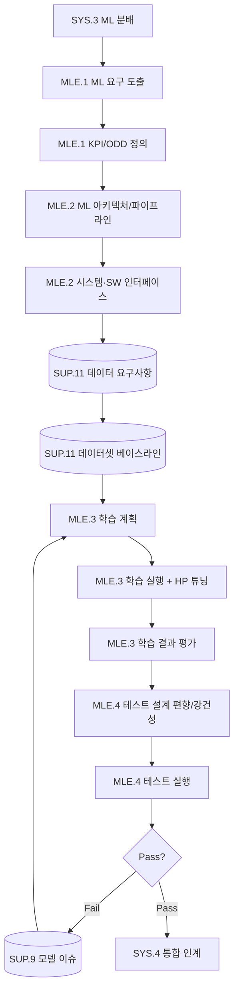

# 머신러닝공학 프로세스 (PRO-ASPICE-01-04)

> 상위 정책: [[POL-ASPICE-01_ASPICE역량거버넌스정책]]
> 적용요건: [[적용요건]] §1.5 (MLE.1~4) — ASPICE 4.0 신규 그룹
> 입력: business_flow.yaml SCN-011~012 (SG-1-4 머신러닝 모델 개발)

---

## 1. 목적

ADAS·자율주행 인지 모델의 **ML 요구사항(MLE.1) → ML 아키텍처/파이프라인(MLE.2) → 모델 학습(MLE.3) → 모델 테스트(MLE.4)** 사이클을 통제된 흐름으로 수행한다. ASPICE 4.0 의 신규 그룹이며, ML 데이터 거버넌스([[PRO-ASPICE-01-10_ML데이터관리프로세스]] / SUP.11) 와 강하게 결합한다.

## 2. 적용 범위

VWAY Motors 가 자체 학습/배포하는 ADAS 인지 모델(차선·객체·신호 인지), 운전자 모니터링 모델, 음성/제스처 인식 모델에 적용한다. 외부 사전학습 모델(pretrained foundation) 의 fine-tuning 도 포함하되, 처음부터 외부 모델을 그대로 통합하는 경우는 [[PRO-ASPICE-01-06_구매및공급망프로세스]] 를 우선 적용한다.

## 3. 역할과 책임 (RACI)

| 단계 | ML Engineer | Data Engineer (SUP.11) | QA (SUP.1) | ML Lead | Safety |
|---|---|---|---|---|---|
| ML 요구사항 분석 (MLE.1) | **R** | C | C | A | C |
| ML 아키텍처 (MLE.2) | **R** | C | C | A | I |
| 모델 학습 (MLE.3) | **R** | C | I | A | I |
| 모델 테스트 (MLE.4) | **R** | C | **A(QA)** | C | C |

## 4. 절차 흐름



## 5. 단계별 상세

| # | 단계 | ASPICE BP | 설명 | 입력 | 출력 |
|---|---|---|---|---|---|
| 1 | ML 요구사항 도출 | MLE.1.BP1 | 데이터·성능·환경(ODD) 요구 명세 | SyRS, ODD | ML Requirements Spec |
| 2 | KPI 정의 | MLE.1.BP3 | accuracy, recall, robustness, fairness 목표 | MLRS | KPI 정의서 |
| 3 | ML 아키텍처/파이프라인 | MLE.2.BP1 | 모델 구조·전처리·후처리·서빙 | MLRS | ML Architecture |
| 4 | 시스템·SW 인터페이스 | MLE.2.BP3 | 입력/출력 텐서·서빙 API | ML Arch | Interface Spec |
| 5 | 학습 계획 | MLE.3.BP1 | dataset 분할·학습/검증/시험 | MLRS, Dataset Baseline | Training Plan |
| 6 | 학습 실행·HP 튜닝 | MLE.3.BP2 | epoch·hyperparameter·재현성 | Training Plan | 학습 모델 + 로그 |
| 7 | 학습 결과 평가·기록 | MLE.3.BP4 | 성능·재현성 정보 보존 | 학습 모델 | 학습 결과 보고 |
| 8 | 모델 테스트 설계 | MLE.4.BP1 | 편향·강건성·공격성·OOD 시나리오 | MLRS, KPI | Model Test Spec |
| 9 | 모델 테스트 실행 | MLE.4.BP3 | metric 수행·기록 | Test Spec, 모델 | Test Report |
| 10 | 결과 보고·이슈 이관 | MLE.4.BP4 | Pass/Fail + 결함 → SUP.9 | Test Report | 보고 + Problem Tickets |

## 6. 연계 업무지침 (WI)

- [[WI-ASPICE-01-04-01_ML요구사항분석]]
- [[WI-ASPICE-01-04-02_ML아키텍처설계]]
- [[WI-ASPICE-01-04-03_모델학습]]
- [[WI-ASPICE-01-04-04_모델테스트]]

## 7. 통제점 / KPI

| 통제점 | 지표 | 목표 | 주기 |
|---|---|---|---|
| 모델 KPI 충족 | accuracy/recall (ODD 내) | 정의 KPI 100% 충족 | 학습별 |
| 학습 재현성 | seed·HP·dataset 버전 기록 | 100% | 학습별 |
| OOD/강건성 통과율 | adversarial/edge 시나리오 | ≥ 90% | 모델별 |
| Bias 평가 | 보호 속성별 성능 편차 | ≤ 5% | 모델별 |
| 데이터셋 버전 일관성 | 학습↔테스트 dataset 추적 | 100% | 학습별 |

## 8. 표준 매핑 (Traceability)

| ASPICE 조항 | Req-ID | 반영 |
|---|---|---|
| MLE.1 Purpose / BP1 | ASPICE-MLE1-R-001/002 | §5 단계 1~2 |
| MLE.2 Purpose / BP3 | ASPICE-MLE2-R-001/002 | §5 단계 3~4 |
| MLE.3 Purpose / BP4 | ASPICE-MLE3-R-001/002 | §5 단계 5~7, §7 재현성 |
| MLE.4 Purpose / BP3 | ASPICE-MLE4-R-001/002 | §5 단계 8~9, §7 KPI/Bias |

## 9. 출처 (source_citation)

```yaml
- type: standard_original
  file: "inputs/01_표준원문/VWAY_Motors/requirements.yaml"
  locator: "VWAY-MLE.1-* ~ VWAY-MLE.4-*"
  retrieved_at: "2026-05-06"
  license: "ASPICE 4.0 © VDA QMC — paraphrase only"
  paraphrase_only: true
- type: standard_original
  file: "inputs/06_목표흐름/business_flow.yaml"
  locator: "SCN-011 ~ SCN-012"
  retrieved_at: "2026-05-06"
```

## 10. 개정 이력

| 버전 | 일자 | 변경내용 | 승인자 |
|---|---|---|---|
| 0.1 | 2026-05-06 | 최초 초안 — MLE.1~4 ML 사이드 정의 (ASPICE 4.0 신규) | (대기) |
