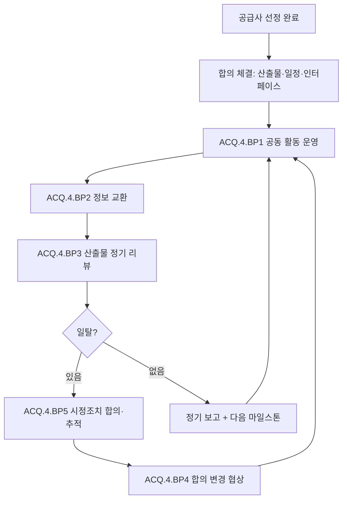

# 구매 및 공급망 프로세스 (PRO-ASPICE-01-06)

> 상위 정책: [[POL-ASPICE-01_ASPICE역량거버넌스정책]]
> 적용요건: [[적용요건]] §1.1 ACQ.4
> 입력: business_flow.yaml SCN-018 (공급망 관리)

---

## 1. 목적

외주 SW/HW/ML 공급사와의 **합의(Agreement) 대비 성과 추적**, **공동 활동·인터페이스·교환정보 운영**, **공급사 산출물 정기 리뷰**, **일탈 시 시정조치 추적** 을 통제된 흐름으로 수행한다 (ACQ.4).

## 2. 적용 범위

VWAY Motors 가 Tier 2/3 SW/HW/ML 공급사로부터 수령하는 모든 작업 산출물(소스코드·바이너리·HW 보드·학습 데이터·문서) 에 적용한다. 단순 부품 구매(상용 OTS 부품) 는 [[PRO-ASPICE-01-09_프로젝트관리프로세스]] 의 자원 관리에서 다룬다.

## 3. 역할과 책임 (RACI)

| 단계 | Procurement | Supplier Quality | System Engineer | QA (SUP.1) | Project Manager | Supplier |
|---|---|---|---|---|---|---|
| 합의(Agreement) 체결 | **R** | C | C | C | A | C |
| 공동 활동 운영 | C | **R** | C | I | A | **R** |
| 정보 교환 | C | **R** | C | I | A | **R** |
| 성과 모니터링 | C | **R** | C | C | A | C |
| 합의 변경 | **R** | C | C | C | A | C |
| 시정조치 추적 | C | **R** | C | **A(QA)** | I | **R** |

## 4. 절차 흐름



## 5. 단계별 상세

| # | 단계 | ASPICE BP | 설명 | 입력 | 출력 |
|---|---|---|---|---|---|
| 1 | 합의 체결 | (전제) | 산출물·인터페이스·일정·SLA | 계약, 요구 | Supplier Agreement |
| 2 | 공동 활동 운영 | ACQ.4.BP1 | 합의된 검토·테스트 활동 | Agreement | Joint Activities Plan + 의사록 |
| 3 | 정보 교환 | ACQ.4.BP2 | 합의된 채널/주기 | Agreement | 교환 정보 로그 |
| 4 | 산출물 리뷰 | ACQ.4.BP3 | 기술/문제/리스크 리뷰 | 공급사 산출물 | Supplier Performance Report |
| 5 | 일탈 시정조치 | ACQ.4.BP5 | NCR + 시정조치 + 검증 | 일탈 보고 | 시정조치 기록 |
| 6 | 합의 변경 협상 | ACQ.4.BP4 | 합의 변경 + CM 등록 | NCR, 변경 요청 | Amendment |

## 6. 연계 업무지침 (WI)

- [[WI-ASPICE-01-06-01_공동활동운영]]
- [[WI-ASPICE-01-06-02_공급사정보교환]]
- [[WI-ASPICE-01-06-03_공급사성과모니터링]]
- [[WI-ASPICE-01-06-04_합의변경및시정조치]]

## 7. 통제점 / KPI

| 통제점 | 지표 | 목표 | 주기 |
|---|---|---|---|
| 합의 활동 이행률 | Joint Activities 수행률 | ≥ 95% | 분기 |
| 공급사 산출물 적시 인도 | on-time delivery | ≥ 90% | 분기 |
| 산출물 결함 밀도 | inspection 결함/산출물 | 추세 감소 | 분기 |
| NCR 시정조치 종결율 | 합의 기한 내 종결 | ≥ 90% | 월 |
| 합의 변경 처리 적시성 | 요청→Amendment | ≤ 10 영업일 | 변경별 |

## 8. 표준 매핑 (Traceability)

| ASPICE 조항 | Req-ID | 반영 |
|---|---|---|
| ACQ.4 Purpose | ASPICE-ACQ4-R-001 | §1 목적, §4 전체 |
| ACQ.4.BP1 (공동 활동) | ASPICE-ACQ4-R-002 | §5 단계 2 |
| ACQ.4.BP3 (산출물 리뷰) | ASPICE-ACQ4-R-003 | §5 단계 4 |
| ACQ.4.BP5 (시정조치) | ASPICE-ACQ4-R-004 | §5 단계 5 |

## 9. 출처 (source_citation)

```yaml
- type: standard_original
  file: "inputs/01_표준원문/VWAY_Motors/requirements.yaml"
  locator: "VWAY-ACQ.4-*"
  retrieved_at: "2026-05-06"
  license: "ASPICE 4.0 © VDA QMC — paraphrase only"
  paraphrase_only: true
- type: standard_original
  file: "inputs/06_목표흐름/business_flow.yaml"
  locator: "SCN-018"
  retrieved_at: "2026-05-06"
```

## 10. 개정 이력

| 버전 | 일자 | 변경내용 | 승인자 |
|---|---|---|---|
| 0.1 | 2026-05-06 | 최초 초안 — ACQ.4 공급사 모니터링 절차 정의 | (대기) |
