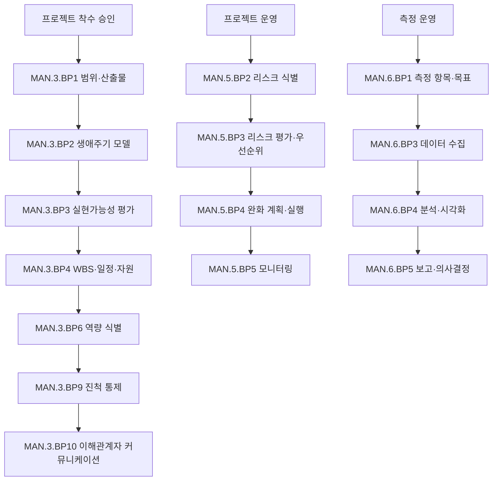

# 프로젝트 관리 프로세스 (PRO-ASPICE-01-09)

> 상위 정책: [[POL-ASPICE-01_ASPICE역량거버넌스정책]]
> 적용요건: [[적용요건]] §1.8 (MAN.3, MAN.5, MAN.6)
> 입력: business_flow.yaml SCN-015~017 (프로젝트 운영)

---

## 1. 목적

VWAY Motors 의 차량 개발 프로젝트에 대한 **프로젝트 활동·자원·계획의 식별 및 통제(MAN.3)**, **리스크 식별·분석·완화(MAN.5)**, **프로세스/제품 측정 데이터의 수집·분석·의사결정 활용(MAN.6)** 을 통합 운영한다. 모든 ASPICE 핵심 PRO 의 거버넌스 컨테이너 역할을 한다.

## 2. 적용 범위

VWAY Motors 의 모든 양산·선행 자동차 개발 프로젝트에 적용한다. 1인 short-term task force 등 비공식 작업은 본 절차 대상이 아니다.

## 3. 역할과 책임 (RACI)

| 단계 | Project Manager | PMO | Process Owner | QA (SUP.1) | CTO |
|---|---|---|---|---|---|
| 프로젝트 계획 (MAN.3.BP1~) | **R** | C | C | C | A |
| 실현가능성 평가 (MAN.3.BP3) | **R** | C | C | I | A |
| WBS·진척 통제 (MAN.3.BP4) | **R** | C | C | I | I |
| 역량 식별·관리 (MAN.3.BP6) | **R** | C | C | I | A |
| 리스크 관리 (MAN.5) | **R** | C | C | C | A |
| 측정·분석 (MAN.6) | **R** | C | C | C | I |

## 4. 절차 흐름



## 5. 단계별 상세

| # | 단계 | ASPICE BP | 설명 | 입력 | 출력 |
|---|---|---|---|---|---|
| 1 | 범위·산출물 정의 | MAN.3.BP1 | 프로젝트 목표·산출물 | OEM 요구 | Project Charter |
| 2 | 생애주기 모델 | MAN.3.BP2 | V-모델·테일러링 | Charter | 생애주기 정의 |
| 3 | 실현가능성 평가 | MAN.3.BP3 | 기술·일정·자원 | Charter | Feasibility Report |
| 4 | WBS·일정·자원 추정 | MAN.3.BP4 | WBS, Schedule, Resource Plan | Feasibility | Project Plan |
| 5 | 역량 식별 | MAN.3.BP6 | Skills/Knowledge 매트릭스 | Plan | Competency Matrix |
| 6 | 진척 통제 | MAN.3.BP9 | EVM·milestone | Plan, 실적 | Status Report |
| 7 | 이해관계자 커뮤니케이션 | MAN.3.BP10 | 정기 회의·보고 | 진척 | 의사록 |
| 8 | 리스크 식별 | MAN.5.BP2 | 워크숍·체크리스트 | 프로젝트 컨텍스트 | Risk Register |
| 9 | 리스크 평가·우선순위 | MAN.5.BP3 | likelihood × impact | Risk Register | 우선순위 표 |
| 10 | 리스크 완화·모니터링 | MAN.5.BP4/5 | 완화 계획·실행·추적 | 우선순위 | Mitigation Plan + 추적 |
| 11 | 측정 항목 정의 | MAN.6.BP1 | KPI·target | 프로젝트 목표 | Measurement Plan |
| 12 | 데이터 수집·분석·보고 | MAN.6.BP3/4/5 | 도구 자동 + 수동 | Plan | Metric Report |

## 6. 연계 업무지침 (WI)

- [[WI-ASPICE-01-09-01_프로젝트계획수립]]
- [[WI-ASPICE-01-09-02_실현가능성평가]]
- [[WI-ASPICE-01-09-03_WBS및진척통제]]
- [[WI-ASPICE-01-09-04_역량매트릭스관리]]
- [[WI-ASPICE-01-09-05_리스크식별및평가]]
- [[WI-ASPICE-01-09-06_리스크완화추적]]
- [[WI-ASPICE-01-09-07_측정지표수집]]
- [[WI-ASPICE-01-09-08_측정결과보고]]

## 7. 통제점 / KPI

| 통제점 | 지표 | 목표 | 주기 |
|---|---|---|---|
| 일정 준수율 | milestone on-time | ≥ 90% | 월 |
| 자원 활용률 | planned vs actual | 80~110% 범위 | 월 |
| 역량 매트릭스 갱신 | Skill Matrix 최신성 | ≤ 분기 | 분기 |
| 리스크 완화 적시성 | 완화 계획 실행률 | ≥ 90% | 월 |
| 측정 데이터 수집율 | 정의 KPI 수집률 | 100% | 월 |

## 8. 표준 매핑 (Traceability)

| ASPICE 조항 | Req-ID | 반영 |
|---|---|---|
| MAN.3 Purpose / BP3 / BP4 / BP6 | ASPICE-MAN3-R-001/002/003/004 | §5 단계 1~7 |
| MAN.5 Purpose / BP3 | ASPICE-MAN5-R-001/002 | §5 단계 8~10 |
| MAN.6 Purpose / BP3 | ASPICE-MAN6-R-001/002 | §5 단계 11~12 |

## 9. 출처 (source_citation)

```yaml
- type: standard_original
  file: "inputs/01_표준원문/VWAY_Motors/requirements.yaml"
  locator: "VWAY-MAN.3-*, VWAY-MAN.5-*, VWAY-MAN.6-*"
  retrieved_at: "2026-05-06"
  license: "ASPICE 4.0 © VDA QMC — paraphrase only"
  paraphrase_only: true
- type: standard_original
  file: "inputs/06_목표흐름/business_flow.yaml"
  locator: "SCN-015 ~ SCN-017"
  retrieved_at: "2026-05-06"
```

## 10. 개정 이력

| 버전 | 일자 | 변경내용 | 승인자 |
|---|---|---|---|
| 0.1 | 2026-05-06 | 최초 초안 — MAN.3 + MAN.5 + MAN.6 통합 정의 | (대기) |
