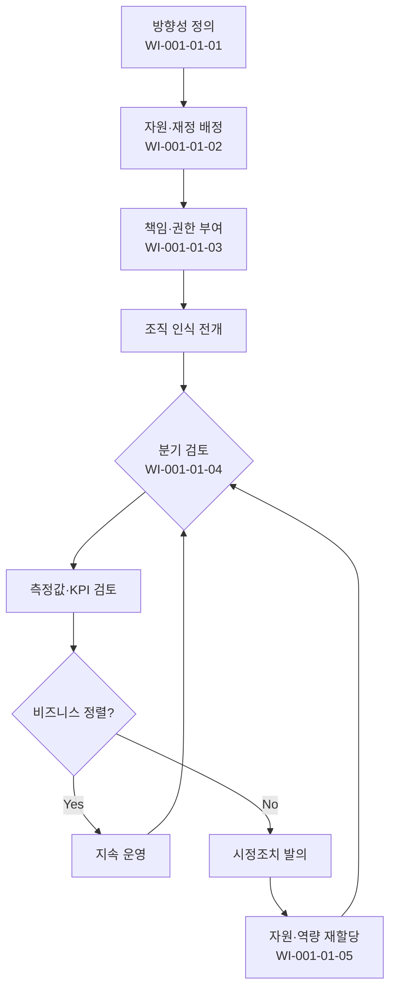

# 거버넌스 운영 절차 (PRO-CMMI-01-01)

> 상위 정책: [[POL-CMMI-01_거버넌스_및_프로세스자산_정책_v1.0]]

## 1. 목적
고위 경영진이 조직의 프로세스 구현·개선을 직접 지휘하기 위한 **방향성 정의 → 자원·권한 부여 → 정기 검토 → 시정** 의 통제된 흐름을 정의한다.

## 2. 적용 범위
- 전사 모든 PA(프로세스 영역)에 대한 경영진 거버넌스 활동
- 분기 정기 검토 + 임시(중대 부적합·위험 발생 시)
- 자회사·해외법인은 본사 거버넌스를 준용하되 테일러링 가능

## 3. 역할과 책임 (RACI)
| 단계 | CEO | 경영진 | PCB | SEPG | QA |
|---|---|---|---|---|---|
| 방향성 정의·전달 | **A** | **R** | C | C | I |
| 자원·재정 확보 | **A** | **R** | C | C | I |
| 책임·권한 부여 | **A** | R | **R** | C | I |
| 인식 형성 | A | **R** | C | **R** | I |
| 검토 (분기) | **A** | R | **R** | **R** | C |
| 시정 결정 | **A** | R | **R** | C | I |
| 역량 보장 | A | **R** | C | C | I |

## 4. 절차 흐름


## 5. 단계별 상세
| # | 단계 | 설명 | 담당 | 입력 | 출력 |
|---|---|---|---|---|---|
| 1 | 방향성 정의 | 프로세스 방향·중요사항을 정책으로 문서화·전달 | CEO/경영진 | 비즈니스 전략 | 프로세스 방향 선언, POL 갱신 |
| 2 | 자원·재정 확보 | 프로세스 구현·개선에 필요한 자원·예산 배정 | CEO | 자원요청서 | 예산 승인 결과 |
| 3 | 책임·권한 부여 | Process Owner·SEPG·PCB 책임·권한 명시 | CEO/PCB | 조직도 | RACI 표 |
| 4 | 인식 형성 | 인력에 프로세스 영향·기대 전달 | 경영진/SEPG | 정책 | 사내 공지·교육 |
| 5 | 분기 검토 | 활동·상태·결과를 측정값과 함께 검토 | CEO 주재 | KPI 보고 | 거버넌스 회의록 |
| 6 | 시정 결정 | 부적합·미정렬 시 시정조치 발의·종결 추적 | CEO | 회의 결정 | 시정조치서 |
| 7 | 역량 보장 | 인력 역량·기술이 비즈니스 목표 지원에 적합함을 보장 | CEO/HR | 역량 분석 | 충원·재배치·교육 결정 |

## 6. 연계 업무지침 (WI)
- [[WI-CMMI-01-01-01_프로세스_방향성_수립_및_전달_v1.0]]
- [[WI-CMMI-01-01-02_프로세스_자원_및_재정_확보_v1.0]]
- [[WI-CMMI-01-01-03_프로세스_책임_권한_부여_v1.0]]
- [[WI-CMMI-01-01-04_분기_거버넌스_검토_운영_v1.0]]
- [[WI-CMMI-01-01-05_경영진_역량_보장_v1.0]]

## 7. 통제점 / KPI
| 통제점 | 지표 | 목표 | 주기 |
|---|---|---|---|
| 분기 거버넌스 검토 개최 | 개최율 | 100% | 분기 |
| 시정조치 종결 리드타임 | 발의→종결 | ≤ 30 영업일 | 분기 |
| KPI 보고 적시성 | 기한 준수율 | ≥ 95% | 분기 |
| 자원 요청 처리율 | 처리율 | ≥ 90% | 반기 |
| 경영검토 부적합 재발률 | 동일 부적합 재발 | < 10% | 연 |

## 8. 표준 매핑 (Traceability)
| Practice | Req-ID | 반영 위치 |
|---|---|---|
| GOV 1.1 | CMMI-GOV-1.1 | §5-1 방향성 정의 |
| GOV 2.1 | CMMI-GOV-2.1 | §5-1 정책 문서화 |
| GOV 2.2 | CMMI-GOV-2.2 | §5-2 자원·재정 |
| GOV 2.3 | CMMI-GOV-2.3 | §5-3 책임·권한 |
| GOV 2.4 | CMMI-GOV-2.4 | §5-4 인식 형성 |
| GOV 2.5 | CMMI-GOV-2.5 | §5-5 측정 기반 검토 |
| GOV 2.6 | CMMI-GOV-2.6 | §5-5,6 분기 검토·시정 |
| GOV 3.1 | CMMI-GOV-3.1 | §5-7 역량 보장 |
| GOV 3.2 | CMMI-GOV-3.2 | §5-7 인력 역량·기술 |

## 9. 출처 (source_citation)
```yaml
- type: standard_original
  file: "_inputs/01_표준원문/CMMI-DEV/Core PAs/GOV.pdf"
  locator: "Governance Practice Statements PG1~PG3"
  retrieved_at: "2026-04-29"
  license: "ISACA copyright — paraphrase only"
  paraphrase_only: true
```

## 10. 개정 이력
| 버전 | 일자 | 변경내용 | 승인자 |
|---|---|---|---|
| 1.0 | 2026-04-29 | 최초 승인 (CMMI-DEV-ML3 편입) | CEO |
