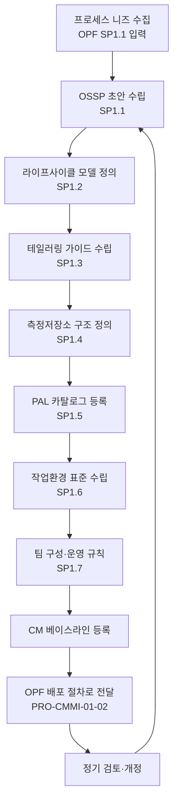

# 조직 표준프로세스(OSSP) 수립·유지 절차 (PRO-CMMI-01-01)

상위 정책: [[POL-CMMI-01_조직_프로세스_거버넌스_정책]] · 표준: CMMI-DEV V1.3 OPD

## 1. 목적
조직이 사용할 표준프로세스 집합(OSSP)과 관련 자산(라이프사이클 모델, 테일러링 가이드, 측정저장소, PAL, 작업환경 표준, 팀 운영 규칙)을 수립·유지하여, 모든 프로젝트가 일관된 기준 위에서 정의된 프로세스를 운영할 수 있도록 한다.

## 2. 적용 범위
조직이 OPD SG1 SP1.1~1.7을 만족하기 위해 EPG·Process Owner·CM이 OSSP 자산을 생성·개정·게시·통제하는 활동에 적용한다.

## 3. 정의
- **OSSP** (Organization's Set of Standard Processes): 조직 표준프로세스 집합.
- **PAL** (Process Asset Library): 프로세스 자산 라이브러리.
- **Lifecycle Model**: 프로젝트가 OSSP를 적용하는 단계 골격.
- **Tailoring Guideline**: OSSP의 어떤 부분을 어떤 기준으로 수정·제거·추가할 수 있는지 정의한 가이드.

## 4. 역할과 책임 (RACI)
| 단계 | EPG Lead | Process Owner | CM | Measurement Analyst | 경영진 |
|---|---|---|---|---|---|
| OSSP 수립 (SP1.1) | **R** | C | C | C | A |
| 라이프사이클 모델 (SP1.2) | **R** | C | I | I | A |
| 테일러링 가이드 (SP1.3) | **R** | C | C | I | A |
| 측정저장소 (SP1.4) | C | I | I | **R** | A |
| PAL (SP1.5) | **R** | C | **R** | C | A |
| 작업환경 표준 (SP1.6) | **R** | C | I | I | A |
| 팀 규칙 (SP1.7) | **R** | C | I | I | A |

## 5. 절차 흐름



## 6. SG/SP 매핑 및 단계별 상세

| #   | SP    | 단계 | 입력 | 출력 (TMP 후보) |
|---|---|---|---|---|
| 1 | SP1.1 | 표준프로세스 수립 | 프로세스 니즈 (OPF SP1.1) | 조직 표준프로세스 집합(OSSP) |
| 2 | SP1.2 | 라이프사이클 모델 기술 | OSSP | 라이프사이클 모델 기술서 |
| 3 | SP1.3 | 테일러링 기준·가이드 수립 | OSSP, 라이프사이클 모델 | 테일러링 가이드 |
| 4 | SP1.4 | 조직 측정저장소 수립 | OSSP, MA SP1.1~1.4 | 측정저장소 (구조 + 데이터) |
| 5 | SP1.5 | PAL 수립 | OSSP, 라이프사이클, 테일러링, 측정저장소 | PAL 카탈로그 |
| 6 | SP1.6 | 작업환경 표준 수립 | OSSP | 작업환경 표준 |
| 7 | SP1.7 | 팀 구성·운영 규칙 수립 | OSSP | 팀 운영 규칙 |

### 6.1 SG/SP source citation
| Req-ID | Title | 출처 |
|---|---|---|
| CMMIDEV-OPD-SG1-REQ-001 | Establish Organizational Process Assets | requirements.yaml#CMMIDEV-OPD-SG1-REQ-001 (p.192) |
| CMMIDEV-OPD-SP1.1-REQ-001 | Establish Standard Processes | requirements.yaml#CMMIDEV-OPD-SP1.1-REQ-001 (p.192) |
| CMMIDEV-OPD-SP1.2-REQ-001 | Establish Lifecycle Model Descriptions | requirements.yaml#CMMIDEV-OPD-SP1.2-REQ-001 (p.194) |
| CMMIDEV-OPD-SP1.3-REQ-001 | Establish Tailoring Criteria and Guidelines | requirements.yaml#CMMIDEV-OPD-SP1.3-REQ-001 (p.195) |
| CMMIDEV-OPD-SP1.4-REQ-001 | Establish the Organization's Measurement Repository | requirements.yaml#CMMIDEV-OPD-SP1.4-REQ-001 (p.197) |
| CMMIDEV-OPD-SP1.5-REQ-001 | Establish the Organization's Process Asset Library | requirements.yaml#CMMIDEV-OPD-SP1.5-REQ-001 (p.199) |
| CMMIDEV-OPD-SP1.6-REQ-001 | Establish Work Environment Standards | requirements.yaml#CMMIDEV-OPD-SP1.6-REQ-001 (p.200) |
| CMMIDEV-OPD-SP1.7-REQ-001 | Establish Rules and Guidelines for Teams | requirements.yaml#CMMIDEV-OPD-SP1.7-REQ-001 (p.200) |

## 7. 통제점 / KPI
| 통제점 | 지표 | 목표 | 주기 |
|---|---|---|---|
| OSSP 검토 주기 | 마지막 검토 후 경과 개월 | ≤ 12개월 | 연 |
| PAL 항목 누락률 | OSSP 컴포넌트 대비 PAL 미등록률 | 0% | 분기 |
| 테일러링 가이드 준수율 | 프로젝트 정의 프로세스의 가이드 적합률 | ≥ 95% | 반기 |
| 측정저장소 활용도 | 분기 신규 측정값 등록 건수 | ≥ 1건/PA | 분기 |

## 8. 표준 매핑 (Traceability)
- OPD SG1 → §5 전체 흐름, §6 단계별 상세
- GP 2.6 (CM 통제) → §5 CM 베이스라인 등록 단계
- GP 3.2 (경험 환류) → §5 정기 검토·개정 루프

## 9. source_citation
```yaml
- type: standard_original
  file: "inputs/01_표준원문/CMMI-DEV/requirements.yaml"
  locator: "CMMIDEV-OPD-SG1-REQ-001 (p.192)"
  retrieved_at: "2026-05-11"
  license: "CMU/SEI internal_use_derivative_work"
  paraphrase_only: true
- type: standard_original
  file: "inputs/01_표준원문/CMMI-DEV/requirements.yaml"
  locator: "CMMIDEV-OPD-SP1.1~1.7-REQ-001 (p.192-200)"
  retrieved_at: "2026-05-11"
- type: standard_original
  file: "inputs/01_표준원문/CMMI-DEV/definitions.yaml"
  locator: "OSSP, OPA, PAL definitions"
  retrieved_at: "2026-05-11"
```

## 10. 개정 이력
| 버전 | 일자 | 변경내용 | 승인자 |
|---|---|---|---|
| 0.1 | 2026-05-11 | 최초 초안 (process-designer 생성) | - |
