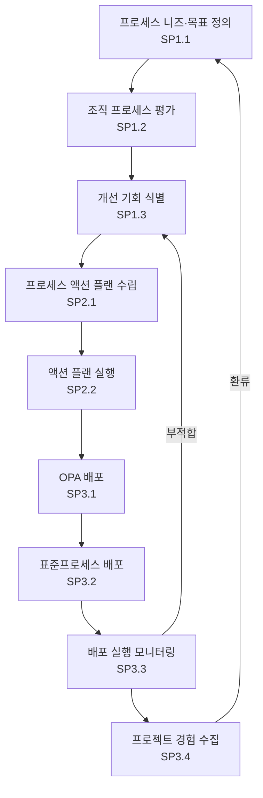

# 조직 프로세스 개선·배포 절차 (PRO-CMMI-01-02)

상위 정책: [[POL-CMMI-01_조직_프로세스_거버넌스_정책]] · 표준: CMMI-DEV V1.3 OPF

## 1. 목적
조직의 프로세스·OPA를 정기적으로 평가하여 개선 기회를 식별·계획·실행·배포하고, 프로젝트 경험을 OPA에 환류하여 지속적 개선 사이클을 운영한다.

## 2. 적용 범위
EPG·경영진·Process Owner·프로젝트가 참여하는 조직 차원의 프로세스 평가·개선·배포 활동에 적용한다.

## 3. 정의
- **Process Need**: 비즈니스 목표·표준·이해관계자가 요구하는 프로세스 특성.
- **Process Action**: 식별된 개선 기회를 실행 가능한 계획으로 만든 단위 활동.
- **Appraisal**: 프로세스 평가 (SCAMPI A/B/C 등).

## 4. 역할과 책임 (RACI)
| 단계 | EPG Lead | Senior Mgmt | Process Owner | 프로젝트 | PPQA |
|---|---|---|---|---|---|
| 니즈·목표 정의 (SP1.1) | C | **R** | C | I | I |
| 평가 (SP1.2) | **R** | A | C | C | C |
| 개선 식별 (SP1.3) | **R** | C | C | I | I |
| 액션 플랜 수립 (SP2.1) | **R** | A | C | I | I |
| 액션 플랜 실행 (SP2.2) | **R** | I | C | C | I |
| OPA 배포 (SP3.1) | **R** | I | C | I | I |
| 표준프로세스 배포 (SP3.2) | **R** | I | C | C | I |
| 실행 모니터링 (SP3.3) | **R** | C | C | C | C |
| 경험 통합 (SP3.4) | **R** | I | C | C | I |

## 5. 절차 흐름



## 6. SG/SP 매핑 및 단계별 상세

| #   | SP    | 단계 | 입력 | 출력 (TMP 후보) |
|---|---|---|---|---|
| 1 | SP1.1 | 조직 프로세스 니즈·목표 정의 | 비즈니스 목표, 표준 요건 | 프로세스 니즈·목표 기술서 |
| 2 | SP1.2 | 프로세스 평가 | 평가 계획, OSSP | 평가 결과보고서 |
| 3 | SP1.3 | 개선 기회 식별 | 평가 결과 | 개선 권고 목록 |
| 4 | SP2.1 | 프로세스 액션 플랜 수립 | 개선 권고 | 액션 플랜 |
| 5 | SP2.2 | 액션 플랜 실행 | 액션 플랜 | 액션 추진 기록 |
| 6 | SP3.1 | OPA 배포 | OPA 업데이트 | 배포 계획·교육자료 |
| 7 | SP3.2 | 표준프로세스 배포 | OSSP, 배포 계획 | 배포 가이드, 교육 완료 |
| 8 | SP3.3 | 배포 실행 모니터링 | 배포 가이드, 프로젝트 사용 데이터 | 컴플라이언스 감사 결과 |
| 9 | SP3.4 | 경험 통합 | 프로젝트 측정값·교훈 | 교훈 등록부, OPA 업데이트 |

### 6.1 SG/SP source citation
| Req-ID | Title | 출처 |
|---|---|---|
| CMMIDEV-OPF-SG1-REQ-001 | Determine Process Improvement Opportunities | requirements.yaml#CMMIDEV-OPF-SG1-REQ-001 (p.204) |
| CMMIDEV-OPF-SP1.1-REQ-001 | Establish Organizational Process Needs | requirements.yaml#CMMIDEV-OPF-SP1.1-REQ-001 (p.204) |
| CMMIDEV-OPF-SP1.2-REQ-001 | Appraise the Organization's Processes | requirements.yaml#CMMIDEV-OPF-SP1.2-REQ-001 (p.206) |
| CMMIDEV-OPF-SP1.3-REQ-001 | Identify the Organization's Process Improvements | requirements.yaml#CMMIDEV-OPF-SP1.3-REQ-001 (p.207) |
| CMMIDEV-OPF-SG2-REQ-001 | Plan and Implement Process Actions | requirements.yaml#CMMIDEV-OPF-SG2-REQ-001 (p.208) |
| CMMIDEV-OPF-SP2.1-REQ-001 | Establish Process Action Plans | requirements.yaml#CMMIDEV-OPF-SP2.1-REQ-001 (p.208) |
| CMMIDEV-OPF-SP2.2-REQ-001 | Implement Process Action Plans | requirements.yaml#CMMIDEV-OPF-SP2.2-REQ-001 (p.209) |
| CMMIDEV-OPF-SG3-REQ-001 | Deploy Organizational Process Assets and Incorporate Experiences | requirements.yaml#CMMIDEV-OPF-SG3-REQ-001 (p.210) |
| CMMIDEV-OPF-SP3.1-REQ-001 | Deploy Organizational Process Assets | requirements.yaml#CMMIDEV-OPF-SP3.1-REQ-001 (p.210) |
| CMMIDEV-OPF-SP3.2-REQ-001 | Deploy Standard Processes | requirements.yaml#CMMIDEV-OPF-SP3.2-REQ-001 (p.211) |
| CMMIDEV-OPF-SP3.3-REQ-001 | Monitor the Implementation | requirements.yaml#CMMIDEV-OPF-SP3.3-REQ-001 (p.212) |
| CMMIDEV-OPF-SP3.4-REQ-001 | Incorporate Experiences into Organizational Process Assets | requirements.yaml#CMMIDEV-OPF-SP3.4-REQ-001 (p.213) |

## 7. 통제점 / KPI
| 통제점 | 지표 | 목표 | 주기 |
|---|---|---|---|
| 개선 액션 종결률 | 종결 ÷ 등록 | ≥ 80% | 반기 |
| 평가 주기 | 마지막 평가 후 경과 개월 | ≤ 12개월 | 연 |
| 배포 컴플라이언스 | 프로젝트의 표준 적용률 | ≥ 90% | 반기 |
| 교훈 등록 건수 | 분기 신규 등록 | ≥ 5건 | 분기 |

## 8. 표준 매핑 (Traceability)
- OPF SG1~SG3 → §5 절차 흐름 + §6 단계별 상세
- BPM-feeds-OT → §6 SP3.2 표준 프로세스 배포는 [[PRO-CMMI-01-03_조직_훈련_절차]] OT SP1.1 입력
- GP 3.2 → §5 SP3.4 경험 환류 루프

## 9. source_citation
```yaml
- type: standard_original
  file: "inputs/01_표준원문/CMMI-DEV/requirements.yaml"
  locator: "CMMIDEV-OPF-SG1~SG3-REQ-001 (p.204-213)"
  retrieved_at: "2026-05-11"
  license: "CMU/SEI internal_use_derivative_work"
  paraphrase_only: true
- type: standard_original
  file: "inputs/01_표준원문/CMMI-DEV/pa_relationships.yaml"
  locator: "BPM-feeds-OT (p.40)"
  retrieved_at: "2026-05-11"
```

## 10. 개정 이력
| 버전 | 일자 | 변경내용 | 승인자 |
|---|---|---|---|
| 0.1 | 2026-05-11 | 최초 초안 (process-designer 생성) | - |
