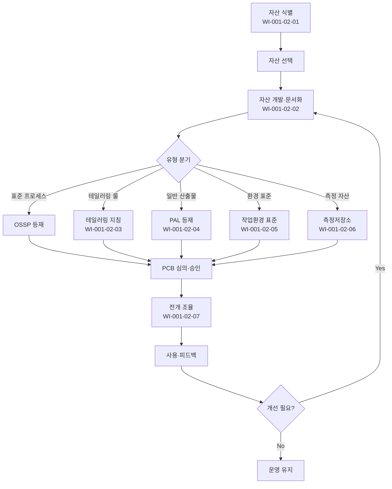

# 프로세스 자산 개발 절차 (PRO-CMMI-01-02)

> 상위 정책: [[POL-CMMI-01_거버넌스_및_프로세스자산_정책_v1.0]]

## 1. 목적
조직 차원에서 프로세스 자산(OSSP·테일러링 지침·PAL·작업환경 표준·측정 저장소)을 식별·개발·유지·갱신·전개하는 통제된 흐름을 정의한다.

## 2. 적용 범위
- 전사 SEPG 가 관리하는 모든 프로세스 자산
- 프로젝트가 자산 라이브러리에 등재 요청하는 산출물·교훈
- 작업환경(개발툴체인·서버·라이선스) 표준

## 3. 역할과 책임 (RACI)
| 단계 | SEPG | PCB | Process Owner | PM | QA |
|---|---|---|---|---|---|
| 자산 식별·선택 | **R** | **A** | C | C | I |
| 자산 개발·기록 | **R** | A | C | C | C |
| OSSP 정의 | **R** | **A** | C | I | C |
| 테일러링 지침 작성 | **R** | A | C | C | I |
| PAL 구축·운영 | **R** | A | C | I | I |
| 작업환경 표준 | **R** | A | C | C | I |
| 측정저장소 운영 | **R** | A | C | C | I |
| 전개 조율 | R | A | **R** | **R** | I |

## 4. 절차 흐름


## 5. 단계별 상세
| # | 단계 | 설명 | 담당 | 입력 | 출력 |
|---|---|---|---|---|---|
| 1 | 식별·선택 | 사용할 자산 후보 식별·평가·선택 | SEPG | 비즈니스 요구·표준 | 자산 후보 목록 |
| 2 | 개발·기록 | 자산 작성·기록·갱신 | SEPG | 후보 | 초안 자산 |
| 3 | OSSP 등재 | 표준 프로세스 집합 정의·갱신 | SEPG | 초안 | OSSP v.X |
| 4 | 테일러링 지침 | 테일러링 기준·범위·예외 정의 | SEPG | OSSP | 테일러링 지침 |
| 5 | PAL 운영 | 자산 라이브러리 등재·검색·버전 관리 | SEPG | 자산 | PAL 갱신본 |
| 6 | 환경 표준 | 도구체인·서버·라이선스 표준 정의 | SEPG | 환경 요건 | 환경 표준서 |
| 7 | 측정저장소 | 조직 측정값·이력·메타정의 운영 | SEPG | 측정 정의 | 측정저장소 갱신 |
| 8 | 전개 조율 | 이해관계자 협력 → 도입·교육·피드백 | Process Owner/SEPG | 자산 v.X | 전개 보고 |

## 6. 연계 업무지침 (WI)
- [[WI-CMMI-01-02-01_프로세스_자산_식별_및_선택_v1.0]]
- [[WI-CMMI-01-02-02_OSSP_개발_및_유지_v1.0]]
- [[WI-CMMI-01-02-03_테일러링_지침_운영_v1.0]]
- [[WI-CMMI-01-02-04_PAL_구축_및_운영_v1.0]]
- [[WI-CMMI-01-02-05_작업환경_표준_관리_v1.0]]
- [[WI-CMMI-01-02-06_조직_측정저장소_운영_v1.0]]
- [[WI-CMMI-01-02-07_프로세스_자산_전개_조율_v1.0]]

## 7. 통제점 / KPI
| 통제점 | 지표 | 목표 | 주기 |
|---|---|---|---|
| OSSP 갱신 주기 | 연 1회 이상 갱신 | 100% | 연 |
| 테일러링 적용율 | 적용 프로젝트 비율 | ≥ 90% | 분기 |
| PAL 등재 자산 수 | 신규 등재 건수 | ≥ 24/년 | 연 |
| 측정저장소 등재율 | 종료 프로젝트 등재 | 100% | 분기 |
| 자산 전개 만족도 | 사용자 설문 | ≥ 4.0/5.0 | 반기 |

## 8. 표준 매핑 (Traceability)
| Practice | Req-ID | 반영 위치 |
|---|---|---|
| PAD 1.1 | CMMI-PAD-1.1 | §5-2 자산 개발 |
| PAD 2.1 | CMMI-PAD-2.1 | §5-1 식별·선택 |
| PAD 2.2 | CMMI-PAD-2.2 | §5-2 기록·갱신 |
| PAD 3.1 | CMMI-PAD-3.1 | §5-3 OSSP |
| PAD 3.2 | CMMI-PAD-3.2 | §5-4 테일러링 지침 |
| PAD 3.3 | CMMI-PAD-3.3 | §5-5 PAL |
| PAD 3.4 | CMMI-PAD-3.4 | §5-6 작업환경 표준 |
| PAD 3.5 | CMMI-PAD-3.5 | §5-7 측정저장소 |
| PAD 3.6 | CMMI-PAD-3.6 | §5-8 전개 조율 |

## 9. 출처 (source_citation)
```yaml
- type: standard_original
  file: "_inputs/01_표준원문/CMMI-DEV/Core PAs/PAD.pdf"
  locator: "Process Asset Development PG1~PG3"
  retrieved_at: "2026-04-29"
  license: "ISACA copyright — paraphrase only"
  paraphrase_only: true
```

## 10. 개정 이력
| 버전 | 일자 | 변경내용 | 승인자 |
|---|---|---|---|
| 1.0 | 2026-04-29 | 최초 승인 (CMMI-DEV-ML3 편입) | CEO |
