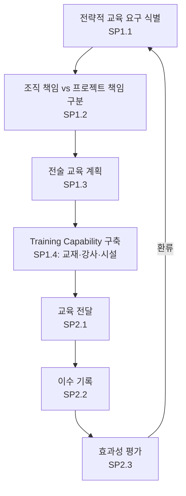

# 조직 훈련 절차 (PRO-CMMI-01-03)

상위 정책: [[POL-CMMI-01_조직_프로세스_거버넌스_정책]] · 표준: CMMI-DEV V1.3 OT

## 1. 목적
조직의 전략·표준프로세스 니즈에서 교육 요구를 도출하여 전술계획·교육자료·강사 풀을 구축하고, 교육을 제공·기록·평가하여 인력의 프로세스 수행 역량을 보장한다.

## 2. 적용 범위
조직 책임의 전략적 교육에 적용한다. 프로젝트별·개인별 일회성 요구는 [[PRO-CMMI-02-01_프로젝트_계획_절차]] PP SP2.5(필요 지식·스킬 계획)로 처리한다.

## 3. 정의
- **Strategic Training Need**: 조직 비즈니스 전략·OSSP 수행을 위해 필요한 역량.
- **Tactical Plan**: 분기·연 단위 교육 일정·자원·콘텐츠 계획.
- **Training Capability**: 교육자료·강사·시설·관리도구의 운영 능력.

## 4. 역할과 책임 (RACI)
| 단계 | Training Mgr | EPG Lead | Senior Mgmt | Process Owner | 학습자 |
|---|---|---|---|---|---|
| 전략적 교육 요구 (SP1.1) | **R** | C | A | C | I |
| 책임 구분 (SP1.2) | **R** | C | A | C | I |
| 전술 계획 (SP1.3) | **R** | C | A | C | I |
| Training Capability (SP1.4) | **R** | C | I | C | I |
| 교육 전달 (SP2.1) | **R** | I | I | C | C |
| 이수 기록 (SP2.2) | **R** | I | I | I | C |
| 효과성 평가 (SP2.3) | **R** | C | I | C | C |

## 5. 절차 흐름



## 6. SG/SP 매핑 및 단계별 상세

| #   | SP    | 단계 | 입력 | 출력 (TMP 후보) |
|---|---|---|---|---|
| 1 | SP1.1 | 전략적 교육요구 식별 | OSSP, 비즈니스 전략, OPF 개선결과 | 전략적 교육요구 분석서 |
| 2 | SP1.2 | 조직 책임 식별 | 교육요구 분석서 | 교육 약정서 (조직 책임 범위) |
| 3 | SP1.3 | 전술 계획 수립 | 약정서 | 조직 교육 전술계획 |
| 4 | SP1.4 | Training Capability 수립 | 전술계획 | 교육자료·강사 풀·커리큘럼 |
| 5 | SP2.1 | 교육 전달 | 커리큘럼 | 교육 세션 |
| 6 | SP2.2 | 이수 기록 | 출석·평가 | 교육 이수 기록 |
| 7 | SP2.3 | 효과성 평가 | 이수 기록, 성과 데이터 | 효과성 평가 보고서 |

### 6.1 SG/SP source citation
| Req-ID | Title | 출처 |
|---|---|---|
| CMMIDEV-OT-SG1-REQ-001 | Establish an Organizational Training Capability | requirements.yaml#CMMIDEV-OT-SG1-REQ-001 (p.248) |
| CMMIDEV-OT-SP1.1-REQ-001 | Establish Strategic Training Needs | requirements.yaml#CMMIDEV-OT-SP1.1-REQ-001 (p.248) |
| CMMIDEV-OT-SP1.2-REQ-001 | Determine Which Training Needs Are the Responsibility of the Organization | requirements.yaml#CMMIDEV-OT-SP1.2-REQ-001 (p.250) |
| CMMIDEV-OT-SP1.3-REQ-001 | Establish an Organizational Training Tactical Plan | requirements.yaml#CMMIDEV-OT-SP1.3-REQ-001 (p.250) |
| CMMIDEV-OT-SP1.4-REQ-001 | Establish a Training Capability | requirements.yaml#CMMIDEV-OT-SP1.4-REQ-001 (p.251) |
| CMMIDEV-OT-SG2-REQ-001 | Provide Training | requirements.yaml#CMMIDEV-OT-SG2-REQ-001 (p.253) |
| CMMIDEV-OT-SP2.1-REQ-001 | Deliver Training | requirements.yaml#CMMIDEV-OT-SP2.1-REQ-001 (p.254) |
| CMMIDEV-OT-SP2.2-REQ-001 | Establish Training Records | requirements.yaml#CMMIDEV-OT-SP2.2-REQ-001 (p.254) |
| CMMIDEV-OT-SP2.3-REQ-001 | Assess Training Effectiveness | requirements.yaml#CMMIDEV-OT-SP2.3-REQ-001 (p.255) |

## 7. 통제점 / KPI
| 통제점 | 지표 | 목표 | 주기 |
|---|---|---|---|
| 이수율 | 등록 인원 대비 이수 | ≥ 95% | 분기 |
| 만족도 | 설문 4점 척도 | ≥ 4.0/5.0 | 분기 |
| 효과성 (수행도) | 사전·사후 평가 차이 | +20% 이상 | 반기 |
| 교육 계획 충족 | 계획 대비 실시 강좌 | ≥ 90% | 분기 |

## 8. 표준 매핑 (Traceability)
- OT SG1~SG2 → §5 흐름, §6 단계
- BPM-feeds-OT (p.40) → §6 SP1.1 입력 (OSSP·OPF에서 교육 니즈)
- GP 2.5 → 본 PRO 전체

## 9. source_citation
```yaml
- type: standard_original
  file: "inputs/01_표준원문/CMMI-DEV/requirements.yaml"
  locator: "CMMIDEV-OT-SG1~SG2-REQ-001 (p.247-255)"
  retrieved_at: "2026-05-11"
  license: "CMU/SEI internal_use_derivative_work"
  paraphrase_only: true
- type: standard_original
  file: "inputs/01_표준원문/CMMI-DEV/pa_relationships.yaml"
  locator: "BPM-feeds-OT (p.40)"
  retrieved_at: "2026-05-11"
```

## 10. 개정 이력
| 버전 | 일자 | 변경내용 | 승인자 |
|---|---|---|---|
| 0.1 | 2026-05-11 | 최초 초안 (process-designer 생성) | - |
