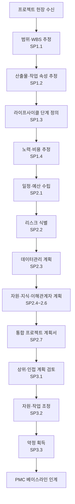

# 프로젝트 계획 절차 (PRO-CMMI-02-01)

상위 정책: [[POL-CMMI-02_프로젝트_관리_정책]] · 표준: CMMI-DEV V1.3 PP

## 1. 목적
프로젝트의 범위·산출물 속성·라이프사이클·노력·일정·예산·리스크·데이터관리·자원·지식·이해관계자 참여를 추정·계획하여 통합 프로젝트 계획서를 수립하고, 관련 이해관계자의 약정을 획득한다.

## 2. 적용 범위
모든 신규 개발 프로젝트의 착수 단계 (kick-off 이전) 및 주요 베이스라인 변경 시 적용한다.

## 3. 정의
- **WBS** (Work Breakdown Structure): 작업분해구조.
- **Project Plan**: 일정·예산·리스크·자원·이해관계자·데이터 관리를 통합한 단일 계획.
- **Commitment**: 약정 — 관련자의 동의·서명·승인.

## 4. 역할과 책임 (RACI)
| 단계 | Project Manager | Engineer | EPG (테일러링) | Risk Manager | 이해관계자 | CEO/Sponsor |
|---|---|---|---|---|---|---|
| 범위 추정 (SP1.1) | **R** | C | I | I | C | A |
| 속성·라이프사이클 (SP1.2~1.3) | **R** | C | C | I | I | A |
| 노력·예산 추정 (SP1.4~SP2.1) | **R** | C | C | I | C | A |
| 리스크 식별 (SP2.2) | **R** | C | I | C | C | A |
| 데이터관리 (SP2.3) | **R** | C | I | I | I | A |
| 자원·스킬 (SP2.4~2.5) | **R** | C | C | I | I | A |
| 이해관계자 참여 (SP2.6) | **R** | I | I | I | C | A |
| 통합 계획서 (SP2.7) | **R** | C | C | C | I | A |
| 약정 검토·조정·획득 (SP3.1~3.3) | **R** | I | I | I | C | **A** |

## 5. 절차 흐름



## 6. SG/SP 매핑 및 단계별 상세

| #   | SP    | 단계 | 입력 | 출력 (TMP 후보) |
|---|---|---|---|---|
| 1 | SP1.1 | 범위 추정 | 프로젝트 헌장 | WBS, 작업패키지 설명서 |
| 2 | SP1.2 | 산출물·작업 속성 추정 | WBS | 산출물 속성 추정표 |
| 3 | SP1.3 | 라이프사이클 단계 정의 | OSSP 라이프사이클 | 라이프사이클 단계정의 |
| 4 | SP1.4 | 노력·비용 추정 | WBS, 속성, 단계 | 추정 근거서 |
| 5 | SP2.1 | 예산·일정 수립 | 추정 | 일정·예산 |
| 6 | SP2.2 | 리스크 식별 | 추정, 일정 | 프로젝트 리스크 목록 |
| 7 | SP2.3 | 데이터관리 계획 | WBS | 데이터관리 계획 |
| 8 | SP2.4 | 자원 계획 | WBS, 일정 | 자원 계획 |
| 9 | SP2.5 | 지식·스킬 계획 | 자원 계획 | 지식·스킬 인벤토리 (OT 연계) |
| 10 | SP2.6 | 이해관계자 참여 계획 | 라이프사이클 | 이해관계자 참여 계획 |
| 11 | SP2.7 | 통합 계획서 수립 | SP1.1~2.6 산출물 | 프로젝트 계획서 v0 |
| 12 | SP3.1 | 영향 계획 검토 | 계획서 | 검토 의견 |
| 13 | SP3.2 | 작업·자원 조정 | 검토 의견 | 조정 계획 |
| 14 | SP3.3 | 약정 획득 | 조정 계획 | 약정 검토 기록 |

### 6.1 SG/SP source citation
| Req-ID | Title | 출처 |
|---|---|---|
| CMMIDEV-PP-SG1-REQ-001 | Establish Estimates | requirements.yaml#CMMIDEV-PP-SG1-REQ-001 (p.283) |
| CMMIDEV-PP-SP1.1~1.4-REQ-001 | Estimate scope/attributes/lifecycle/effort | requirements.yaml (p.283-287) |
| CMMIDEV-PP-SG2-REQ-001 | Develop a Project Plan | requirements.yaml#CMMIDEV-PP-SG2-REQ-001 (p.288) |
| CMMIDEV-PP-SP2.1~2.7-REQ-001 | Budget/Risk/Data/Resource/Knowledge/Stakeholder/Plan | requirements.yaml (p.289-296) |
| CMMIDEV-PP-SG3-REQ-001 | Obtain Commitment to the Plan | requirements.yaml#CMMIDEV-PP-SG3-REQ-001 (p.297) |
| CMMIDEV-PP-SP3.1~3.3-REQ-001 | Review/Reconcile/Obtain commitment | requirements.yaml (p.297-298) |

## 7. 통제점 / KPI
| 통제점 | 지표 | 목표 | 주기 |
|---|---|---|---|
| 계획 베이스라인 변경 | 베이스라인 후 변경 건수 | ≤ 분기 2건 | 분기 |
| 추정 정확도 | 실적/추정 편차 | ±20% 이내 | 프로젝트 종료 |
| 약정 미충족률 | 미충족 약정 / 전체 | ≤ 5% | 월 |
| 이해관계자 식별 누락 | PMC에서 신규 식별 건수 | ≤ 2건/프로젝트 | 프로젝트 종료 |

## 8. 표준 매핑 (Traceability)
- PP SG1~SG3 → §5 흐름, §6 단계
- PP-baseline-for-PMC (p.44) → §5 마지막 단계 (PMC 인계)
- IPM SP1.4 (Integrate Plans) → 통합 계획서가 IPM에서 추가 통합되어 사용됨

## 9. source_citation
```yaml
- type: standard_original
  file: "inputs/01_표준원문/CMMI-DEV/requirements.yaml"
  locator: "CMMIDEV-PP-SG1~SG3-REQ-001 (p.283-298)"
  retrieved_at: "2026-05-11"
  license: "CMU/SEI internal_use_derivative_work"
  paraphrase_only: true
- type: standard_original
  file: "inputs/01_표준원문/CMMI-DEV/pa_relationships.yaml"
  locator: "PP-baseline-for-PMC (p.44)"
  retrieved_at: "2026-05-11"
```

## 10. 개정 이력
| 버전 | 일자 | 변경내용 | 승인자 |
|---|---|---|---|
| 0.1 | 2026-05-11 | 최초 초안 (process-designer 생성) | - |
