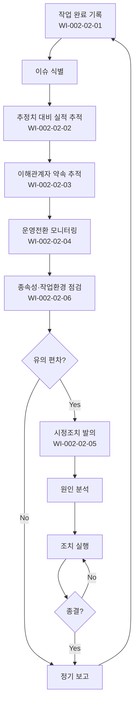

# 프로젝트 모니터링 및 통제 절차 (PRO-CMMI-02-02)

> 상위 정책: [[POL-CMMI-02_프로젝트관리_정책_v1.0]]

## 1. 목적
계획 대비 실적·약속 이행·전환 진척·작업환경 상태를 정기 모니터링하고, 의미 있는 편차에 대해 시정조치를 발의·종결하여 프로젝트 가시성·통제력을 확보한다.

## 2. 적용 범위
- 승인된 모든 프로젝트의 진척 모니터링
- 보고 주기는 프로젝트 등급별 적용 (대형 주 1회, 중형 격주, 소형 월 1회)
- 운영·지원 전환 활동도 본 절차 대상

## 3. 역할과 책임 (RACI)
| 단계 | PM | 팀원 | PMO | 이해관계자 | CEO |
|---|---|---|---|---|---|
| 작업 완료·이슈 | C | **R** | I | I | - |
| 실적 추적 | **R** | C | A | I | I |
| 약속 추적 | **R** | C | C | C | I |
| 전환 모니터링 | **R** | C | C | C | I |
| 시정조치 | **R** | C | A | I | I |
| 종속성·환경 관리 | **R** | C | C | C | I |

## 4. 절차 흐름


## 5. 단계별 상세
| # | 단계 | 설명 | 담당 | 입력 | 출력 |
|---|---|---|---|---|---|
| 1 | 작업 완료·이슈 | 일일/주간 진척·이슈 기록 | 팀원 | 작업 목록 | 진척 데이터·이슈 |
| 2 | 실적 추적 | 규모·작업량·일정·자원·예산 실적 vs 추정 | PM | 진척·추정서 | 편차 분석 |
| 3 | 약속 추적 | 이해관계자 약속·참여 추적 | PM | 약속 목록 | 약속 상태 |
| 4 | 전환 모니터링 | 운영·지원 전환 진척 | PM | 전환 계획 | 전환 상태 |
| 5 | 종속성·환경 | 외부 종속성·환경 이슈 점검 | PM | 종속성 목록 | 종속성 상태 |
| 6 | 시정조치 | 편차 시 발의·실행·종결 | PM | 편차 분석 | 시정조치 종결 |
| 7 | 정기 보고 | 등급별 주기 보고 | PM | 종합 데이터 | 진척 보고서 |

## 6. 연계 업무지침 (WI)
- [[WI-CMMI-02-02-01_작업_완료_및_이슈_식별_v1.0]]
- [[WI-CMMI-02-02-02_추정치_대비_실적_추적_v1.0]]
- [[WI-CMMI-02-02-03_이해관계자_약속_추적_v1.0]]
- [[WI-CMMI-02-02-04_운영전환_모니터링_v1.0]]
- [[WI-CMMI-02-02-05_시정조치_발의_및_종결_v1.0]]
- [[WI-CMMI-02-02-06_종속성_및_작업환경_관리_v1.0]]

## 7. 통제점 / KPI
| 통제점 | 지표 | 목표 | 주기 |
|---|---|---|---|
| 보고 적시성 | 정기 보고서 기한 준수 | ≥ 95% | 월 |
| 일정 편차율 | SPI 기준 | 0.9 ≤ SPI ≤ 1.1 | 월 |
| 비용 편차율 | CPI 기준 | 0.9 ≤ CPI ≤ 1.1 | 월 |
| 시정조치 종결률 | 발의 대비 종결 | ≥ 90% | 분기 |
| 이슈 평균 해결 기간 | 발의→종결 | ≤ 10 영업일 | 월 |

## 8. 표준 매핑 (Traceability)
| Practice | Req-ID | 반영 위치 |
|---|---|---|
| MC 1.1 | CMMI-MC-1.1 | §5-1 작업 완료 |
| MC 1.2 | CMMI-MC-1.2 | §5-1 이슈 식별 |
| MC 2.1 | CMMI-MC-2.1 | §5-2 실적 추적 |
| MC 2.2 | CMMI-MC-2.2 | §5-3 약속 추적 |
| MC 2.3 | CMMI-MC-2.3 | §5-4 전환 |
| MC 2.4 | CMMI-MC-2.4 | §5-6 시정조치 |
| MC 3.1 | CMMI-MC-3.1 | §5-7 정기 보고 |
| MC 3.2 | CMMI-MC-3.2 | §5-5 종속성 |
| MC 3.3 | CMMI-MC-3.3 | §5-5 환경 |
| MC 3.4 | CMMI-MC-3.4 | §5-3,6 이해관계자 협력 |

## 9. 출처 (source_citation)
```yaml
- type: standard_original
  file: "_inputs/01_표준원문/CMMI-DEV/Core PAs/MC.pdf"
  locator: "Monitor & Control PG1~PG3 (직접 Read 확인)"
  retrieved_at: "2026-04-29"
  license: "ISACA copyright — paraphrase only"
  paraphrase_only: true
```

## 10. 개정 이력
| 버전 | 일자 | 변경내용 | 승인자 |
|---|---|---|---|
| 1.0 | 2026-04-29 | 최초 승인 (CMMI-DEV-ML3 편입) | CEO |
