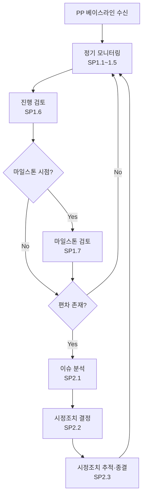

# 프로젝트 모니터링·통제 절차 (PRO-CMMI-02-02)

상위 정책: [[POL-CMMI-02_프로젝트_관리_정책]] · 표준: CMMI-DEV V1.3 PMC

## 1. 목적
PP 산출 통합 계획서를 베이스라인으로 프로젝트 진행을 정기적으로 평가하고, 편차에 대해 시정조치를 분석·실행·종결까지 관리하여 프로젝트 결과를 약정에 정렬시킨다.

## 2. 적용 범위
프로젝트 착수(PP 약정 획득) 이후부터 종료까지의 전 기간. 베이스라인 변경은 PP 절차로 회귀.

## 3. 정의
- **Planning Parameter**: PP 베이스라인의 일정·예산·노력·범위 등.
- **Corrective Action**: 편차·이슈 해결을 위한 시정 활동.
- **Milestone Review**: 라이프사이클 단계 종료 시점 검토.

## 4. 역할과 책임 (RACI)
| 단계 | Project Manager | Engineer | Risk Manager | 이해관계자 | Senior Mgmt |
|---|---|---|---|---|---|
| 파라미터 모니터링 (SP1.1) | **R** | C | I | I | I |
| 약정 모니터링 (SP1.2) | **R** | I | I | C | I |
| 리스크 모니터링 (SP1.3) | C | I | **R** | I | I |
| 데이터관리 모니터링 (SP1.4) | **R** | I | I | I | I |
| 이해관계자 참여 (SP1.5) | **R** | I | I | C | I |
| 진행 검토 (SP1.6) | **R** | C | C | C | A |
| 마일스톤 검토 (SP1.7) | **R** | C | C | C | **A** |
| 이슈 분석 (SP2.1) | **R** | C | C | I | I |
| 시정조치 (SP2.2) | **R** | C | I | I | A |
| 시정조치 관리 (SP2.3) | **R** | I | I | I | C |

## 5. 절차 흐름



## 6. SG/SP 매핑 및 단계별 상세

| #   | SP    | 단계 | 입력 | 출력 (TMP 후보) |
|---|---|---|---|---|
| 1 | SP1.1 | 계획 파라미터 모니터링 | PP 베이스라인, 실적 | 프로젝트 성과 기록, 편차 기록 |
| 2 | SP1.2 | 약정 모니터링 | 약정 검토 기록 | 약정 검토 결과 |
| 3 | SP1.3 | 리스크 모니터링 | 리스크 목록 (PP SP2.2) | 리스크 모니터링 기록 |
| 4 | SP1.4 | 데이터관리 모니터링 | 데이터관리 계획 | 데이터관리 평가 기록 |
| 5 | SP1.5 | 이해관계자 참여 모니터링 | 참여 계획 | 이해관계자 참여 기록 |
| 6 | SP1.6 | 진행 검토 | 모니터링 결과 | 진행 검토 결과보고 |
| 7 | SP1.7 | 마일스톤 검토 | 진행 보고, 단계 산출물 | 마일스톤 검토 결과보고 |
| 8 | SP2.1 | 이슈 분석 | 편차·이슈 | 이슈 분석 결과 |
| 9 | SP2.2 | 시정조치 결정 | 이슈 분석 | 시정조치 계획서 |
| 10 | SP2.3 | 시정조치 종결 추적 | 시정조치 계획 | 시정조치 결과보고 |

### 6.1 SG/SP source citation
| Req-ID | Title | 출처 |
|---|---|---|
| CMMIDEV-PMC-SG1-REQ-001 | Monitor the Project Against the Plan | requirements.yaml#CMMIDEV-PMC-SG1-REQ-001 (p.272) |
| CMMIDEV-PMC-SP1.1~1.7-REQ-001 | Monitor parameters/commitments/risks/data/stakeholder/progress/milestone | requirements.yaml (p.272-276) |
| CMMIDEV-PMC-SG2-REQ-001 | Manage Corrective Action to Closure | requirements.yaml#CMMIDEV-PMC-SG2-REQ-001 (p.277) |
| CMMIDEV-PMC-SP2.1~2.3-REQ-001 | Analyze/Take/Manage Corrective Action | requirements.yaml (p.277-279) |

## 7. 통제점 / KPI
| 통제점 | 지표 | 목표 | 주기 |
|---|---|---|---|
| 일정 편차 | (실적-계획)/계획 | ≤ ±10% | 주 |
| 비용 편차 | EVM CV | ≤ ±10% | 월 |
| 시정조치 종결율 | 종결 ÷ 등록 (월별) | ≥ 80% | 월 |
| 마일스톤 통과율 | 정해진 마일스톤 통과 비율 | 100% | 마일스톤별 |

## 8. 표준 매핑 (Traceability)
- PMC SG1~SG2 → §5 흐름, §6 단계
- PP-baseline-for-PMC (p.44) → §5 진입 (PP 베이스라인 수신)
- GP 2.8/2.10 → 본 PRO 자체

## 9. source_citation
```yaml
- type: standard_original
  file: "inputs/01_표준원문/CMMI-DEV/requirements.yaml"
  locator: "CMMIDEV-PMC-SG1~SG2-REQ-001 (p.272-279)"
  retrieved_at: "2026-05-11"
  license: "CMU/SEI internal_use_derivative_work"
  paraphrase_only: true
- type: standard_original
  file: "inputs/01_표준원문/CMMI-DEV/pa_relationships.yaml"
  locator: "PP-baseline-for-PMC (p.44)"
  retrieved_at: "2026-05-11"
```

## 10. 개정 이력
| 버전 | 일자 | 변경내용 | 승인자 |
|---|---|---|---|
| 0.1 | 2026-05-11 | 최초 초안 (process-designer 생성) | - |
