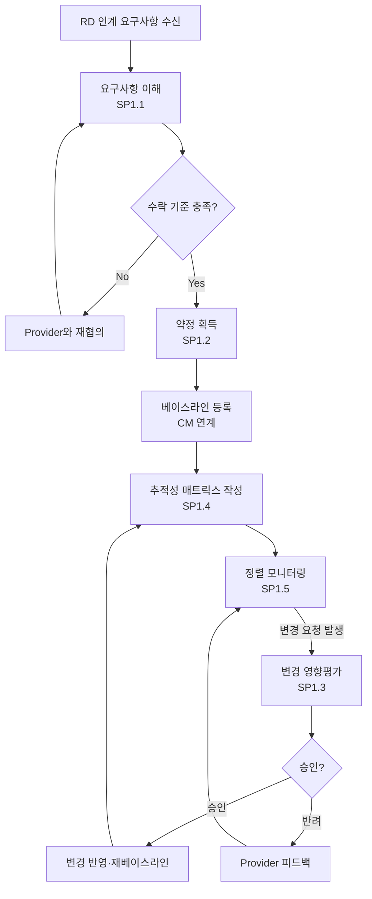

# 요구사항 관리 절차 (PRO-CMMI-02-03)

상위 정책: [[POL-CMMI-02_프로젝트_관리_정책]] · 표준: CMMI-DEV V1.3 REQM

## 1. 목적
프로젝트 요구사항을 이해·평가하여 수락하고, 약정·변경·추적성·정렬을 통제된 방식으로 관리하여 후속 엔지니어링·계획 활동에 일관된 베이스라인을 제공한다.

## 2. 적용 범위
RD가 산출한 고객·제품·인터페이스 요구사항이 프로젝트에 인계된 시점부터 종료까지. 변경 영향평가 후 RD/TS/PI/계획에 통제된 전파를 포함한다.

## 3. 정의
- **Bidirectional Traceability** (REQM SP1.4): 요구사항 ↔ 산출물 양방향 추적.
- **Requirement Provider**: 요구사항 출처 (고객·내부·표준 등).
- **RTM** (Requirements Traceability Matrix): 요구사항 추적성 매트릭스.

## 4. 역할과 책임 (RACI)
| 단계 | Requirements Engineer | Project Manager | Engineer | 고객 |
|---|---|---|---|---|
| 요구사항 이해 (SP1.1) | **R** | C | C | C |
| 약정 획득 (SP1.2) | C | **R** | C | C |
| 변경 관리 (SP1.3) | **R** | C | C | C |
| 추적성 유지 (SP1.4) | **R** | I | C | I |
| 정렬 보증 (SP1.5) | **R** | C | C | I |

## 5. 절차 흐름



## 6. SG/SP 매핑 및 단계별 상세

| #   | SP    | 단계 | 입력 | 출력 (TMP 후보) |
|---|---|---|---|---|
| 1 | SP1.1 | 요구사항 이해 | RD 산출 요구사항 | 요구사항 평가·수락 기준, 승인된 요구사항 집합 |
| 2 | SP1.2 | 약정 획득 | 승인된 요구사항 | 약정 기록 |
| 3 | SP1.3 | 변경 관리 | 변경요청 | 변경영향 보고서, 변경된 베이스라인 |
| 4 | SP1.4 | 양방향 추적성 유지 | 요구사항·하위 산출물 | RTM |
| 5 | SP1.5 | 정렬 보증 | RTM, 산출물 | 부적합 시정조치 기록 |

### 6.1 SG/SP source citation
| Req-ID | Title | 출처 |
|---|---|---|
| CMMIDEV-REQM-SG1-REQ-001 | Manage Requirements | requirements.yaml#CMMIDEV-REQM-SG1-REQ-001 (p.343) |
| CMMIDEV-REQM-SP1.1-REQ-001 | Understand Requirements | requirements.yaml#CMMIDEV-REQM-SP1.1-REQ-001 (p.343) |
| CMMIDEV-REQM-SP1.2-REQ-001 | Obtain Commitment to Requirements | requirements.yaml#CMMIDEV-REQM-SP1.2-REQ-001 (p.344) |
| CMMIDEV-REQM-SP1.3-REQ-001 | Manage Requirements Changes | requirements.yaml#CMMIDEV-REQM-SP1.3-REQ-001 (p.345) |
| CMMIDEV-REQM-SP1.4-REQ-001 | Maintain Bidirectional Traceability of Requirements | requirements.yaml#CMMIDEV-REQM-SP1.4-REQ-001 (p.345) |
| CMMIDEV-REQM-SP1.5-REQ-001 | Ensure Alignment Between Project Work and Requirements | requirements.yaml#CMMIDEV-REQM-SP1.5-REQ-001 (p.346) |

## 7. 통제점 / KPI
| 통제점 | 지표 | 목표 | 주기 |
|---|---|---|---|
| RTM 완전성 | 추적된 요구사항 / 전체 | 100% | 마일스톤별 |
| 변경 리드타임 | 접수→반영 영업일 | ≤ 5일 | 월 |
| 미약정 요구사항 | 미서명 요구사항 수 | 0건 (베이스라인 후) | 마일스톤 |
| 정렬 부적합 | RTM 정렬 부적합 건수 | ≤ 분기 2건 | 분기 |

## 8. 표준 매핑 (Traceability)
- REQM SG1 → §5 흐름, §6 단계
- REQM-feeds-RD-TS (p.45) → §5 변경 반영 후 RD/TS 통제 전파

## 9. source_citation
```yaml
- type: standard_original
  file: "inputs/01_표준원문/CMMI-DEV/requirements.yaml"
  locator: "CMMIDEV-REQM-SG1-REQ-001 (p.343-346)"
  retrieved_at: "2026-05-11"
  license: "CMU/SEI internal_use_derivative_work"
  paraphrase_only: true
- type: standard_original
  file: "inputs/01_표준원문/CMMI-DEV/pa_relationships.yaml"
  locator: "REQM-feeds-RD-TS (p.45)"
  retrieved_at: "2026-05-11"
```

## 10. 개정 이력
| 버전 | 일자 | 변경내용 | 승인자 |
|---|---|---|---|
| 0.1 | 2026-05-11 | 최초 초안 (process-designer 생성) | - |
