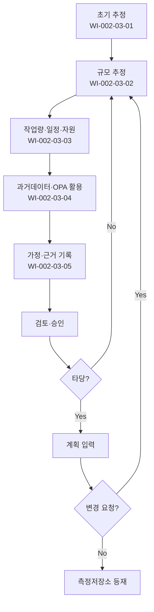

# 추정 관리 절차 (PRO-CMMI-02-03)

> 상위 정책: [[POL-CMMI-02_프로젝트관리_정책_v1.0]]

## 1. 목적
규모 → 작업량/일정/자원의 순서로 모델·과거데이터에 근거한 추정치를 개발·기록·갱신하여 사실 기반 계획·통제의 근거를 제공한다.

## 2. 적용 범위
- 프로젝트 착수 전·중 추정 활동
- 변경요청·재계획 시점의 재추정
- 측정저장소·OSSP 데이터 활용 권장

## 3. 역할과 책임 (RACI)
| 단계 | PM | 팀 시니어 | PMO | SEPG | 검토자 |
|---|---|---|---|---|---|
| 초기 추정 | **R** | C | A | C | I |
| 규모 추정 | C | **R** | A | C | C |
| 작업량·일정 | **R** | C | A | C | C |
| 과거데이터 활용 | C | C | A | **R** | I |
| 가정·매개변수 | **R** | C | A | C | C |
| 검토·승인 | C | C | **A** | C | **R** |

## 4. 절차 흐름


## 5. 단계별 상세
| # | 단계 | 설명 | 담당 | 입력 | 출력 |
|---|---|---|---|---|---|
| 1 | 초기 추정 | 대략적 작업·자원 추정 | PM | 범위 초안 | 초기 추정서 |
| 2 | 규모 추정 | 산출물·작업의 규모(LOC·FP·Story Point 등) | 팀 시니어 | WBS | 규모 추정서 |
| 3 | 작업량·일정·자원 | 규모 → 작업량 → 자원·일정 변환 | PM | 규모 추정 | 작업량/일정/자원 |
| 4 | 과거데이터 활용 | OPA·측정저장소·과거 프로젝트 데이터 사용 | SEPG/PM | 측정저장소 | 적용 데이터 |
| 5 | 가정·매개변수 | 가정·근거·매개변수 기록 | PM | 모델 | 추정 근거서 |
| 6 | 검토·승인 | PMO 검토 + 승인 | PMO | 추정서 | 승인 추정 |

## 6. 연계 업무지침 (WI)
- [[WI-CMMI-02-03-01_초기_추정_수립_v1.0]]
- [[WI-CMMI-02-03-02_규모_추정_v1.0]]
- [[WI-CMMI-02-03-03_작업량_일정_자원_추정_v1.0]]
- [[WI-CMMI-02-03-04_과거데이터_및_OPA_활용_v1.0]]
- [[WI-CMMI-02-03-05_가정_및_매개변수_기록_v1.0]]

## 7. 통제점 / KPI
| 통제점 | 지표 | 목표 | 주기 |
|---|---|---|---|
| 추정 정확도 | 실적 vs 추정 편차 | ≤ ±15% | 프로젝트 |
| 모델 사용율 | 모델 기반 추정 비율 | ≥ 80% | 분기 |
| 추정 근거 기록율 | 가정·매개변수 기록 보유 | 100% | 프로젝트 |
| 측정저장소 활용율 | 과거데이터 활용 비율 | ≥ 70% | 분기 |
| 재추정 적시성 | 변경 후 재추정 5 영업일 | ≥ 90% | 분기 |

## 8. 표준 매핑 (Traceability)
| Practice | Req-ID | 반영 위치 |
|---|---|---|
| EST 1.1 | CMMI-EST-1.1 | §5-1 초기 추정 |
| EST 2.1 | CMMI-EST-2.1 | §5-2 규모 추정 |
| EST 2.2 | CMMI-EST-2.2 | §5-3 작업량·일정·자원 |
| EST 3.1 | CMMI-EST-3.1 | §5-4 측정저장소·OPA |
| EST 3.2 | CMMI-EST-3.2 | §5-5 가정·매개변수 |

## 9. 출처 (source_citation)
```yaml
- type: standard_original
  file: "_inputs/01_표준원문/CMMI-DEV/Core PAs/EST.pdf"
  locator: "Estimating PG1~PG3"
  retrieved_at: "2026-04-29"
  license: "ISACA copyright — paraphrase only"
  paraphrase_only: true
```

## 10. 개정 이력
| 버전 | 일자 | 변경내용 | 승인자 |
|---|---|---|---|
| 1.0 | 2026-04-29 | 최초 승인 (CMMI-DEV-ML3 편입) | CEO |
