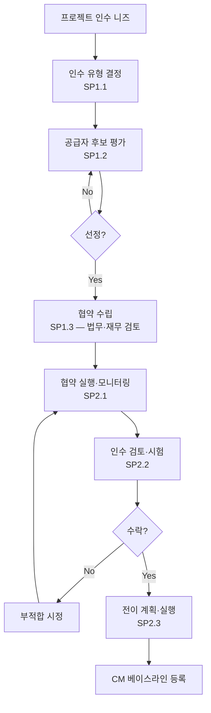

# 공급자 협약 관리 절차 (PRO-CMMI-02-04)

상위 정책: [[POL-CMMI-02_프로젝트_관리_정책]] · 표준: CMMI-DEV V1.3 SAM

## 1. 목적
외주 또는 외부 인수 대상 제품·서비스에 대해 인수 유형을 결정하고, 공급자를 선정·협약하고, 협약 실행을 모니터링하며 제품을 인수·전이한다.

## 2. 적용 범위
외주·외부 인수가 발생하는 모든 프로젝트. COTS·OSS·고객 지급물 등은 협약 형식에 따라 적용 범위 조정.

## 3. 정의
- **Acquisition Type**: COTS / 기성 / 맞춤 개발 / 서비스 / 고객 지급물 등.
- **Supplier Agreement**: 공급자 협약서 (SOW, Contract, Statement of Work).
- **Transition**: 인수된 제품·기술의 운영·유지보수 인계.

## 4. 역할과 책임 (RACI)
| 단계 | Procurement Lead | Project Manager | Engineer | 법무·재무 | 공급자 |
|---|---|---|---|---|---|
| 인수 유형 결정 (SP1.1) | **R** | C | C | I | I |
| 공급자 선정 (SP1.2) | **R** | C | C | C | I |
| 협약 수립 (SP1.3) | **R** | C | C | **A** | C |
| 협약 실행 (SP2.1) | **R** | C | I | I | **R** |
| 인수 (SP2.2) | C | **R** | C | I | C |
| 전이 (SP2.3) | C | **R** | C | I | C |

## 5. 절차 흐름



## 6. SG/SP 매핑 및 단계별 상세

| #   | SP    | 단계 | 입력 | 출력 (TMP 후보) |
|---|---|---|---|---|
| 1 | SP1.1 | 인수 유형 결정 | 인수 니즈 | 인수 유형 목록 |
| 2 | SP1.2 | 공급자 선정 | 후보 평가 기준 | 후보 공급자 목록, 평가 결과 |
| 3 | SP1.3 | 협약 수립 | 선정 공급자 | 공급자 협약서 (SOW/Contract) |
| 4 | SP2.1 | 협약 실행 | 협약서 | 공급자 진행 보고서 |
| 5 | SP2.2 | 제품 인수 | 인수 절차 | 인수 검토/시험 결과 |
| 6 | SP2.3 | 전이 | 수락된 제품 | 전이 계획서 |

### 6.1 SG/SP source citation
| Req-ID | Title | 출처 |
|---|---|---|
| CMMIDEV-SAM-SG1-REQ-001 | Establish Supplier Agreements | requirements.yaml#CMMIDEV-SAM-SG1-REQ-001 (p.365) |
| CMMIDEV-SAM-SP1.1~1.3-REQ-001 | Acquisition Type/Select Suppliers/Establish Agreement | requirements.yaml (p.365-367) |
| CMMIDEV-SAM-SG2-REQ-001 | Satisfy Supplier Agreements | requirements.yaml#CMMIDEV-SAM-SG2-REQ-001 (p.369) |
| CMMIDEV-SAM-SP2.1~2.3-REQ-001 | Execute/Accept/Transition | requirements.yaml (p.369-372) |

## 7. 통제점 / KPI
| 통제점 | 지표 | 목표 | 주기 |
|---|---|---|---|
| 협약 미서명 인수 | 미서명 진행 건수 | 0건 | 분기 |
| 인수 부적합 시정 | 인수 부적합 / 인수 | ≤ 10% | 인수별 |
| 전이 완료 | 전이 완료율 | 100% | 인수별 |
| 협약 변경 건수 | 베이스라인 후 변경 | ≤ 3건/협약 | 협약 종료 |

## 8. 표준 매핑 (Traceability)
- SAM SG1~SG2 → §5 흐름, §6 단계
- BPM-enables-APM (p.45) → 기본 PM(SAM 포함)이 advanced PM 가능케 함

## 9. source_citation
```yaml
- type: standard_original
  file: "inputs/01_표준원문/CMMI-DEV/requirements.yaml"
  locator: "CMMIDEV-SAM-SG1~SG2-REQ-001 (p.365-372)"
  retrieved_at: "2026-05-11"
  license: "CMU/SEI internal_use_derivative_work"
  paraphrase_only: true
```

## 10. 개정 이력
| 버전 | 일자 | 변경내용 | 승인자 |
|---|---|---|---|
| 0.1 | 2026-05-11 | 최초 초안 (process-designer 생성) | - |
