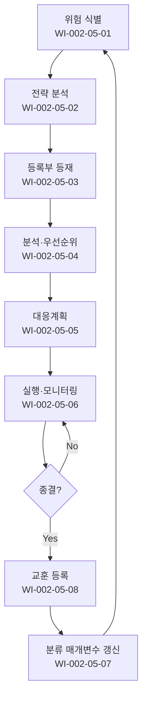

# 리스크 및 기회 관리 절차 (PRO-CMMI-02-05)

> 상위 정책: [[POL-CMMI-02_프로젝트관리_정책_v1.0]]

## 1. 목적
프로젝트·조직 차원의 리스크·기회를 체계적으로 식별·분석·대응·모니터링하여 위협을 줄이고 가치를 극대화한다.

## 2. 적용 범위
- 모든 프로젝트의 리스크·기회 활동
- 조직 차원의 전략적 리스크는 거버넌스(PRO-CMMI-01-01) 와 연계
- ISO 31000 의 일반 리스크 거버넌스 경계면 (interface)

## 3. 역할과 책임 (RACI)
| 단계 | PM | 팀원 | PMO | CEO | SEPG |
|---|---|---|---|---|---|
| 식별·초기처리 | **R** | C | A | I | I |
| 전략 분석 | C | C | **R** | A | C |
| 등록부 관리 | **R** | C | A | I | C |
| 분석·우선순위 | **R** | C | A | I | C |
| 대응계획 | **R** | C | A | I | C |
| 실행·모니터링 | **R** | C | A | I | I |
| 분류 매개변수 | C | C | **R** | A | C |
| 전략·교훈 | C | C | **R** | A | **R** |

## 4. 절차 흐름


## 5. 단계별 상세
| # | 단계 | 설명 | 담당 | 입력 | 출력 |
|---|---|---|---|---|---|
| 1 | 식별 | 위험·기회 식별·초기 처리 | PM/팀원 | 활동 데이터 | 위험 목록 |
| 2 | 전략 분석 | 식별·분석·우선순위 전략 분석 | PMO | 조직 전략 | 위험 전략서 |
| 3 | 등록부 | 위험·기회 등록·갱신 | PM | 식별 결과 | 등록부 |
| 4 | 분석·우선순위 | 발생 가능성·영향·우선순위 | PM | 등록부 | 우선순위 |
| 5 | 대응계획 | 우선순위 高 항목 대응계획 | PM | 우선순위 | 대응계획 |
| 6 | 실행·모니터링 | 계획 실행·결과 모니터링 | PM | 대응계획 | 실행 보고 |
| 7 | 분류 매개변수 | 분류·평가 매개변수 갱신 | PMO | 데이터 | 매개변수 갱신 |
| 8 | 전략·교훈 | 데이터·교훈 기반 전략 개선 | PMO/SEPG | 교훈 | 전략 갱신 |

## 6. 연계 업무지침 (WI)
- [[WI-CMMI-02-05-01_위험_식별_및_초기처리_v1.0]]
- [[WI-CMMI-02-05-02_위험_기회_전략_분석_v1.0]]
- [[WI-CMMI-02-05-03_위험_기회_등록부_관리_v1.0]]
- [[WI-CMMI-02-05-04_위험_기회_분석_및_우선순위_v1.0]]
- [[WI-CMMI-02-05-05_대응계획_수립_v1.0]]
- [[WI-CMMI-02-05-06_대응_실행_및_모니터링_v1.0]]
- [[WI-CMMI-02-05-07_분류_매개변수_관리_v1.0]]
- [[WI-CMMI-02-05-08_전략_및_교훈_관리_v1.0]]

## 7. 통제점 / KPI
| 통제점 | 지표 | 목표 | 주기 |
|---|---|---|---|
| 등록부 갱신 주기 | 격주 갱신율 | ≥ 95% | 월 |
| 우선순위 高 대응율 | 계획 보유율 | 100% | 분기 |
| 위험 발현 감소율 | 분기 대비 발현 건수 | 감소 추세 | 분기 |
| 기회 식별 비율 | 등록 항목 중 기회 비율 | ≥ 20% | 분기 |
| 교훈 등록 건수 | 종료 프로젝트당 등록 | ≥ 3 | 프로젝트 |

## 8. 표준 매핑 (Traceability)
| Practice | Req-ID | 반영 위치 |
|---|---|---|
| RSK 1.1 | CMMI-RSK-1.1 | §5-1 식별 |
| RSK 1.2 | CMMI-RSK-1.2 | §5-1 초기 처리 |
| RSK 2.1 | CMMI-RSK-2.1 | §5-2 전략 분석 |
| RSK 2.2 | CMMI-RSK-2.2 | §5-3 등록 |
| RSK 2.3 | CMMI-RSK-2.3 | §5-4 분석·우선순위 |
| RSK 2.4 | CMMI-RSK-2.4 | §5-5 대응계획 |
| RSK 2.5 | CMMI-RSK-2.5 | §5-6 실행·모니터링 |
| RSK 3.1 | CMMI-RSK-3.1 | §5-7 매개변수 |
| RSK 3.2 | CMMI-RSK-3.2 | §5-2,8 전략 갱신 |
| RSK 3.3 | CMMI-RSK-3.3 | §5-8 교훈 학습 |

## 9. 출처 (source_citation)
```yaml
- type: standard_original
  file: "_inputs/01_표준원문/CMMI-DEV/Core PAs/RSK.pdf"
  locator: "Risk & Opportunity Management PG1~PG3"
  retrieved_at: "2026-04-29"
  license: "ISACA copyright — paraphrase only"
  paraphrase_only: true
```

## 10. 개정 이력
| 버전 | 일자 | 변경내용 | 승인자 |
|---|---|---|---|
| 1.0 | 2026-04-29 | 최초 승인 (CMMI-DEV-ML3 편입) | CEO |
