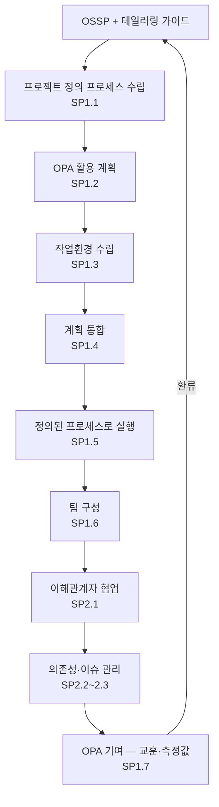

# 통합 프로젝트 관리 절차 (PRO-CMMI-02-05)

상위 정책: [[POL-CMMI-02_프로젝트_관리_정책]] · 표준: CMMI-DEV V1.3 IPM

## 1. 목적
OSSP를 테일러링하여 프로젝트의 정의된 프로세스를 수립하고, 작업환경·계획·실행을 OPA와 통합하여 운영하며, 이해관계자 협업·의존성·이슈를 관리한다. GG3 Defined Process 제도화의 프로젝트 측 구현체.

## 2. 적용 범위
ML3 cumulative 프로젝트 전체에 의무 적용. ML2 단독 프로젝트는 선택 적용.

## 3. 정의
- **Project's Defined Process**: 프로젝트가 OSSP 테일러링으로 정의·유지하는 프로세스.
- **Integrated Plan**: PP의 통합 계획서를 다른 PA(MA, OT, CM, QA 등) 계획과 통합한 결과.
- **Team Charter**: 팀 비전·역할·운영 규칙 문서.

## 4. 역할과 책임 (RACI)
| 단계 | Project Manager | EPG | 팀원 | 이해관계자 | Senior Mgmt |
|---|---|---|---|---|---|
| 정의 프로세스 수립 (SP1.1) | **R** | C | I | I | A |
| OPA 활용 계획 (SP1.2) | **R** | C | I | I | I |
| 작업환경 수립 (SP1.3) | **R** | C | C | I | I |
| 계획 통합 (SP1.4) | **R** | C | C | C | A |
| 통합 실행 (SP1.5) | **R** | I | C | I | I |
| 팀 구성 (SP1.6) | **R** | C | C | I | A |
| OPA 기여 (SP1.7) | **R** | C | C | I | I |
| 이해관계자 참여 (SP2.1) | **R** | I | C | C | I |
| 의존성 관리 (SP2.2) | **R** | I | C | C | I |
| 이슈 해결 (SP2.3) | **R** | I | C | C | A |

## 5. 절차 흐름



## 6. SG/SP 매핑 및 단계별 상세

| #   | SP    | 단계 | 입력 | 출력 (TMP 후보) |
|---|---|---|---|---|
| 1 | SP1.1 | 정의 프로세스 수립 | OSSP, 테일러링 가이드 | 프로젝트 정의 프로세스 |
| 2 | SP1.2 | OPA 활용 | OPA, 측정저장소 | 활용 계획·근거 |
| 3 | SP1.3 | 작업환경 수립 | OPD SP1.6 작업환경 표준 | 프로젝트 작업환경 |
| 4 | SP1.4 | 계획 통합 | PP 계획서 + 다른 PA 계획 | 통합 계획서 |
| 5 | SP1.5 | 통합 계획 기반 실행 | 통합 계획 | 정의된 프로세스 실행 산출물, 측정 actuals |
| 6 | SP1.6 | 팀 구성 | OPD SP1.7 팀 규칙 | 팀 헌장, 공유 비전 |
| 7 | SP1.7 | OPA 기여 | 측정값, 교훈 | OPA 기여 자료 (개선제안, 측정값, 교훈) |
| 8 | SP2.1 | 이해관계자 참여 관리 | 참여 계획 | 이해관계자 협업 회의록 |
| 9 | SP2.2 | 의존성 관리 | 통합 계획 | 중요 의존성 추적 |
| 10 | SP2.3 | 이슈 해결 | 협업·의존성 이슈 | 이슈 해결 기록 |

### 6.1 SG/SP source citation
| Req-ID | Title | 출처 |
|---|---|---|
| CMMIDEV-IPM-SG1-REQ-001 | Use the Project's Defined Process | requirements.yaml#CMMIDEV-IPM-SG1-REQ-001 (p.159) |
| CMMIDEV-IPM-SP1.1~1.7-REQ-001 | Establish DP / Use OPA / Workenv / Integrate / Manage / Teams / Contribute | requirements.yaml (p.159-169) |
| CMMIDEV-IPM-SG2-REQ-001 | Coordinate and Collaborate with Relevant Stakeholders | requirements.yaml#CMMIDEV-IPM-SG2-REQ-001 (p.171) |
| CMMIDEV-IPM-SP2.1~2.3-REQ-001 | Stakeholder/Dependencies/Issues | requirements.yaml (p.171-173) |

## 7. 통제점 / KPI
| 통제점 | 지표 | 목표 | 주기 |
|---|---|---|---|
| 정의 프로세스 보유 | 활성 프로젝트 중 정의 프로세스 보유율 | 100% | 분기 |
| OPA 기여 건수 | 프로젝트 종료 시 OPA 기여 건수 | ≥ 3건 | 프로젝트 종료 |
| 의존성 미해결 | open critical 의존성 | 0건 | 마일스톤 |
| 통합 계획 변경 빈도 | 베이스라인 후 변경 | ≤ 분기 3건 | 분기 |

## 8. 표준 매핑 (Traceability)
- IPM SG1~SG2 → §5 흐름, §6 단계
- BPM-enables-APM (p.45) → §5 IPM은 PP/PMC/REQM/SAM이 가능케 함
- GP 3.1 (Defined Process) → §5 SP1.1 핵심
- GP 3.2 (Collect Experiences) → §5 SP1.7

## 9. source_citation
```yaml
- type: standard_original
  file: "inputs/01_표준원문/CMMI-DEV/requirements.yaml"
  locator: "CMMIDEV-IPM-SG1~SG2-REQ-001 (p.159-173)"
  retrieved_at: "2026-05-11"
  license: "CMU/SEI internal_use_derivative_work"
  paraphrase_only: true
- type: standard_original
  file: "inputs/01_표준원문/CMMI-DEV/pa_relationships.yaml"
  locator: "BPM-enables-APM (p.45)"
  retrieved_at: "2026-05-11"
```

## 10. 개정 이력
| 버전 | 일자 | 변경내용 | 승인자 |
|---|---|---|---|
| 0.1 | 2026-05-11 | 최초 초안 (process-designer 생성) | - |
