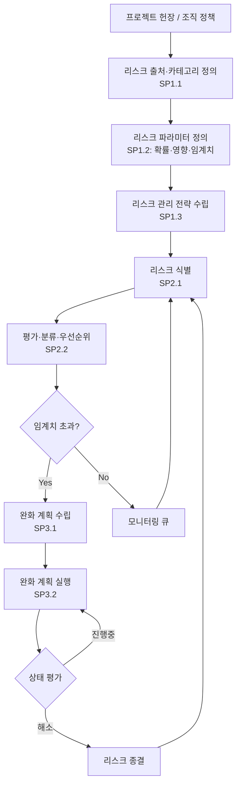

# 리스크 관리 절차 (PRO-CMMI-02-06)

상위 정책: [[POL-CMMI-02_프로젝트_관리_정책]] · 표준: CMMI-DEV V1.3 RSKM

> ※ RSKM SG1 (Prepare for Risk Management) 은 적용요건.md §6-2-15 의 누락 플래그가 있었으나 본 PRO는 inputs/01_표준원문/CMMI-DEV/requirements.yaml 의 RSKM SP1.1~1.3 (p.351-353) 및 PDF 원문 p.351 의 SG1 "Prepare for Risk Management" 를 기반으로 작성한다. (다음 ingest pass에서 SG1 엔트리 보충 권고)

## 1. 목적
프로젝트·조직 리스크를 사전에 식별·분석·완화하기 위한 전략을 수립하고, 식별된 리스크를 평가·우선순위화하며, 완화 계획·실행을 모니터링한다.

## 2. 적용 범위
모든 개발 프로젝트 및 조직 차원의 리스크 거버넌스. 일반 이슈(이미 발생한 사건)는 [[PRO-CMMI-02-02_프로젝트_모니터링_통제_절차]] PMC SG2(시정조치)로 처리.

## 3. 정의
- **Risk**: 발생 가능성이 있고 발생 시 부정적 영향을 주는 미래 사건.
- **Risk Source**: 리스크가 유래하는 영역 (요구사항·기술·일정·외주·환경 등).
- **Risk Parameter**: 확률·영향·임계치·우선순위 등.
- **Mitigation Plan**: 리스크 발생 가능성·영향 감소 활동 계획.

## 4. 역할과 책임 (RACI)
| 단계 | Risk Manager | Project Manager | Engineer | Senior Mgmt |
|---|---|---|---|---|
| 출처·카테고리 (SP1.1) | **R** | C | C | I |
| 파라미터 정의 (SP1.2) | **R** | C | I | A |
| 전략 수립 (SP1.3) | **R** | C | I | **A** |
| 리스크 식별 (SP2.1) | **R** | C | C | I |
| 평가·우선순위 (SP2.2) | **R** | C | C | I |
| 완화계획 (SP3.1) | **R** | C | C | A |
| 완화계획 실행 (SP3.2) | C | **R** | C | I |

## 5. 절차 흐름



## 6. SG/SP 매핑 및 단계별 상세

| #   | SP    | 단계 | 입력 | 출력 (TMP 후보) |
|---|---|---|---|---|
| 1 | SP1.1 | 리스크 출처·카테고리 결정 | 프로젝트 컨텍스트 | 리스크 출처/카테고리 목록 |
| 2 | SP1.2 | 리스크 파라미터 정의 | 조직 정책 | 리스크 평가 파라미터 |
| 3 | SP1.3 | 리스크 관리 전략 수립 | 파라미터 | 리스크 관리 전략서 |
| 4 | SP2.1 | 리스크 식별 | 전략서, 프로젝트 정보 | 식별된 리스크 목록 |
| 5 | SP2.2 | 평가·우선순위 | 리스크 목록 | 리스크 평가/우선순위 |
| 6 | SP3.1 | 완화 계획 수립 | 우선순위 리스크 | 완화 계획, 비상 계획 |
| 7 | SP3.2 | 완화 계획 실행 | 완화 계획 | 리스크 모니터링 기록 |

### 6.1 SG/SP source citation
| Req-ID | Title | 출처 |
|---|---|---|
| (RSKM SG1) | Prepare for Risk Management | PDF p.351 (ingest yaml SG1 누락 → 추후 보완) |
| CMMIDEV-RSKM-SP1.1-REQ-001 | Determine Risk Sources and Categories | requirements.yaml#CMMIDEV-RSKM-SP1.1-REQ-001 (p.351) |
| CMMIDEV-RSKM-SP1.2-REQ-001 | Define Risk Parameters | requirements.yaml#CMMIDEV-RSKM-SP1.2-REQ-001 (p.352) |
| CMMIDEV-RSKM-SP1.3-REQ-001 | Establish a Risk Management Strategy | requirements.yaml#CMMIDEV-RSKM-SP1.3-REQ-001 (p.353) |
| CMMIDEV-RSKM-SG2-REQ-001 | Identify and Analyze Risks | requirements.yaml#CMMIDEV-RSKM-SG2-REQ-001 (p.354) |
| CMMIDEV-RSKM-SP2.1-REQ-001 | Identify Risks | requirements.yaml#CMMIDEV-RSKM-SP2.1-REQ-001 (p.354) |
| CMMIDEV-RSKM-SP2.2-REQ-001 | Evaluate, Categorize, and Prioritize Risks | requirements.yaml#CMMIDEV-RSKM-SP2.2-REQ-001 (p.357) |
| CMMIDEV-RSKM-SG3-REQ-001 | Mitigate Risks | requirements.yaml#CMMIDEV-RSKM-SG3-REQ-001 (p.358) |
| CMMIDEV-RSKM-SP3.1-REQ-001 | Develop Risk Mitigation Plans | requirements.yaml#CMMIDEV-RSKM-SP3.1-REQ-001 (p.358) |
| CMMIDEV-RSKM-SP3.2-REQ-001 | Implement Risk Mitigation Plans | requirements.yaml#CMMIDEV-RSKM-SP3.2-REQ-001 (p.360) |

## 7. 통제점 / KPI
| 통제점 | 지표 | 목표 | 주기 |
|---|---|---|---|
| High 리스크 검토 주기 | 마지막 검토 후 경과 | ≤ 1주 | 주 |
| 완화 계획 보유율 | 임계치 초과 리스크 대비 | 100% | 월 |
| 리스크 적중률 | 실제 발생 / 식별 (사후) | 분석 후 환류 | 프로젝트 종료 |
| 종결 리드타임 | 식별→종결 | ≤ 30일 (medium) | 월 |

## 8. 표준 매핑 (Traceability)
- RSKM SG1~SG3 → §5 흐름, §6 단계
- BPM-enables-APM (p.45) → §5 RSKM은 PP/PMC 베이스라인 위에 운영
- PP SP2.2 (Identify Project Risks) → 본 PRO §6 SP2.1 입력 통합

## 9. source_citation
```yaml
- type: standard_original
  file: "inputs/01_표준원문/CMMI-DEV/requirements.yaml"
  locator: "CMMIDEV-RSKM-SP1.1~SP3.2 (p.351-360)"
  retrieved_at: "2026-05-11"
  license: "CMU/SEI internal_use_derivative_work"
  paraphrase_only: true
- type: standard_original_pdf
  file: "inputs/01_표준원문/CMMI-DEV/*.pdf"
  locator: "RSKM SG1 'Prepare for Risk Management' (p.351) — ingest yaml SG1 entry 누락 보완"
  retrieved_at: "2026-05-11"
  license: "CMU/SEI internal_use_derivative_work"
```

## 10. 개정 이력
| 버전 | 일자 | 변경내용 | 승인자 |
|---|---|---|---|
| 0.1 | 2026-05-11 | 최초 초안 (process-designer 생성) | - |
