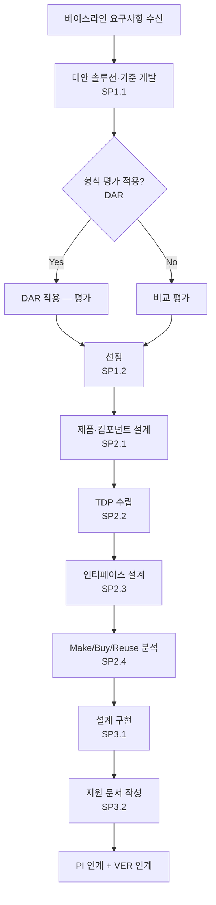

# 기술 솔루션 설계 절차 (PRO-CMMI-03-02)

상위 정책: [[POL-CMMI-03_엔지니어링_정책]] · 표준: CMMI-DEV V1.3 TS

## 1. 목적
요구사항을 만족하는 대안 솔루션을 평가·선정하고, 선정된 솔루션을 설계(TDP, ICD, Make/Buy/Reuse 분석)하며, 설계를 구현하고 지원 문서를 개발한다.

## 2. 적용 범위
제품·제품컴포넌트 솔루션 선정·설계·구현 활동 전체. 인터페이스 설계는 PI 절차와 연계한다.

## 3. 정의
- **TDP** (Technical Data Package, SP2.2): 제품 설계 기술자료 집합.
- **ICD** (Interface Control Document, SP2.3): 인터페이스 설계 명세서.
- **Make/Buy/Reuse Analysis** (SP2.4): 자체 개발·구매·재사용 결정.

## 4. 역할과 책임 (RACI)
| 단계 | Architect | Engineer | DAR Owner | Procurement | Doc Writer |
|---|---|---|---|---|---|
| 대안 평가 (SP1.1) | **R** | C | C (DAR 적용) | C | I |
| 선정 (SP1.2) | **R** | C | C | C | I |
| 제품 설계 (SP2.1) | **R** | **R** | I | I | I |
| TDP 수립 (SP2.2) | **R** | C | I | I | C |
| 인터페이스 설계 (SP2.3) | **R** | C | I | I | I |
| Make/Buy/Reuse (SP2.4) | C | C | C (DAR) | **R** | I |
| 구현 (SP3.1) | C | **R** | I | I | I |
| 지원 문서 (SP3.2) | C | C | I | I | **R** |

## 5. 절차 흐름



## 6. SG/SP 매핑 및 단계별 상세

| #   | SP    | 단계 | 입력 | 출력 (TMP 후보) |
|---|---|---|---|---|
| 1 | SP1.1 | 대안 솔루션·기준 개발 | 요구사항 | 대안 솔루션 평가보고서 |
| 2 | SP1.2 | 솔루션 선정 | 평가보고서 | 선정 기준·결정 근거 |
| 3 | SP2.1 | 제품·컴포넌트 설계 | 선정 솔루션 | 제품 아키텍처, 컴포넌트 설계서 |
| 4 | SP2.2 | TDP 수립 | 설계서 | 기술자료 패키지(TDP) |
| 5 | SP2.3 | 인터페이스 설계 (기준 사용) | 인터페이스 요구 | 인터페이스 설계 명세서(ICD) |
| 6 | SP2.4 | Make/Buy/Reuse 분석 | 설계, 비용 | Make/Buy/Reuse 분석서 |
| 7 | SP3.1 | 설계 구현 | 설계, Make/Buy 결정 | 구현된 컴포넌트 |
| 8 | SP3.2 | 지원 문서 개발 | 구현 | 사용자/운영/유지보수 매뉴얼 |

### 6.1 SG/SP source citation
| Req-ID | Title | 출처 |
|---|---|---|
| CMMIDEV-TS-SG1-REQ-001 | Select Product Component Solutions | requirements.yaml#CMMIDEV-TS-SG1-REQ-001 (p.375) |
| CMMIDEV-TS-SP1.1~1.2-REQ-001 | Alternative/Select | requirements.yaml (p.376-378) |
| CMMIDEV-TS-SG2-REQ-001 | Develop the Design | requirements.yaml#CMMIDEV-TS-SG2-REQ-001 (p.379) |
| CMMIDEV-TS-SP2.1~2.4-REQ-001 | Design/TDP/Interfaces/MBR | requirements.yaml (p.380-386) |
| CMMIDEV-TS-SG3-REQ-001 | Implement the Product Design | requirements.yaml#CMMIDEV-TS-SG3-REQ-001 (p.387) |
| CMMIDEV-TS-SP3.1~3.2-REQ-001 | Implement/Support Documentation | requirements.yaml (p.388-390) |

## 7. 통제점 / KPI
| 통제점 | 지표 | 목표 | 주기 |
|---|---|---|---|
| DAR 적용율 (영향 큰 결정) | 영향 큰 결정 중 DAR 적용 비율 | 100% | 마일스톤 |
| 설계 결함 (VER 발견) | VER 단계 결함 / 코드 LOC | 추세 감소 | 마일스톤 |
| TDP 완전성 | 필수 항목 충족율 | 100% | 설계 베이스라인 |
| 지원 문서 누락 | 인도 시점 누락 문서 | 0건 | 인도 시 |

## 8. 표준 매핑 (Traceability)
- TS SG1~SG3 → §5 흐름, §6 단계
- Engineering Flow: RD→TS, TS→RD (alternative solutions feedback), TS→PI
- DAR-supports-all (p.53) → §5 SP1.1, SP2.4 DAR 적용

## 9. source_citation
```yaml
- type: standard_original
  file: "inputs/01_표준원문/CMMI-DEV/requirements.yaml"
  locator: "CMMIDEV-TS-SG1~SG3-REQ-001 (p.375-390)"
  retrieved_at: "2026-05-11"
  license: "CMU/SEI internal_use_derivative_work"
  paraphrase_only: true
```

## 10. 개정 이력
| 버전 | 일자 | 변경내용 | 승인자 |
|---|---|---|---|
| 0.1 | 2026-05-11 | 최초 초안 (process-designer 생성) | - |
