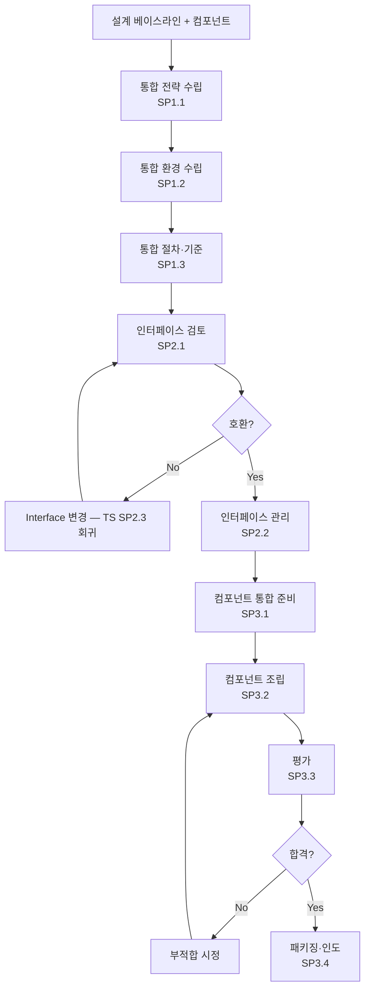

# 제품 통합 절차 (PRO-CMMI-03-03)

상위 정책: [[POL-CMMI-03_엔지니어링_정책]] · 표준: CMMI-DEV V1.3 PI

## 1. 목적
통합 전략·환경·절차·기준을 수립하고, 인터페이스 호환성·완전성을 보장하며, 컴포넌트를 조립·평가·패키징하여 고객에게 인도한다.

## 2. 적용 범위
컴포넌트가 다수인 모든 제품의 통합 단계. 단일 컴포넌트 제품의 경우 SG2는 외부 인터페이스에 한정.

## 3. 정의
- **Integration Strategy** (SP1.1): 통합 순서·체계.
- **Integration Environment** (SP1.2): 통합·시험 환경.
- **Interface Description** (SP2.1): 컴포넌트 간 인터페이스 명세.

## 4. 역할과 책임 (RACI)
| 단계 | Integration Lead | Architect | Engineer | CM | 고객 |
|---|---|---|---|---|---|
| 전략 수립 (SP1.1) | **R** | C | C | I | I |
| 환경 수립 (SP1.2) | **R** | C | C | C | I |
| 절차·기준 (SP1.3) | **R** | C | C | I | I |
| 인터페이스 검토 (SP2.1) | **R** | C | C | I | I |
| 인터페이스 관리 (SP2.2) | **R** | C | C | C | I |
| 통합 준비 (SP3.1) | **R** | I | C | C | I |
| 조립 (SP3.2) | **R** | C | **R** | C | I |
| 평가 (SP3.3) | **R** | C | C | I | C |
| 패키징·인도 (SP3.4) | **R** | I | C | C | **A** |

## 5. 절차 흐름



## 6. SG/SP 매핑 및 단계별 상세

| #   | SP    | 단계 | 입력 | 출력 (TMP 후보) |
|---|---|---|---|---|
| 1 | SP1.1 | 통합 전략 수립 | 설계 | 제품 통합 전략서 |
| 2 | SP1.2 | 통합 환경 수립 | 전략 | 통합 환경 명세 |
| 3 | SP1.3 | 통합 절차·기준 | 환경, 인터페이스 | 통합 절차·기준 |
| 4 | SP2.1 | 인터페이스 검토 | ICD (TS SP2.3) | 인터페이스 카테고리/목록/매핑 |
| 5 | SP2.2 | 인터페이스 관리 | ICD, CM | ICD 변경관리 기록 |
| 6 | SP3.1 | 통합 준비 확인 | 컴포넌트, 절차 | 인수 문서 |
| 7 | SP3.2 | 컴포넌트 조립 | 컴포넌트, 절차 | 조립 결과 |
| 8 | SP3.3 | 통합 평가 | 조립 결과, 기준 | 통합 요약 보고서 |
| 9 | SP3.4 | 패키징·인도 | 평가 통과 제품 | 패키징 명세, 인도 문서 |

### 6.1 SG/SP source citation
| Req-ID | Title | 출처 |
|---|---|---|
| CMMIDEV-PI-SG1-REQ-001 | Prepare for Product Integration | requirements.yaml#CMMIDEV-PI-SG1-REQ-001 (p.259) |
| CMMIDEV-PI-SP1.1~1.3-REQ-001 | Strategy/Environment/Procedures | requirements.yaml (p.259-262) |
| CMMIDEV-PI-SG2-REQ-001 | Ensure Interface Compatibility | requirements.yaml#CMMIDEV-PI-SG2-REQ-001 (p.263) |
| CMMIDEV-PI-SP2.1~2.2-REQ-001 | Review/Manage Interfaces | requirements.yaml (p.263-264) |
| CMMIDEV-PI-SG3-REQ-001 | Assemble Product Components and Deliver the Product | requirements.yaml#CMMIDEV-PI-SG3-REQ-001 (p.266) |
| CMMIDEV-PI-SP3.1~3.4-REQ-001 | Confirm/Assemble/Evaluate/Package | requirements.yaml (p.266-268) |

## 7. 통제점 / KPI
| 통제점 | 지표 | 목표 | 주기 |
|---|---|---|---|
| 인터페이스 부적합 | PI 발견 인터페이스 결함 | ≤ 5건/제품 | 마일스톤 |
| 통합 평가 통과율 | 1차 시도 통과 / 시도 | ≥ 80% | 통합 라운드 |
| 인도 후 결함 | 인도 후 1개월 내 결함 | ≤ 2건 | 인도 후 |
| 통합 환경 가용성 | 환경 가용 시간 / 계획 | ≥ 95% | 월 |

## 8. 표준 매핑 (Traceability)
- PI SG1~SG3 → §5 흐름, §6 단계
- Engineering Flow: TS→PI; PI→Customer
- CM-supports-all → §5 인터페이스 관리, 조립 베이스라인

## 9. source_citation
```yaml
- type: standard_original
  file: "inputs/01_표준원문/CMMI-DEV/requirements.yaml"
  locator: "CMMIDEV-PI-SG1~SG3-REQ-001 (p.259-268)"
  retrieved_at: "2026-05-11"
  license: "CMU/SEI internal_use_derivative_work"
  paraphrase_only: true
```

## 10. 개정 이력
| 버전 | 일자 | 변경내용 | 승인자 |
|---|---|---|---|
| 0.1 | 2026-05-11 | 최초 초안 (process-designer 생성) | - |
