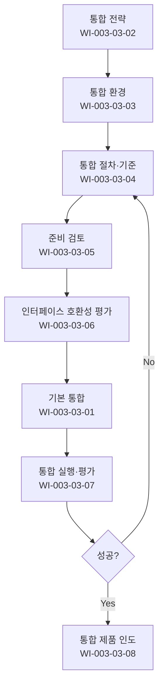

# 제품통합 절차 (PRO-CMMI-03-03)

> 상위 정책: [[POL-CMMI-03_엔지니어링_정책_v1.0]]

## 1. 목적
제품 구성요소를 통합 전략·환경·절차에 따라 점진적으로 결합하여 인도 가능한 제품을 만들고, 인터페이스 호환성을 보장한다.

## 2. 적용 범위
- 다중 구성요소·서브시스템·외부 부품의 통합
- 통합 환경(테스트베드·도구체인) 운영
- 인도 전 인수 검토

## 3. 역할과 책임 (RACI)
| 단계 | Integration Lead | 개발자 | 아키텍트 | QA | PM |
|---|---|---|---|---|---|
| 기본 통합 | **R** | C | C | I | A |
| 전략 | **R** | C | **C** | I | A |
| 환경 | **R** | C | C | I | A |
| 절차·기준 | **R** | C | C | **C** | A |
| 준비 검토 | **R** | C | C | C | A |
| 인터페이스 호환성 | C | C | **R** | C | A |
| 실행·평가 | **R** | C | C | C | A |
| 인도 | **R** | C | C | C | **A** |

## 4. 절차 흐름


## 5. 단계별 상세
| # | 단계 | 설명 | 담당 | 입력 | 출력 |
|---|---|---|---|---|---|
| 1 | 전략 | 통합 시퀀스·접근방식 정의 | Integration Lead | 아키텍처 | 통합 전략 |
| 2 | 환경 | 환경 구축·유지 | Integration Lead | 도구·인프라 | 통합 환경 |
| 3 | 절차·기준 | 통합 절차·합격 기준 | Integration Lead | 전략 | 절차서 |
| 4 | 준비 검토 | 통합 전 준비 상태 확인 | Integration Lead | CI 상태 | 검토 결과 |
| 5 | 인터페이스 | 인터페이스 호환성·완전성 평가 | 아키텍트 | ICD | 평가 결과 |
| 6 | 기본 통합 | 구성요소 통합 | Integration Lead | CI | 통합본 |
| 7 | 실행·평가 | 통합 실행·결과 평가 | Integration Lead | 통합본 | 통합 보고서 |
| 8 | 인도 | 통합 제품 인도 | Integration Lead | 통합본 | 인도 패키지 |

## 6. 연계 업무지침 (WI)
- [[WI-CMMI-03-03-01_기본_통합_수행_v1.0]]
- [[WI-CMMI-03-03-02_통합_전략_수립_v1.0]]
- [[WI-CMMI-03-03-03_통합_환경_관리_v1.0]]
- [[WI-CMMI-03-03-04_통합_절차_및_기준_v1.0]]
- [[WI-CMMI-03-03-05_통합_준비_검토_v1.0]]
- [[WI-CMMI-03-03-06_인터페이스_호환성_평가_v1.0]]
- [[WI-CMMI-03-03-07_통합_실행_및_평가_v1.0]]
- [[WI-CMMI-03-03-08_통합_제품_인도_v1.0]]

## 7. 통제점 / KPI
| 통제점 | 지표 | 목표 | 주기 |
|---|---|---|---|
| 통합 성공률 | 첫 시도 성공률 | ≥ 80% | 분기 |
| ICD 결함 발견율 | 통합 전 발견율 | ≥ 90% | 분기 |
| 통합 환경 가용률 | 가동 시간 비율 | ≥ 95% | 월 |
| 통합 일정 준수율 | 계획 대비 실적 | ≥ 90% | 프로젝트 |
| 인도 부적합율 | 인수 검토 부적합 | ≤ 5% | 프로젝트 |

## 8. 표준 매핑 (Traceability)
| Practice | Req-ID | 반영 위치 |
|---|---|---|
| PI 1.1 | CMMI-PI-1.1 | §5-6 기본 통합 |
| PI 2.1 | CMMI-PI-2.1 | §5-1 전략 |
| PI 2.2 | CMMI-PI-2.2 | §5-2 환경 |
| PI 2.3 | CMMI-PI-2.3 | §5-3 절차 |
| PI 3.1 | CMMI-PI-3.1 | §5-4 준비 검토 |
| PI 3.2 | CMMI-PI-3.2 | §5-5 인터페이스 |
| PI 3.3 | CMMI-PI-3.3 | §5-7 실행·평가 |
| PI 3.4 | CMMI-PI-3.4 | §5-8 인도 |

## 9. 출처 (source_citation)
```yaml
- type: standard_original
  file: "_inputs/01_표준원문/CMMI-DEV/Development PAs/PI.pdf"
  locator: "Product Integration PG1~PG3"
  retrieved_at: "2026-04-29"
  license: "ISACA copyright — paraphrase only"
  paraphrase_only: true
```

## 10. 개정 이력
| 버전 | 일자 | 변경내용 | 승인자 |
|---|---|---|---|
| 1.0 | 2026-04-29 | 최초 승인 (CMMI-DEV-ML3 편입) | CEO |
