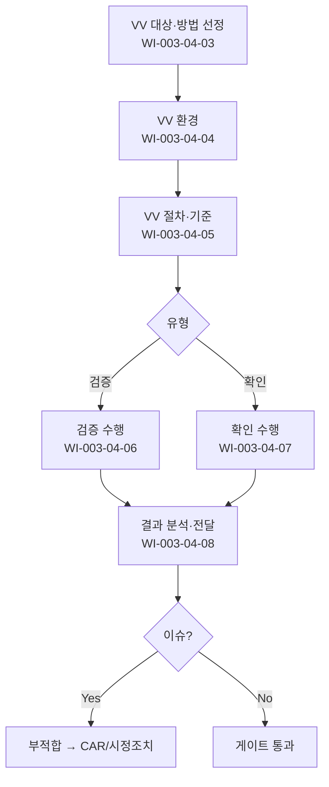

# 검증 및 확인 절차 (PRO-CMMI-03-04)

> 상위 정책: [[POL-CMMI-03_엔지니어링_정책_v1.0]]

## 1. 목적
검증(요구사항 충족)과 확인(의도 환경 작동)을 분리 계획·환경·절차로 운영하여 솔루션의 적합성·유효성을 입증한다.

## 2. 적용 범위
- 모든 솔루션·구성요소의 검증·확인
- 단위·통합·시스템·인수 시험 전 단계
- 시뮬레이션·실환경 확인 모두 적용

## 3. 역할과 책임 (RACI)
| 단계 | V&V Lead | 시험자 | 개발자 | QA | 이해관계자 |
|---|---|---|---|---|---|
| 기본 검증 | C | **R** | C | C | I |
| 기본 확인 | C | **R** | C | C | **C** |
| 대상·방법 선정 | **R** | C | C | C | C |
| 환경 | **R** | C | C | I | I |
| 절차·기준 | **R** | C | C | **C** | I |
| 검증 수행 | **R** | **R** | C | C | I |
| 확인 수행 | **R** | **R** | C | C | **C** |
| 결과 분석·전달 | **R** | C | C | C | C |

## 4. 절차 흐름


## 5. 단계별 상세
| # | 단계 | 설명 | 담당 | 입력 | 출력 |
|---|---|---|---|---|---|
| 1 | 대상·방법 | 검증·확인 대상·방법 선정 | V&V Lead | 산출물 목록 | V&V 계획 |
| 2 | 환경 | V&V 환경 개발·갱신 | V&V Lead | 인프라 | 환경 |
| 3 | 절차·기준 | V&V 절차·합격 기준 | V&V Lead | 계획 | 절차서 |
| 4 | 검증 | 요구사항 충족 검증 수행 | 시험자 | 절차 | 검증 결과 |
| 5 | 확인 | 의도 환경 작동 확인 수행 | 시험자 | 절차 | 확인 결과 |
| 6 | 분석·전달 | 결과 분석·이해관계자 전달 | V&V Lead | 결과 | V&V 보고서 |

## 6. 연계 업무지침 (WI)
- [[WI-CMMI-03-04-01_기본_검증_수행_v1.0]]
- [[WI-CMMI-03-04-02_기본_확인_수행_v1.0]]
- [[WI-CMMI-03-04-03_VV_대상_및_방법_선정_v1.0]]
- [[WI-CMMI-03-04-04_VV_환경_관리_v1.0]]
- [[WI-CMMI-03-04-05_VV_절차_및_기준_v1.0]]
- [[WI-CMMI-03-04-06_검증_수행_v1.0]]
- [[WI-CMMI-03-04-07_확인_수행_v1.0]]
- [[WI-CMMI-03-04-08_VV_결과_분석_및_전달_v1.0]]

## 7. 통제점 / KPI
| 통제점 | 지표 | 목표 | 주기 |
|---|---|---|---|
| 검증 통과율 | 검증 합격 비율 | ≥ 95% | 분기 |
| 확인 통과율 | 확인 합격 비율 | ≥ 95% | 분기 |
| 결함 누설율 | 후공정 결함 비율 | ≤ 5% | 분기 |
| V&V 자동화율 | 자동화 케이스 비율 | ≥ 60% | 분기 |
| 환경 가용률 | 가동 시간 | ≥ 95% | 월 |

## 8. 표준 매핑 (Traceability)
| Practice | Req-ID | 반영 위치 |
|---|---|---|
| VV 1.1 | CMMI-VV-1.1 | §5-4 검증 |
| VV 1.2 | CMMI-VV-1.2 | §5-5 확인 |
| VV 2.1 | CMMI-VV-2.1 | §5-1 대상·방법 |
| VV 2.2 | CMMI-VV-2.2 | §5-2 환경 |
| VV 2.3 | CMMI-VV-2.3 | §5-3 절차·기준 |
| VV 3.1 | CMMI-VV-3.1 | §5-4 검증 |
| VV 3.2 | CMMI-VV-3.2 | §5-5 확인 |
| VV 3.3 | CMMI-VV-3.3 | §5-6 분석·전달 |

## 9. 출처 (source_citation)
```yaml
- type: standard_original
  file: "_inputs/01_표준원문/CMMI-DEV/Core PAs/VV.pdf"
  locator: "Verification & Validation PG1~PG3"
  retrieved_at: "2026-04-29"
  license: "ISACA copyright — paraphrase only"
  paraphrase_only: true
```

## 10. 개정 이력
| 버전 | 일자 | 변경내용 | 승인자 |
|---|---|---|---|
| 1.0 | 2026-04-29 | 최초 승인 (CMMI-DEV-ML3 편입) | CEO |
