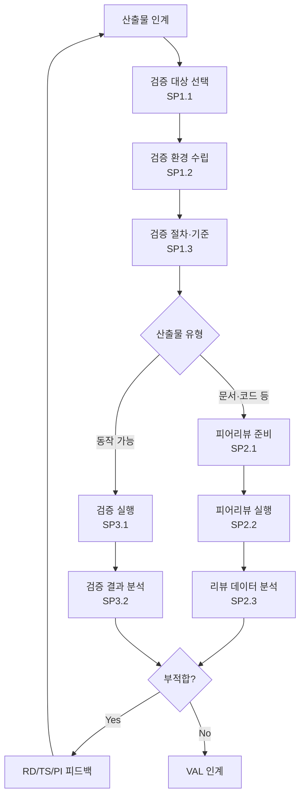

# 검증 절차 (Verification) (PRO-CMMI-03-04)

상위 정책: [[POL-CMMI-03_엔지니어링_정책]] · 표준: CMMI-DEV V1.3 VER

## 1. 목적
"올바르게 만들었는가"를 평가하기 위해, 선택된 산출물을 명세된 요구사항에 대해 검증한다. 피어리뷰를 포함하며 결함을 식별·제거하여 후속 활동(VAL 포함)에 안전한 입력을 제공한다.

## 2. 적용 범위
요구사항·설계·코드·문서·통합 결과 등 모든 주요 산출물. 시스템·서브시스템·컴포넌트 레벨 모두에 재귀 적용.

## 3. 정의
- **Peer Review** (SG2): 동료가 정의된 기준으로 산출물을 검토.
- **Verification Method**: 시험, 분석, 검사, 시연 등.

## 4. 역할과 책임 (RACI)
| 단계 | Verification Lead | Engineer | Peer Reviewer | Test Engineer | RD/TS Owner |
|---|---|---|---|---|---|
| 대상 선택 (SP1.1) | **R** | C | I | C | C |
| 환경 (SP1.2) | **R** | C | I | C | I |
| 절차·기준 (SP1.3) | **R** | C | C | C | C |
| 피어리뷰 준비 (SP2.1) | **R** | C | C | I | I |
| 피어리뷰 실행 (SP2.2) | C | C | **R** | I | I |
| 데이터 분석 (SP2.3) | **R** | C | C | I | I |
| 검증 실행 (SP3.1) | **R** | C | I | **R** | I |
| 결과 분석 (SP3.2) | **R** | C | I | C | C (피드백) |

## 5. 절차 흐름



## 6. SG/SP 매핑 및 단계별 상세

| #   | SP    | 단계 | 입력 | 출력 (TMP 후보) |
|---|---|---|---|---|
| 1 | SP1.1 | 검증 대상 선택 | 산출물 목록 | 검증 대상 목록·방법 |
| 2 | SP1.2 | 검증 환경 수립 | 대상·방법 | 검증 환경 |
| 3 | SP1.3 | 검증 절차·기준 | 환경, 요구사항 | 검증 절차·기준 |
| 4 | SP2.1 | 피어리뷰 준비 | 산출물 | 피어리뷰 일정·체크리스트, 진입/종료 기준 |
| 5 | SP2.2 | 피어리뷰 실행 | 체크리스트 | 피어리뷰 결과·이슈 |
| 6 | SP2.3 | 리뷰 데이터 분석 | 결과·이슈 | 결함 분석 보고 |
| 7 | SP3.1 | 검증 실행 | 절차, 환경 | 검증 결과 |
| 8 | SP3.2 | 결과 분석 | 검증 결과 | 검증 결과 보고서, 부적합 분석 |

### 6.1 SG/SP source citation
| Req-ID | Title | 출처 |
|---|---|---|
| CMMIDEV-VER-SG1-REQ-001 | Prepare for Verification | requirements.yaml#CMMIDEV-VER-SG1-REQ-001 (p.403) |
| CMMIDEV-VER-SP1.1~1.3-REQ-001 | Select/Environment/Procedures | requirements.yaml (p.403-405) |
| CMMIDEV-VER-SG2-REQ-001 | Perform Peer Reviews | requirements.yaml#CMMIDEV-VER-SG2-REQ-001 (p.406) |
| CMMIDEV-VER-SP2.1~2.3-REQ-001 | Prepare/Conduct/Analyze Peer Reviews | requirements.yaml (p.406-408) |
| CMMIDEV-VER-SG3-REQ-001 | Verify Selected Work Products | requirements.yaml#CMMIDEV-VER-SG3-REQ-001 (p.409) |
| CMMIDEV-VER-SP3.1~3.2-REQ-001 | Perform/Analyze Verification | requirements.yaml (p.409-410) |

## 7. 통제점 / KPI
| 통제점 | 지표 | 목표 | 주기 |
|---|---|---|---|
| 피어리뷰 결함 밀도 | 결함 수 / LOC 또는 페이지 | 추세 안정 | 마일스톤 |
| 검증 통과율 | 1차 통과 / 시도 | ≥ 80% | 마일스톤 |
| 결함 누설율 | VAL/고객 발견 / 전체 발견 | ≤ 10% | 분기 |
| 피어리뷰 적용율 | 주요 산출물 중 리뷰 적용 | ≥ 95% | 마일스톤 |

## 8. 표준 매핑 (Traceability)
- VER SG1~SG3 → §5 흐름, §6 단계
- VER-before-VAL (p.49) → §5 마지막에서 VAL 인계
- Engineering Flow: VER → RD/TS/PI (피드백)
- Recursion (p.50) → §2 시스템·서브시스템·컴포넌트 레벨 모두 적용

## 9. source_citation
```yaml
- type: standard_original
  file: "inputs/01_표준원문/CMMI-DEV/requirements.yaml"
  locator: "CMMIDEV-VER-SG1~SG3-REQ-001 (p.403-410)"
  retrieved_at: "2026-05-11"
  license: "CMU/SEI internal_use_derivative_work"
  paraphrase_only: true
- type: standard_original
  file: "inputs/01_표준원문/CMMI-DEV/pa_relationships.yaml"
  locator: "VER-before-VAL (p.49)"
  retrieved_at: "2026-05-11"
```

## 10. 개정 이력
| 버전 | 일자 | 변경내용 | 승인자 |
|---|---|---|---|
| 0.1 | 2026-05-11 | 최초 초안 (process-designer 생성) | - |
