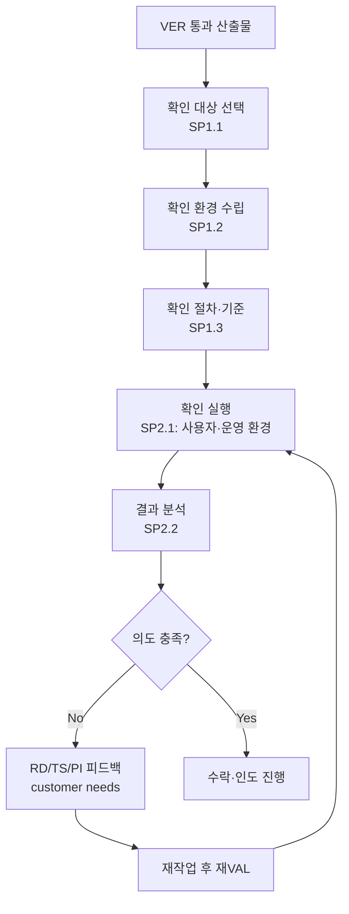

# 확인 절차 (Validation) (PRO-CMMI-03-05)

상위 정책: [[POL-CMMI-03_엔지니어링_정책]] · 표준: CMMI-DEV V1.3 VAL

## 1. 목적
"올바른 것을 만들었는가"를 평가하기 위해, 제품·제품컴포넌트가 의도된 운영 환경에서 사용 목적을 충족함을 확인한다. VAL 결과는 RD/TS/PI에 customer needs feedback으로 환류된다.

## 2. 적용 범위
인도 전(또는 인도 후 시범 운영 단계) 모든 제품·주요 컴포넌트. VER 통과 산출물만 VAL 대상.

## 3. 정의
- **Validation**: 운영 환경에서 의도된 사용 목적 충족 확인.
- **Validation Environment**: 운영 환경을 모사한 환경 (또는 실제 운영 환경).

## 4. 역할과 책임 (RACI)
| 단계 | Validation Lead | 고객/사용자 | Engineer | Test Engineer | Project Manager |
|---|---|---|---|---|---|
| 대상 선택 (SP1.1) | **R** | C | C | C | A |
| 환경 (SP1.2) | **R** | C | C | C | I |
| 절차·기준 (SP1.3) | **R** | C | C | C | I |
| 실행 (SP2.1) | **R** | **R** | I | C | I |
| 결과 분석 (SP2.2) | **R** | C | C | C | A |

## 5. 절차 흐름



## 6. SG/SP 매핑 및 단계별 상세

| #   | SP    | 단계 | 입력 | 출력 (TMP 후보) |
|---|---|---|---|---|
| 1 | SP1.1 | 확인 대상 선택 | VER 통과 산출물 | 확인 대상 목록·방법 |
| 2 | SP1.2 | 확인 환경 수립 | 대상, 운영 환경 정보 | 확인 환경 |
| 3 | SP1.3 | 확인 절차·기준 | 환경, 고객 요구사항 | 확인 절차·기준 |
| 4 | SP2.1 | 확인 실행 | 절차, 환경 | 확인 보고서, 확인 교차참조 매트릭스, 운영 데모 |
| 5 | SP2.2 | 확인 결과 분석 | 보고서 | 결함 보고서, customer needs feedback |

### 6.1 SG/SP source citation
| Req-ID | Title | 출처 |
|---|---|---|
| CMMIDEV-VAL-SG1-REQ-001 | Prepare for Validation | requirements.yaml#CMMIDEV-VAL-SG1-REQ-001 (p.394) |
| CMMIDEV-VAL-SP1.1-REQ-001 | Select Products for Validation | requirements.yaml#CMMIDEV-VAL-SP1.1-REQ-001 (p.395) |
| CMMIDEV-VAL-SP1.2-REQ-001 | Establish the Validation Environment | requirements.yaml#CMMIDEV-VAL-SP1.2-REQ-001 (p.397) |
| CMMIDEV-VAL-SP1.3-REQ-001 | Establish Validation Procedures and Criteria | requirements.yaml#CMMIDEV-VAL-SP1.3-REQ-001 (p.398) |
| CMMIDEV-VAL-SG2-REQ-001 | Validate Product or Product Components | requirements.yaml#CMMIDEV-VAL-SG2-REQ-001 (p.398) |
| CMMIDEV-VAL-SP2.1-REQ-001 | Perform Validation | requirements.yaml#CMMIDEV-VAL-SP2.1-REQ-001 (p.398) |
| CMMIDEV-VAL-SP2.2-REQ-001 | Analyze Validation Results | requirements.yaml#CMMIDEV-VAL-SP2.2-REQ-001 (p.399) |

## 7. 통제점 / KPI
| 통제점 | 지표 | 목표 | 주기 |
|---|---|---|---|
| 확인 통과율 | 1차 통과 / 시도 | ≥ 85% | 마일스톤 |
| 운영 환경 결함 | 인도 후 결함 / 인도 | 추세 감소 | 분기 |
| 환류 처리 리드타임 | VAL 피드백→재VAL | ≤ 14일 | 피드백별 |
| 고객 수락 | 1회 수락 비율 | ≥ 80% | 마일스톤 |

## 8. 표준 매핑 (Traceability)
- VAL SG1~SG2 → §5 흐름, §6 단계
- VER-before-VAL (p.49) → §5 진입 조건 (VER 통과)
- Engineering Flow: VAL → RD/TS/PI (customer needs feedback)

## 9. source_citation
```yaml
- type: standard_original
  file: "inputs/01_표준원문/CMMI-DEV/requirements.yaml"
  locator: "CMMIDEV-VAL-SG1~SG2-REQ-001 (p.394-399)"
  retrieved_at: "2026-05-11"
  license: "CMU/SEI internal_use_derivative_work"
  paraphrase_only: true
- type: standard_original
  file: "inputs/01_표준원문/CMMI-DEV/pa_relationships.yaml"
  locator: "VER-before-VAL (p.49)"
  retrieved_at: "2026-05-11"
```

## 10. 개정 이력
| 버전 | 일자 | 변경내용 | 승인자 |
|---|---|---|---|
| 0.1 | 2026-05-11 | 최초 초안 (process-designer 생성) | - |
