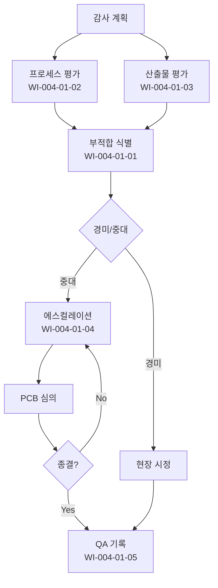

# 프로세스 품질보증 절차 (PRO-CMMI-04-01)

> 상위 정책: [[POL-CMMI-04_품질_구성_및_의사결정_정책_v1.0]]

## 1. 목적
독립된 QA 가 프로세스 수행·작업산출물을 객관 평가하여 부적합을 식별·전달·종결하고, 결과를 근거 기록으로 보관한다.

## 2. 적용 범위
- 정의된 모든 프로세스의 수행 활동
- 핵심 작업산출물 표본 평가
- 모든 프로젝트와 프로세스 자산

## 3. 역할과 책임 (RACI)
| 단계 | QA | Process Owner | PM | PCB | CEO |
|---|---|---|---|---|---|
| 부적합 식별 | **R** | C | I | A | I |
| 프로세스 평가 | **R** | C | C | A | I |
| 산출물 평가 | **R** | C | C | A | I |
| 에스컬레이션·종결 | **R** | **R** | **R** | **A** | I |
| QA 기록 | **R** | C | I | A | I |

## 4. 절차 흐름


## 5. 단계별 상세
| # | 단계 | 설명 | 담당 | 입력 | 출력 |
|---|---|---|---|---|---|
| 1 | 감사 계획 | 분기 감사 계획 수립 | QA | 정의된 프로세스 | 감사 계획서 |
| 2 | 프로세스 평가 | 객관 평가 수행 | QA | 활동 증적 | 평가서 |
| 3 | 산출물 평가 | 산출물 객관 평가 | QA | 산출물 | 평가서 |
| 4 | 부적합 식별 | 부적합 기록 | QA | 평가서 | 부적합 등록부 |
| 5 | 에스컬레이션 | 미해결 시 상위 보고 | QA/PM | 부적합 | 에스컬레이션 |
| 6 | 종결 추적 | 시정조치 종결까지 추적 | QA | 시정조치 | 종결 기록 |
| 7 | QA 기록 | 활동·결과 기록 보관 | QA | 모든 결과 | QA 기록부 |

## 6. 연계 업무지침 (WI)
- [[WI-CMMI-04-01-01_부적합_식별_및_기록_v1.0]]
- [[WI-CMMI-04-01-02_프로세스_평가_v1.0]]
- [[WI-CMMI-04-01-03_작업산출물_평가_v1.0]]
- [[WI-CMMI-04-01-04_품질이슈_에스컬레이션_및_종결_v1.0]]
- [[WI-CMMI-04-01-05_품질보증_기록_관리_v1.0]]

## 7. 통제점 / KPI
| 통제점 | 지표 | 목표 | 주기 |
|---|---|---|---|
| 감사 계획 준수율 | 계획 대비 실시 | ≥ 95% | 분기 |
| 부적합 종결율 | 발견 대비 종결 | ≥ 95% | 분기 |
| 부적합 평균 종결 기간 | 발견→종결 | ≤ 20 영업일 | 분기 |
| QA 독립성 점검 | 평가자 vs 수행자 분리 | 100% | 분기 |
| 동일 부적합 재발률 | 재발 비율 | < 10% | 반기 |

## 8. 표준 매핑 (Traceability)
| Practice | Req-ID | 반영 위치 |
|---|---|---|
| PQA 1.1 | CMMI-PQA-1.1 | §5-4 부적합 식별 |
| PQA 2.1 | CMMI-PQA-2.1 | §5-2 프로세스 평가 |
| PQA 2.2 | CMMI-PQA-2.2 | §5-3 산출물 평가 |
| PQA 2.3 | CMMI-PQA-2.3 | §5-5,6 에스컬레이션·종결 |
| PQA 2.4 | CMMI-PQA-2.4 | §5-7 QA 기록 |

## 9. 출처 (source_citation)
```yaml
- type: standard_original
  file: "_inputs/01_표준원문/CMMI-DEV/Core PAs/PQA.pdf"
  locator: "Process Quality Assurance PG1~PG2"
  retrieved_at: "2026-04-29"
  license: "ISACA copyright — paraphrase only"
  paraphrase_only: true
```

## 10. 개정 이력
| 버전 | 일자 | 변경내용 | 승인자 |
|---|---|---|---|
| 1.0 | 2026-04-29 | 최초 승인 (CMMI-DEV-ML3 편입) | CEO |
