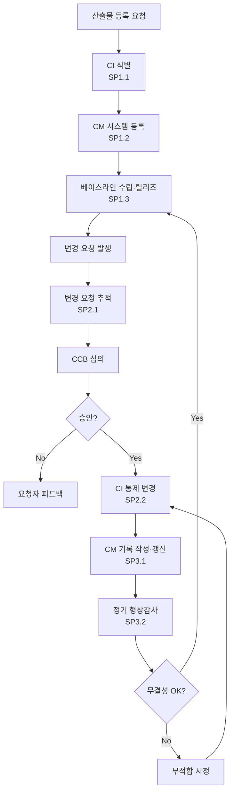

# 형상 관리 절차 (PRO-CMMI-04-01)

상위 정책: [[POL-CMMI-04_지원_품질보증_정책]] · 표준: CMMI-DEV V1.3 CM

## 1. 목적
프로젝트 및 조직 산출물의 무결성을 유지하기 위해, 형상항목(CI)을 식별·통제·기록·감사한다. 전 PA의 work products 무결성 지원 (CM-supports-all).

## 2. 적용 범위
모든 프로젝트 산출물(요구사항·설계·코드·문서·테스트 산출물·외부 인수물) 및 조직 OPA에 적용. 임시 초안·개인 노트는 제외.

## 3. 정의
- **CI** (Configuration Item): 식별·통제 단위.
- **Baseline**: 합의된 CI 집합 — 변경은 CCB 승인 후.
- **CCB** (Configuration Control Board): 형상통제위원회.
- **Audit** (SP3.2): 형상 기록과 실제 산출물의 일치성·완전성 평가.

## 4. 역할과 책임 (RACI)
| 단계 | Configuration Manager | CCB | 요청자 | Project Manager | PPQA |
|---|---|---|---|---|---|
| CI 식별 (SP1.1) | **R** | C | I | C | I |
| CM 시스템 (SP1.2) | **R** | C | I | I | I |
| 베이스라인 (SP1.3) | **R** | **A** | I | C | I |
| 변경 요청 추적 (SP2.1) | **R** | C | C | I | I |
| CI 통제 (SP2.2) | **R** | **A** | I | C | I |
| 기록 (SP3.1) | **R** | I | I | I | I |
| 형상감사 (SP3.2) | **R** | I | I | C | **R** |

## 5. 절차 흐름



## 6. SG/SP 매핑 및 단계별 상세

| #   | SP    | 단계 | 입력 | 출력 (TMP 후보) |
|---|---|---|---|---|
| 1 | SP1.1 | CI 식별 | 산출물 목록 | 식별된 형상항목 목록 |
| 2 | SP1.2 | CM 시스템 수립 | CI 목록 | 형상관리시스템 운영규정 (CCB 포함) |
| 3 | SP1.3 | 베이스라인 수립·릴리즈 | CI, 시스템 | 베이스라인 기술서 |
| 4 | SP2.1 | 변경 요청 추적 | 변경 요청 | 변경요청 DB |
| 5 | SP2.2 | CI 통제 | 승인된 변경 | CI 개정 이력 |
| 6 | SP3.1 | CM 기록 작성 | CI 활동 | 변경 로그, CM 기록 |
| 7 | SP3.2 | 형상감사 수행 | 기록, 베이스라인 | 형상감사 결과보고 |

### 6.1 SG/SP source citation
| Req-ID | Title | 출처 |
|---|---|---|
| CMMIDEV-CM-SG1-REQ-001 | Establish Baselines | requirements.yaml#CMMIDEV-CM-SG1-REQ-001 (p.140) |
| CMMIDEV-CM-SP1.1~1.3-REQ-001 | Identify/System/Baselines | requirements.yaml (p.140-143) |
| CMMIDEV-CM-SG2-REQ-001 | Track and Control Changes | requirements.yaml#CMMIDEV-CM-SG2-REQ-001 (p.144) |
| CMMIDEV-CM-SP2.1~2.2-REQ-001 | Track Requests/Control CI | requirements.yaml (p.144-145) |
| CMMIDEV-CM-SG3-REQ-001 | Establish Integrity | requirements.yaml#CMMIDEV-CM-SG3-REQ-001 (p.146) |
| CMMIDEV-CM-SP3.1~3.2-REQ-001 | Records/Audits | requirements.yaml (p.146) |

## 7. 통제점 / KPI
| 통제점 | 지표 | 목표 | 주기 |
|---|---|---|---|
| 미통제 변경 | CCB 미승인 변경 건수 | 0건 | 분기 |
| 베이스라인 결함률 | 감사 발견 부적합 / CI | ≤ 2% | 분기 감사 |
| 변경 처리 리드타임 | 접수→반영 | ≤ 5영업일 | 월 |
| CM 시스템 가용성 | 가용 시간 / 계획 | ≥ 99% | 월 |

## 8. 표준 매핑 (Traceability)
- CM SG1~SG3 → §5 흐름, §6 단계
- CM-supports-all (p.52) → 본 PRO는 전 PA의 산출물을 지원 대상
- GP 2.6 → 각 PA의 work product 통제는 본 PRO로 위임

## 9. source_citation
```yaml
- type: standard_original
  file: "inputs/01_표준원문/CMMI-DEV/requirements.yaml"
  locator: "CMMIDEV-CM-SG1~SG3-REQ-001 (p.140-146)"
  retrieved_at: "2026-05-11"
  license: "CMU/SEI internal_use_derivative_work"
  paraphrase_only: true
- type: standard_original
  file: "inputs/01_표준원문/CMMI-DEV/pa_relationships.yaml"
  locator: "CM-supports-all (p.52)"
  retrieved_at: "2026-05-11"
```

## 10. 개정 이력
| 버전 | 일자 | 변경내용 | 승인자 |
|---|---|---|---|
| 0.1 | 2026-05-11 | 최초 초안 (process-designer 생성) | - |
