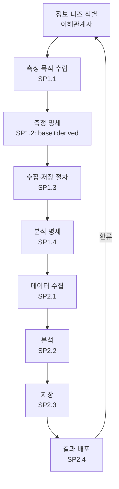

# 측정 및 분석 절차 (PRO-CMMI-04-02)

상위 정책: [[POL-CMMI-04_지원_품질보증_정책]] · 표준: CMMI-DEV V1.3 MA

## 1. 목적
정보 니즈에 기반한 측정 목적·명세를 정의하고, 데이터 수집·분석·저장·전달을 수행하여 의사결정에 필요한 측정 정보를 제공한다. 전 PA에 측정정보 지원 (MA-supports-all).

## 2. 적용 범위
조직·프로젝트의 모든 측정 활동. 프로젝트 종료 시 측정값은 조직 측정저장소(OPD SP1.4)에 통합.

## 3. 정의
- **Information Need**: 의사결정에 필요한 정보 요구.
- **Base Measure**: 직접 측정값.
- **Derived Measure**: base 측정값의 함수.
- **Measurement Objective** (SP1.1): 정보 니즈에서 도출된 측정 목적.

## 4. 역할과 책임 (RACI)
| 단계 | Measurement Analyst | Project Manager | Data Owner | 이해관계자 |
|---|---|---|---|---|
| 측정 목적 (SP1.1) | **R** | C | I | C |
| 측정 명세 (SP1.2) | **R** | C | C | I |
| 수집·저장 절차 (SP1.3) | **R** | I | **R** | I |
| 분석 명세 (SP1.4) | **R** | C | I | C |
| 데이터 수집 (SP2.1) | C | I | **R** | I |
| 분석 (SP2.2) | **R** | C | I | I |
| 저장 (SP2.3) | **R** | I | **R** | I |
| 결과 전달 (SP2.4) | **R** | C | I | C |

## 5. 절차 흐름



## 6. SG/SP 매핑 및 단계별 상세

| #   | SP    | 단계 | 입력 | 출력 (TMP 후보) |
|---|---|---|---|---|
| 1 | SP1.1 | 측정 목적 수립 | 정보 니즈 | 측정목적 정의서 |
| 2 | SP1.2 | 측정 명세 | 측정 목적 | 측정 명세서 (base+derived) |
| 3 | SP1.3 | 수집·저장 절차 | 측정 명세 | 데이터 수집·저장 절차 |
| 4 | SP1.4 | 분석 명세 | 측정 명세 | 분석 명세서 |
| 5 | SP2.1 | 데이터 수집 | 절차 | 측정 데이터셋 |
| 6 | SP2.2 | 분석 | 데이터, 분석 명세 | 분석 보고서 |
| 7 | SP2.3 | 저장 | 데이터 | 측정 저장소 등록 |
| 8 | SP2.4 | 결과 전달 | 분석 보고서 | 측정 정보 배포 기록 |

### 6.1 SG/SP source citation
| Req-ID | Title | 출처 |
|---|---|---|
| CMMIDEV-MA-SG1-REQ-001 | Align Measurement and Analysis Activities | requirements.yaml#CMMIDEV-MA-SG1-REQ-001 (p.177) |
| CMMIDEV-MA-SP1.1~1.4-REQ-001 | Objectives/Measures/Collection/Analysis | requirements.yaml (p.177-183) |
| CMMIDEV-MA-SG2-REQ-001 | Provide Measurement Results | requirements.yaml#CMMIDEV-MA-SG2-REQ-001 (p.186) |
| CMMIDEV-MA-SP2.1~2.4-REQ-001 | Obtain/Analyze/Store/Communicate | requirements.yaml (p.186-189) |

## 7. 통제점 / KPI
| 통제점 | 지표 | 목표 | 주기 |
|---|---|---|---|
| 측정 누락 | 계획 측정 vs 수집 | ≤ 5% 누락 | 월 |
| 데이터 품질 | 무결성 부적합 / 레코드 | ≤ 1% | 월 |
| 결과 활용도 | 분석 보고서 활용 사례 | 분기 ≥ 3건 | 분기 |
| 저장소 적시성 | 수집 → 저장 리드타임 | ≤ 5영업일 | 월 |

## 8. 표준 매핑 (Traceability)
- MA SG1~SG2 → §5 흐름, §6 단계
- MA-supports-all (p.51) → 본 PRO는 전 PA의 측정 지원
- GP 2.8 (Monitor & Control) → 본 PRO와 연계

## 9. source_citation
```yaml
- type: standard_original
  file: "inputs/01_표준원문/CMMI-DEV/requirements.yaml"
  locator: "CMMIDEV-MA-SG1~SG2-REQ-001 (p.177-189)"
  retrieved_at: "2026-05-11"
  license: "CMU/SEI internal_use_derivative_work"
  paraphrase_only: true
- type: standard_original
  file: "inputs/01_표준원문/CMMI-DEV/pa_relationships.yaml"
  locator: "MA-supports-all (p.51)"
  retrieved_at: "2026-05-11"
```

## 10. 개정 이력
| 버전 | 일자 | 변경내용 | 승인자 |
|---|---|---|---|
| 0.1 | 2026-05-11 | 최초 초안 (process-designer 생성) | - |
