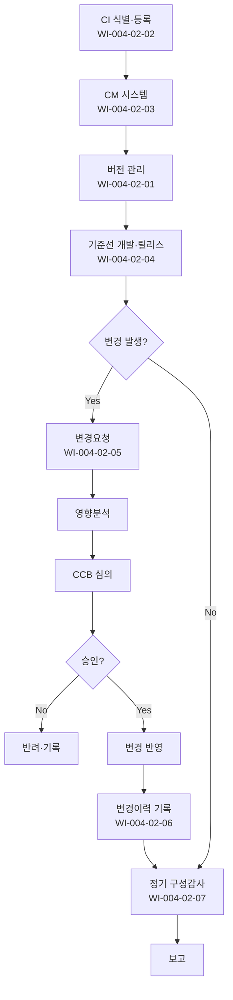

# 형상관리 절차 (PRO-CMMI-04-02)

> 상위 정책: [[POL-CMMI-04_품질_구성_및_의사결정_정책_v1.0]]

## 1. 목적
형상항목(CI) 식별 → 기준선 → 변경통제 → 상태기록 → 구성감사로 이어지는 흐름을 통해 모든 작업산출물의 무결성과 변경 추적성을 보장한다.

## 2. 적용 범위
- 인도 가능 산출물(요구사항·설계·코드·시험·문서·릴리스 패키지)
- 프로세스 자산(POL/PRO/WI/TMP/EX 등)
- 외부 종속 부품·라이브러리

## 3. 역할과 책임 (RACI)
| 단계 | CM Manager | 작성자 | CCB | QA | PM |
|---|---|---|---|---|---|
| 버전 관리 | **R** | C | I | I | A |
| CI 식별 | **R** | C | I | C | A |
| 시스템 운영 | **R** | C | I | I | A |
| 기준선 릴리스 | **R** | C | **C** | C | A |
| 변경 승인 | C | **R** | **A** | C | I |
| 변경이력 기록 | **R** | C | I | C | A |
| 구성감사 | **R** | C | I | **C** | A |

## 4. 절차 흐름


## 5. 단계별 상세
| # | 단계 | 설명 | 담당 | 입력 | 출력 |
|---|---|---|---|---|---|
| 1 | CI 식별 | 형상항목 식별·기록 | CM Manager | 산출물 목록 | CI 목록 |
| 2 | 시스템 운영 | CM 도구 구축·유지·사용 | CM Manager | CI 목록 | CM 시스템 |
| 3 | 버전 관리 | 작업산출물 버전 관리 | 작성자/CM | CI | 버전 이력 |
| 4 | 기준선 | 기준선 개발·릴리스 | CM Manager | 버전 | 기준선·릴리스 노트 |
| 5 | 변경요청 | 변경요청 접수·영향분석 | 작성자/CM | 변경요청서 | 영향분석 |
| 6 | CCB 승인 | 변경 심의·승인 | CCB | 영향분석 | 승인 결과 |
| 7 | 변경이력 | 상태·변경이력 기록 | CM Manager | 변경 결과 | 변경이력 대장 |
| 8 | 구성감사 | 기준선·변경·시스템 무결성 감사 | CM Manager | CM 데이터 | 감사 보고 |

## 6. 연계 업무지침 (WI)
- [[WI-CMMI-04-02-01_버전_관리_기본_v1.0]]
- [[WI-CMMI-04-02-02_형상항목_식별_및_등록_v1.0]]
- [[WI-CMMI-04-02-03_CM_시스템_운영_v1.0]]
- [[WI-CMMI-04-02-04_기준선_개발_및_릴리스_v1.0]]
- [[WI-CMMI-04-02-05_변경요청_및_CCB_승인_v1.0]]
- [[WI-CMMI-04-02-06_변경이력_기록_관리_v1.0]]
- [[WI-CMMI-04-02-07_구성감사_수행_v1.0]]

## 7. 통제점 / KPI
| 통제점 | 지표 | 목표 | 주기 |
|---|---|---|---|
| CI 등록율 | 인도 산출물 중 등록 비율 | 100% | 프로젝트 |
| 변경요청 처리 SLA | 접수→결정 | ≤ 5 영업일 | 월 |
| 무단 변경 발생 건수 | 비공식 변경 | 0건 | 분기 |
| 구성감사 부적합 재발률 | 재발 비율 | < 10% | 반기 |
| 기준선 릴리스 노트 보유율 | 릴리스당 보유 | 100% | 분기 |

## 8. 표준 매핑 (Traceability)
| Practice | Req-ID | 반영 위치 |
|---|---|---|
| CM 1.1 | CMMI-CM-1.1 | §5-3 버전 관리 |
| CM 2.1 | CMMI-CM-2.1 | §5-1 CI 식별 |
| CM 2.2 | CMMI-CM-2.2 | §5-2 시스템 운영 |
| CM 2.3 | CMMI-CM-2.3 | §5-4 기준선 |
| CM 2.4 | CMMI-CM-2.4 | §5-5,6 변경 통제 |
| CM 2.5 | CMMI-CM-2.5 | §5-7 상태 기록 |
| CM 2.6 | CMMI-CM-2.6 | §5-8 구성감사 |

## 9. 출처 (source_citation)
```yaml
- type: standard_original
  file: "_inputs/01_표준원문/CMMI-DEV/Core PAs/CM.pdf"
  locator: "Configuration Management PG1~PG2 (직접 Read 확인)"
  retrieved_at: "2026-04-29"
  license: "ISACA copyright — paraphrase only"
  paraphrase_only: true
```

## 10. 개정 이력
| 버전 | 일자 | 변경내용 | 승인자 |
|---|---|---|---|
| 1.0 | 2026-04-29 | 최초 승인 (CMMI-DEV-ML3 편입) | CEO |
