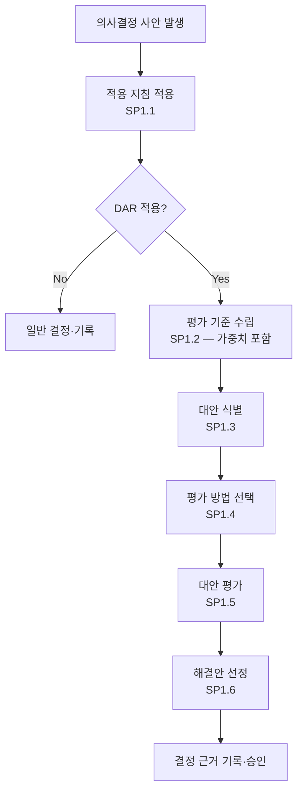

# 의사결정 분석·결정 절차 (PRO-CMMI-04-04)

상위 정책: [[POL-CMMI-04_지원_품질보증_정책]] · 표준: CMMI-DEV V1.3 DAR

## 1. 목적
영향 큰 의사결정(고비용·비가역·이해관계자 다양·고리스크)을 형식적 평가 프로세스로 처리하여, 평가기준·대안·평가방법에 따라 객관적 결정을 내리고 근거를 기록한다. 전 PA의 형식적 의사결정 지원 (DAR-supports-all).

## 2. 적용 범위
DAR 적용 지침(SP1.1)이 트리거하는 모든 의사결정. 예: TS SP1.1 솔루션 선정, TS SP2.4 Make/Buy/Reuse, SAM SP1.2 공급자 선정, OPF SP1.3 개선 선정 등.

## 3. 정의
- **Formal Evaluation Process**: 가중·평가기준 기반 의사결정 프로세스.
- **DAR Trigger Criteria**: DAR 적용 여부 판정 지침(SP1.1).

## 4. 역할과 책임 (RACI)
| 단계 | Decision Owner | Decision Facilitator | 평가 패널 | 이해관계자 | Approver |
|---|---|---|---|---|---|
| 적용 지침 (SP1.1) | C | **R** | I | I | A |
| 평가 기준 (SP1.2) | **R** | C | C | C | A |
| 대안 식별 (SP1.3) | **R** | C | C | C | I |
| 평가 방법 (SP1.4) | C | **R** | C | I | A |
| 대안 평가 (SP1.5) | C | **R** | **R** | C | I |
| 해결안 선정 (SP1.6) | **R** | C | C | I | **A** |

## 5. 절차 흐름



## 6. SG/SP 매핑 및 단계별 상세

| #   | SP    | 단계 | 입력 | 출력 (TMP 후보) |
|---|---|---|---|---|
| 1 | SP1.1 | 적용 지침 적용 | 의사결정 사안 | 형식평가 적용 지침 적용 결과 |
| 2 | SP1.2 | 평가 기준 수립 | 사안 | 평가기준 정의서(가중치 포함) |
| 3 | SP1.3 | 대안 식별 | 기준 | 대안 목록 |
| 4 | SP1.4 | 평가 방법 선정 | 기준, 대안 | 선정된 평가 방법 |
| 5 | SP1.5 | 대안 평가 | 방법 적용 | 평가 결과 기록 |
| 6 | SP1.6 | 해결안 선정 | 평가 결과 | 의사결정 근거서, 추천 해결안 보고서 |

### 6.1 SG/SP source citation
| Req-ID | Title | 출처 |
|---|---|---|
| CMMIDEV-DAR-SG1-REQ-001 | Evaluate Alternatives | requirements.yaml#CMMIDEV-DAR-SG1-REQ-001 (p.151) |
| CMMIDEV-DAR-SP1.1-REQ-001 | Establish Guidelines for Decision Analysis | requirements.yaml#CMMIDEV-DAR-SP1.1-REQ-001 (p.151) |
| CMMIDEV-DAR-SP1.2-REQ-001 | Establish Evaluation Criteria | requirements.yaml#CMMIDEV-DAR-SP1.2-REQ-001 (p.152) |
| CMMIDEV-DAR-SP1.3-REQ-001 | Identify Alternative Solutions | requirements.yaml#CMMIDEV-DAR-SP1.3-REQ-001 (p.153) |
| CMMIDEV-DAR-SP1.4-REQ-001 | Select Evaluation Methods | requirements.yaml#CMMIDEV-DAR-SP1.4-REQ-001 (p.154) |
| CMMIDEV-DAR-SP1.5-REQ-001 | Evaluate Alternative Solutions | requirements.yaml#CMMIDEV-DAR-SP1.5-REQ-001 (p.155) |
| CMMIDEV-DAR-SP1.6-REQ-001 | Select Solutions | requirements.yaml#CMMIDEV-DAR-SP1.6-REQ-001 (p.156) |

## 7. 통제점 / KPI
| 통제점 | 지표 | 목표 | 주기 |
|---|---|---|---|
| 트리거 적용율 | 영향 큰 결정 중 DAR 적용 비율 | 100% | 분기 |
| 결정 후 번복율 | 6개월 내 결정 번복 / 결정 수 | ≤ 10% | 반기 |
| 결정 근거 완전성 | 근거서 필수항목 충족율 | 100% | 분기 |
| 결정 리드타임 | 트리거→결정 | 사안 복잡도별 SLA 충족 | 분기 |

## 8. 표준 매핑 (Traceability)
- DAR SG1 → §5 흐름, §6 단계
- DAR-supports-all (p.53) → 본 PRO는 전 PA의 형식 평가 지원
- TS SP1.1, SP2.4 등이 본 PRO 호출

## 9. source_citation
```yaml
- type: standard_original
  file: "inputs/01_표준원문/CMMI-DEV/requirements.yaml"
  locator: "CMMIDEV-DAR-SG1-REQ-001 (p.151-156)"
  retrieved_at: "2026-05-11"
  license: "CMU/SEI internal_use_derivative_work"
  paraphrase_only: true
- type: standard_original
  file: "inputs/01_표준원문/CMMI-DEV/pa_relationships.yaml"
  locator: "DAR-supports-all (p.53)"
  retrieved_at: "2026-05-11"
```

## 10. 개정 이력
| 버전 | 일자 | 변경내용 | 승인자 |
|---|---|---|---|
| 0.1 | 2026-05-11 | 최초 초안 (process-designer 생성) | - |
