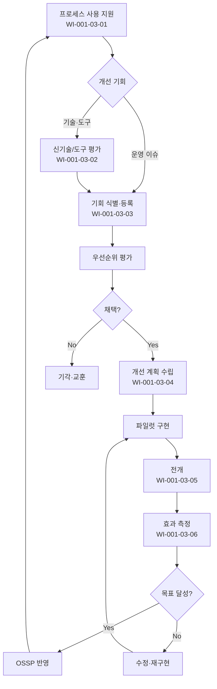

# 프로세스 관리 및 개선 절차 (PRO-CMMI-103)

> 상위 정책: [[POL-CMMI-001_거버넌스_및_프로세스자산_정책_v1.0]]

## 1. 목적
정의된 프로세스의 사용을 지원하고, 개선 기회를 식별·관리·구현·전개·평가하여 프로세스 성숙도를 점진적으로 향상시킨다.

## 2. 적용 범위
- 전사 모든 프로세스 영역(PA)에 대한 사용 지원·개선 활동
- 신기술·도구·방법론 평가
- 외부 벤치마크·내부 측정 데이터에서 도출된 기회

## 3. 역할과 책임 (RACI)
| 단계 | SEPG | PCB | Process Owner | PM | 일반 인력 |
|---|---|---|---|---|---|
| 사용 지원 | **R** | A | **R** | C | I |
| 개선 지원 | **R** | A | C | C | C |
| 신기술 평가 | **R** | A | C | C | I |
| 기회 식별·관리 | **R** | **A** | C | C | C |
| 개선 구현 | R | A | **R** | C | I |
| 개선 전개 | **R** | A | R | **R** | I |
| 효과 평가 | **R** | **A** | C | C | I |

## 4. 절차 흐름


## 5. 단계별 상세
| # | 단계 | 설명 | 담당 | 입력 | 출력 |
|---|---|---|---|---|---|
| 1 | 사용 지원 | 헬프데스크·코칭·QA 컨설팅 | SEPG | 문의·이슈 | 답변·가이드 |
| 2 | 신기술 평가 | 잠재 기술·도구·프로세스 효익 평가 | SEPG | 후보 목록 | 평가서 |
| 3 | 기회 등록 | 측정·내부심사·교훈에서 도출 | SEPG | 데이터 소스 | 개선기회 등록부 |
| 4 | 우선순위 평가 | 효익·노력·리스크 기반 | PCB | 등록부 | 우선순위 결정 |
| 5 | 계획 구현 | 파일럿 계획·실행 | Process Owner | 우선순위 결정 | 파일럿 결과 |
| 6 | 전개 | 전사 도입·교육·코칭 | SEPG | 파일럿 결과 | 전개 보고 |
| 7 | 효과 평가 | KPI·만족도 평가 | SEPG | 전개 데이터 | 효과 평가서 |

## 6. 연계 업무지침 (WI)
- [[WI-CMMI-001-03-01_프로세스_사용_지원_v1.0]]
- [[WI-CMMI-001-03-02_신기술_및_도구_평가_v1.0]]
- [[WI-CMMI-001-03-03_개선기회_식별_및_관리_v1.0]]
- [[WI-CMMI-001-03-04_프로세스_개선_계획_및_구현_v1.0]]
- [[WI-CMMI-001-03-05_개선_전개_v1.0]]
- [[WI-CMMI-001-03-06_개선_효과_평가_v1.0]]

## 7. 통제점 / KPI
| 통제점 | 지표 | 목표 | 주기 |
|---|---|---|---|
| 개선기회 처리율 | 등록 대비 종결 | ≥ 80% | 분기 |
| 파일럿 성공률 | 전개 진입율 | ≥ 60% | 반기 |
| 신기술 평가 건수 | 연간 평가 건수 | ≥ 6 | 연 |
| 개선 효과 정량 측정율 | KPI 측정 가능 비율 | ≥ 90% | 반기 |
| 사용지원 응답시간 | 24시간 이내 응답 | ≥ 95% | 월 |

## 8. 표준 매핑 (Traceability)
| Practice | Req-ID | 반영 위치 |
|---|---|---|
| PCM 1.1 | CMMI-PCM-1.1 | §5-1 사용 지원 |
| PCM 2.1 | CMMI-PCM-2.1 | §5-1,2 개선 지원 |
| PCM 2.2 | CMMI-PCM-2.2 | §5-2 신기술 평가 |
| PCM 3.1 | CMMI-PCM-3.1 | §5-3 기회 식별 |
| PCM 3.2 | CMMI-PCM-3.2 | §5-5 계획·구현 |
| PCM 3.3 | CMMI-PCM-3.3 | §5-6 전개 |
| PCM 3.4 | CMMI-PCM-3.4 | §5-7 효과 평가 |

## 9. 출처 (source_citation)
```yaml
- type: standard_original
  file: "_inputs/01_표준원문/CMMI-DEV/Core PAs/PCM.pdf"
  locator: "Process Management PG1~PG3"
  retrieved_at: "2026-04-29"
  license: "ISACA copyright — paraphrase only"
  paraphrase_only: true
```

## 10. 개정 이력
| 버전 | 일자 | 변경내용 | 승인자 |
|---|---|---|---|
| 1.0 | 2026-04-29 | 최초 승인 (CMMI-DEV-ML3 편입) | CEO |
