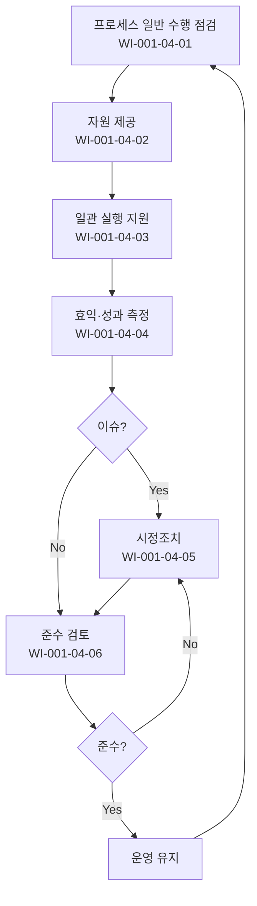

# 구현 인프라 운영 절차 (PRO-CMMI-104)

> 상위 정책: [[POL-CMMI-001_거버넌스_및_프로세스자산_정책_v1.0]]

## 1. 목적
프로세스가 정의된 대로 일관 수행되도록 자원·교육·점검 인프라를 제공하고, 비용·효익·성과를 측정하여 시정조치하며, 준수 여부를 정기 검토한다.

## 2. 적용 범위
- 정의된 모든 프로세스의 실제 수행 현장
- 도구체인·코칭·교육·체크리스트 등 인에이블링 자원
- 부적합 발견 시 시정조치까지 종결 추적

## 3. 역할과 책임 (RACI)
| 단계 | SEPG | Process Owner | PM | QA | PCB |
|---|---|---|---|---|---|
| 내재화 점검 | **R** | C | C | C | A |
| 자원 제공 | **R** | C | C | I | A |
| 일관 실행 지원 | **R** | **R** | C | I | A |
| 효익 측정 | **R** | C | C | C | A |
| 시정조치 | C | **R** | **R** | C | A |
| 준수 검토 | **R** | C | C | **R** | **A** |

## 4. 절차 흐름


## 5. 단계별 상세
| # | 단계 | 설명 | 담당 | 입력 | 출력 |
|---|---|---|---|---|---|
| 1 | 내재화 점검 | 프로세스가 일반 수행 방식대로 실행되는지 확인 | SEPG | 운영 데이터 | 점검표 |
| 2 | 자원 제공 | 도구·문서·교육·코칭 제공 | SEPG | 요청서 | 자원 배포 |
| 3 | 일관 실행 지원 | 프로세스 일관 수행을 위한 코칭·점검 | SEPG/Owner | 운영 현장 | 코칭 기록 |
| 4 | 효익 측정 | 비용·성과·효익 측정값 수집·분석 | SEPG | 측정 정의 | 측정 보고 |
| 5 | 시정조치 | 발견된 부적합 처리 | Owner/PM | 부적합 | 시정조치서 |
| 6 | 준수 검토 | 정기 준수 여부 검토 | QA | 활동 증적 | 준수 검토 보고 |

## 6. 연계 업무지침 (WI)
- [[WI-CMMI-001-04-01_프로세스_내재화_점검_v1.0]]
- [[WI-CMMI-001-04-02_프로세스_자원_제공_v1.0]]
- [[WI-CMMI-001-04-03_일관_실행_지원_v1.0]]
- [[WI-CMMI-001-04-04_효익_및_성과_측정_v1.0]]
- [[WI-CMMI-001-04-05_프로세스_시정조치_v1.0]]
- [[WI-CMMI-001-04-06_프로세스_준수_검토_v1.0]]

## 7. 통제점 / KPI
| 통제점 | 지표 | 목표 | 주기 |
|---|---|---|---|
| 프로세스 내재화율 | 정의 vs 실행 일치율 | ≥ 90% | 반기 |
| 자원 제공 적시성 | 요청→제공 SLA | ≤ 5 영업일 | 월 |
| 시정조치 종결율 | 발의 대비 종결 | ≥ 95% | 분기 |
| 준수 검토 부적합률 | 검토당 부적합 평균 | 감소 추세 | 반기 |
| 효익 측정 수행률 | 정의된 측정값 수집율 | ≥ 95% | 분기 |

## 8. 표준 매핑 (Traceability)
| Practice | Req-ID | 반영 위치 |
|---|---|---|
| II 1.1 | CMMI-II-1.1 | §5-1 내재화 점검 |
| II 2.1 | CMMI-II-2.1 | §5-2 자원 제공 |
| II 2.2 | CMMI-II-2.2 | §5-3 일관 실행 |
| II 3.1 | CMMI-II-3.1 | §5-4 효익 측정 |
| II 3.2 | CMMI-II-3.2 | §5-5 시정조치 |
| II 3.3 | CMMI-II-3.3 | §5-6 준수 검토 |

## 9. 출처 (source_citation)
```yaml
- type: standard_original
  file: "_inputs/01_표준원문/CMMI-DEV/Core PAs/II.pdf"
  locator: "Implementation Infrastructure PG1~PG3"
  retrieved_at: "2026-04-29"
  license: "ISACA copyright — paraphrase only"
  paraphrase_only: true
```

## 10. 개정 이력
| 버전 | 일자 | 변경내용 | 승인자 |
|---|---|---|---|
| 1.0 | 2026-04-29 | 최초 승인 (CMMI-DEV-ML3 편입) | CEO |
