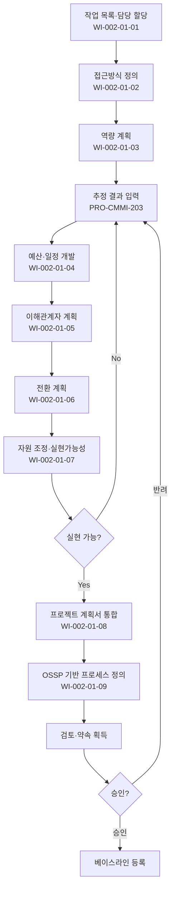

# 프로젝트 계획 절차 (PRO-CMMI-201)

> 상위 정책: [[POL-CMMI-002_프로젝트관리_정책_v1.0]]

## 1. 목적
프로젝트 착수 시 작업 접근방식·역량·예산·일정·이해관계자·전환·프로세스 정의를 통합한 계획서를 작성·검토·약속·승인하여 사실 기반의 실행 가능 계획을 확보한다.

## 2. 적용 범위
- 모든 신규/개선 개발 프로젝트
- 다단계 프로젝트는 단계별 계획 갱신 적용
- 운영지원·소규모 변경은 경량 테일러링 후 적용

## 3. 역할과 책임 (RACI)
| 단계 | PM | PMO | Process Owner | 이해관계자 | CEO/임원 |
|---|---|---|---|---|---|
| 작업 목록·할당 | **R** | C | C | I | I |
| 접근방식 정의 | **R** | C | C | C | I |
| 역량 계획 | **R** | C | C | I | I |
| 예산·일정 | **R** | **A** | C | C | I |
| 이해관계자 계획 | **R** | C | C | C | I |
| 전환 계획 | **R** | C | C | C | I |
| 자원 조정 | **R** | **A** | C | C | I |
| 통합·승인 | **R** | A | C | **C** | **A** |
| OSSP 테일러링 | C | C | **R** | I | I |

## 4. 절차 흐름


## 5. 단계별 상세
| # | 단계 | 설명 | 담당 | 입력 | 출력 |
|---|---|---|---|---|---|
| 1 | 작업 목록·할당 | WBS·담당자 할당 | PM | 범위 | 작업 목록 |
| 2 | 접근방식 정의 | 수명주기·방법론·테일러링 | PM | OSSP | 접근방식 |
| 3 | 역량 계획 | 필요 지식·기술 명세 | PM | 작업 목록 | 역량 계획 |
| 4 | 예산·일정 | 추정 결과 기반 | PM | 추정서 | 예산·일정 |
| 5 | 이해관계자 계획 | 식별·참여·통신 계획 | PM | 이해관계자 목록 | 참여 계획 |
| 6 | 전환 계획 | 운영·지원 이관 계획 | PM | 인도 모델 | 전환 계획 |
| 7 | 자원 조정 | 가용성·용량 조정 | PM/PMO | 자원 풀 | 조정 결과 |
| 8 | 통합·승인 | 계획서 통합 + 검토 + 약속 + 승인 | PM/CEO | 모든 입력 | 승인된 계획서 |
| 9 | OSSP 테일러링 | OSSP·테일러링 지침으로 프로젝트 프로세스 정의 | Process Owner | OSSP, 지침 | 프로젝트 프로세스 정의서 |

## 6. 연계 업무지침 (WI)
- [[WI-CMMI-002-01-01_작업_목록_개발_및_담당_할당_v1.0]]
- [[WI-CMMI-002-01-02_작업_접근방식_정의_v1.0]]
- [[WI-CMMI-002-01-03_지식_및_역량_계획_v1.0]]
- [[WI-CMMI-002-01-04_예산_및_일정_개발_v1.0]]
- [[WI-CMMI-002-01-05_이해관계자_참여_계획_v1.0]]
- [[WI-CMMI-002-01-06_전환_계획_수립_v1.0]]
- [[WI-CMMI-002-01-07_자원_조정_및_실현가능성_분석_v1.0]]
- [[WI-CMMI-002-01-08_프로젝트_계획서_통합_및_승인_v1.0]]
- [[WI-CMMI-002-01-09_OSSP_기반_프로젝트_프로세스_정의_v1.0]]

## 7. 통제점 / KPI
| 통제점 | 지표 | 목표 | 주기 |
|---|---|---|---|
| 계획서 승인 적시성 | 착수 후 30일 내 승인 | ≥ 95% | 분기 |
| 추정 근거 보유율 | 추정서 보유 프로젝트 | 100% | 분기 |
| 이해관계자 약속 획득율 | 핵심 이해관계자 서명 | 100% | 프로젝트 |
| 테일러링 적용률 | OSSP 기반 정의 비율 | ≥ 90% | 분기 |
| 계획 변경 빈도 | 베이스라인 변경 건수 | ≤ 4/프로젝트 | 프로젝트 |

## 8. 표준 매핑 (Traceability)
| Practice | Req-ID | 반영 위치 |
|---|---|---|
| PLAN 1.1 | CMMI-PLAN-1.1 | §5-1 작업 목록 |
| PLAN 1.2 | CMMI-PLAN-1.2 | §5-1 담당 할당 |
| PLAN 2.1 | CMMI-PLAN-2.1 | §5-2 접근방식 |
| PLAN 2.2 | CMMI-PLAN-2.2 | §5-3 역량 계획 |
| PLAN 2.3 | CMMI-PLAN-2.3 | §5-4 예산·일정 |
| PLAN 2.4 | CMMI-PLAN-2.4 | §5-5 이해관계자 |
| PLAN 2.5 | CMMI-PLAN-2.5 | §5-6 전환 |
| PLAN 2.6 | CMMI-PLAN-2.6 | §5-7 자원 조정 |
| PLAN 2.7 | CMMI-PLAN-2.7 | §5-8 통합 |
| PLAN 2.8 | CMMI-PLAN-2.8 | §5-8 약속·승인 |
| PLAN 3.1 | CMMI-PLAN-3.1 | §5-9 OSSP 테일러링 |
| PLAN 3.2 | CMMI-PLAN-3.2 | §5-8 통합(OPA·측정저장소) |
| PLAN 3.3 | CMMI-PLAN-3.3 | §5-7 종속성 |
| PLAN 3.4 | CMMI-PLAN-3.4 | §5-9 환경 계획 |

## 9. 출처 (source_citation)
```yaml
- type: standard_original
  file: "_inputs/01_표준원문/CMMI-DEV/Core PAs/PLAN.pdf"
  locator: "Planning PG1~PG3 (직접 Read 확인)"
  retrieved_at: "2026-04-29"
  license: "ISACA copyright — paraphrase only"
  paraphrase_only: true
```

## 10. 개정 이력
| 버전 | 일자 | 변경내용 | 승인자 |
|---|---|---|---|
| 1.0 | 2026-04-29 | 최초 승인 (CMMI-DEV-ML3 편입) | CEO |
