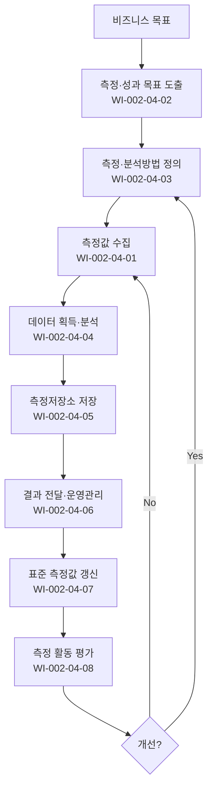

# 성과 및 측정 관리 절차 (PRO-CMMI-204)

> 상위 정책: [[POL-CMMI-002_프로젝트관리_정책_v1.0]]

## 1. 목적
비즈니스 목표 → 측정·성과 목표 → 측정 정의 → 데이터 수집·분석·저장·보고 → 평가·개선의 사이클을 운영하여 사실에 기반한 운영·의사결정을 지원한다.

## 2. 적용 범위
- 프로젝트·조직 차원의 측정·성과 활동
- 조직 표준 측정값(OPM)·측정저장소 운영
- 결과의 이해관계자 보고·활용

## 3. 역할과 책임 (RACI)
| 단계 | SEPG | PMO | PM | Process Owner | CEO |
|---|---|---|---|---|---|
| 측정값 수집·이슈 | C | A | **R** | C | I |
| 목표 도출 | **R** | A | C | C | **R** |
| 정의 | **R** | A | C | C | I |
| 데이터 획득·분석 | C | A | **R** | C | I |
| 저장 | **R** | A | C | C | I |
| 결과 전달 | **R** | **R** | C | C | I |
| 표준 측정값 | **R** | A | C | C | I |
| 평가·개선 | **R** | A | C | C | I |

## 4. 절차 흐름


## 5. 단계별 상세
| # | 단계 | 설명 | 담당 | 입력 | 출력 |
|---|---|---|---|---|---|
| 1 | 목표 도출 | 비즈니스 목표 → 측정·성과 목표 | SEPG | 비즈니스 목표 | 측정 목표 |
| 2 | 정의 | 측정·분석방법 정의 | SEPG | 측정 목표 | 측정 정의서 |
| 3 | 수집·이슈 | 진척·성과 측정값 수집·이슈 처리 | PM | 정의서 | 원시 데이터 |
| 4 | 획득·분석 | 정해진 절차로 획득·분석 | PM | 원시 데이터 | 분석 결과 |
| 5 | 저장 | 측정저장소 저장(이력·정의 포함) | SEPG | 분석 결과 | 저장본 |
| 6 | 결과 전달 | 이해관계자 보고·운영 결정 | PMO/SEPG | 저장본 | 보고서·결정 |
| 7 | 표준 측정값 | 조직 표준·저장소 갱신 | SEPG | 결과 | OPM·OMR 갱신 |
| 8 | 평가·개선 | 측정·분석 활동 자체 평가 | SEPG | KPI | 개선 결정 |

## 6. 연계 업무지침 (WI)
- [[WI-CMMI-002-04-01_측정값_수집_및_이슈_처리_v1.0]]
- [[WI-CMMI-002-04-02_측정_및_성과_목표_도출_v1.0]]
- [[WI-CMMI-002-04-03_측정_및_분석방법_정의_v1.0]]
- [[WI-CMMI-002-04-04_데이터_획득_및_분석_v1.0]]
- [[WI-CMMI-002-04-05_측정저장소_저장_v1.0]]
- [[WI-CMMI-002-04-06_결과_전달_및_운영관리_v1.0]]
- [[WI-CMMI-002-04-07_조직_표준_측정값_관리_v1.0]]
- [[WI-CMMI-002-04-08_측정_활동_평가_및_개선_v1.0]]

## 7. 통제점 / KPI
| 통제점 | 지표 | 목표 | 주기 |
|---|---|---|---|
| 측정 목표 정렬율 | 비즈니스 목표 추적성 보유 | 100% | 반기 |
| 데이터 수집율 | 정의 측정값 수집 비율 | ≥ 95% | 월 |
| 저장소 등재율 | 종료 프로젝트 등재 | 100% | 분기 |
| 보고 적시성 | 기한 준수율 | ≥ 95% | 월 |
| 측정 활동 만족도 | 사용자 만족도 | ≥ 4.0/5.0 | 반기 |

## 8. 표준 매핑 (Traceability)
| Practice | Req-ID | 반영 위치 |
|---|---|---|
| MPM 1.1 | CMMI-MPM-1.1 | §5-3 수집 |
| MPM 1.2 | CMMI-MPM-1.2 | §5-3 이슈 처리 |
| MPM 2.1 | CMMI-MPM-2.1 | §5-1 목표 도출 |
| MPM 2.2 | CMMI-MPM-2.2 | §5-2 정의 |
| MPM 2.3 | CMMI-MPM-2.3 | §5-4 획득 |
| MPM 2.4 | CMMI-MPM-2.4 | §5-4 분석 |
| MPM 2.5 | CMMI-MPM-2.5 | §5-5 저장 |
| MPM 2.6 | CMMI-MPM-2.6 | §5-6 전달 |
| MPM 3.1 | CMMI-MPM-3.1 | §5-7 조직 측정 목표 |
| MPM 3.2 | CMMI-MPM-3.2 | §5-7 OPM·OMR |
| MPM 3.3 | CMMI-MPM-3.3 | §5-6 개선 기회 |
| MPM 3.4 | CMMI-MPM-3.4 | §5-6 분석 보고 |
| MPM 3.5 | CMMI-MPM-3.5 | §5-6 운영 관리 |
| MPM 3.6 | CMMI-MPM-3.6 | §5-8 평가·개선 |

## 9. 출처 (source_citation)
```yaml
- type: standard_original
  file: "_inputs/01_표준원문/CMMI-DEV/Core PAs/MPM.pdf"
  locator: "Managing Performance & Measurement PG1~PG3"
  retrieved_at: "2026-04-29"
  license: "ISACA copyright — paraphrase only"
  paraphrase_only: true
```

## 10. 개정 이력
| 버전 | 일자 | 변경내용 | 승인자 |
|---|---|---|---|
| 1.0 | 2026-04-29 | 최초 승인 (CMMI-DEV-ML3 편입) | CEO |
