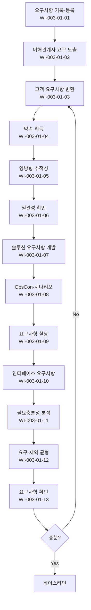

# 요구사항 개발 및 관리 절차 (PRO-CMMI-301)

> 상위 정책: [[POL-CMMI-003_엔지니어링_정책_v1.0]]

## 1. 목적
이해관계자 요구사항 도출에서 솔루션 구성요소 요구사항 할당까지를 통제하고, 양방향 추적성·일관성·필요충분성을 확보한다.

## 2. 적용 범위
- 신규/개선 SW·시스템 개발의 요구사항 활동
- 기존 시스템 변경 요구도 동일 절차 적용
- 인터페이스·운영개념(OpsCon) 포함

## 3. 역할과 책임 (RACI)
| 단계 | BA | 아키텍트 | PM | 이해관계자 | QA |
|---|---|---|---|---|---|
| 기록 | **R** | C | A | I | C |
| 도출 | **R** | C | A | **C** | I |
| 변환 | **R** | C | A | C | I |
| 약속 획득 | **R** | C | **A** | **C** | I |
| 추적성 | **R** | C | A | I | **C** |
| 일관성 확인 | **R** | C | A | I | **C** |
| 솔루션 요구사항 | C | **R** | A | C | C |
| OpsCon | **R** | C | A | C | I |
| 할당 | C | **R** | A | I | I |
| 인터페이스 | C | **R** | A | C | C |
| 필요충분성 | **R** | **R** | A | C | C |
| 균형 | **R** | C | A | **C** | I |
| 확인 | **R** | C | A | C | C |

## 4. 절차 흐름


## 5. 단계별 상세
| # | 단계 | 설명 | 담당 | 입력 | 출력 |
|---|---|---|---|---|---|
| 1 | 기록 | 요구사항 등록·식별 | BA | 입력 | 요구사항 등록부 |
| 2 | 도출 | 이해관계자 요구·기대·제약 도출 | BA | 인터뷰·문서 | 원시 요구 |
| 3 | 변환 | 우선순위 매겨진 고객 요구사항 | BA | 원시 요구 | 고객 요구사항 |
| 4 | 약속 획득 | 구현 약속 수령 | PM | 고객 요구 | 약속서 |
| 5 | 추적성 | 양방향 추적성 매트릭스 | BA | 요구사항 | 추적성 매트릭스 |
| 6 | 일관성 | 계획·산출물과의 일관성 | BA/QA | 산출물 | 일관성 점검 결과 |
| 7 | 솔루션 요구 | 솔루션·구성요소 요구사항 | 아키텍트 | 고객 요구 | 시스템 요구사항 |
| 8 | OpsCon | 운영개념·시나리오 | BA | 시스템 요구 | OpsCon |
| 9 | 할당 | 구성요소·기능에 할당 | 아키텍트 | 시스템 요구 | 할당 매트릭스 |
| 10 | 인터페이스 | ICD 식별·정의 | 아키텍트 | 시스템 구조 | ICD |
| 11 | 필요충분성 | 누락·중복·모순 분석 | BA/아키텍트 | 요구사항 | 분석 결과 |
| 12 | 균형 | 요구·제약 트레이드오프 | BA | 분석 결과 | 균형 결정 |
| 13 | 확인 | 의도 환경에서 작동 검증 | BA | 시나리오 | 확인 결과 |

## 6. 연계 업무지침 (WI)
- [[WI-CMMI-003-01-01_요구사항_기록_및_등록부_v1.0]]
- [[WI-CMMI-003-01-02_요구사항_도출_및_확인_v1.0]]
- [[WI-CMMI-003-01-03_고객_요구사항_변환_v1.0]]
- [[WI-CMMI-003-01-04_요구사항_약속_획득_v1.0]]
- [[WI-CMMI-003-01-05_양방향_추적성_관리_v1.0]]
- [[WI-CMMI-003-01-06_요구사항_일관성_확인_v1.0]]
- [[WI-CMMI-003-01-07_솔루션_요구사항_개발_v1.0]]
- [[WI-CMMI-003-01-08_운영개념_시나리오_개발_v1.0]]
- [[WI-CMMI-003-01-09_요구사항_할당_v1.0]]
- [[WI-CMMI-003-01-10_인터페이스_요구사항_관리_v1.0]]
- [[WI-CMMI-003-01-11_요구사항_필요충분성_분석_v1.0]]
- [[WI-CMMI-003-01-12_이해관계자_요구_제약_균형_v1.0]]
- [[WI-CMMI-003-01-13_요구사항_확인_v1.0]]

## 7. 통제점 / KPI
| 통제점 | 지표 | 목표 | 주기 |
|---|---|---|---|
| 추적성 매트릭스 보유율 | 요구사항 추적성 | 100% | 프로젝트 |
| 요구사항 변경 빈도 | 베이스라인 후 변경율 | ≤ 15% | 프로젝트 |
| 요구사항 결함 발견 단계 | 후공정 결함 비율 | ≤ 10% | 프로젝트 |
| 약속 획득율 | 핵심 이해관계자 서명 | 100% | 프로젝트 |
| 인터페이스 호환성 결함 | 통합 단계 발견 ICD 결함 | 감소 추세 | 분기 |

## 8. 표준 매핑 (Traceability)
| Practice | Req-ID | 반영 위치 |
|---|---|---|
| RDM 1.1 | CMMI-RDM-1.1 | §5-1 기록 |
| RDM 2.1 | CMMI-RDM-2.1 | §5-2 도출 |
| RDM 2.2 | CMMI-RDM-2.2 | §5-3 변환 |
| RDM 2.3 | CMMI-RDM-2.3 | §5-4 약속 |
| RDM 2.4 | CMMI-RDM-2.4 | §5-5 추적성 |
| RDM 2.5 | CMMI-RDM-2.5 | §5-6 일관성 |
| RDM 3.1 | CMMI-RDM-3.1 | §5-7 솔루션 요구 |
| RDM 3.2 | CMMI-RDM-3.2 | §5-8 OpsCon |
| RDM 3.3 | CMMI-RDM-3.3 | §5-9 할당 |
| RDM 3.4 | CMMI-RDM-3.4 | §5-10 인터페이스 |
| RDM 3.5 | CMMI-RDM-3.5 | §5-11 필요충분성 |
| RDM 3.6 | CMMI-RDM-3.6 | §5-12 균형 |
| RDM 3.7 | CMMI-RDM-3.7 | §5-13 확인 |

## 9. 출처 (source_citation)
```yaml
- type: standard_original
  file: "_inputs/01_표준원문/CMMI-DEV/Core PAs/RDM.pdf"
  locator: "Requirements Development & Management PG1~PG3 (직접 Read 확인)"
  retrieved_at: "2026-04-29"
  license: "ISACA copyright — paraphrase only"
  paraphrase_only: true
```

## 10. 개정 이력
| 버전 | 일자 | 변경내용 | 승인자 |
|---|---|---|---|
| 1.0 | 2026-04-29 | 최초 승인 (CMMI-DEV-ML3 편입) | CEO |
