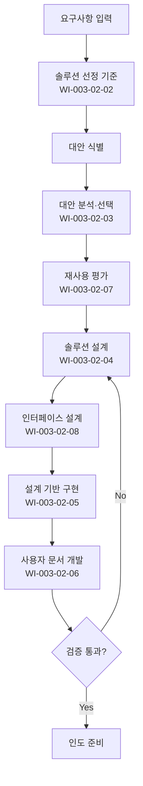

# 기술솔루션 절차 (PRO-CMMI-302)

> 상위 정책: [[POL-CMMI-003_엔지니어링_정책_v1.0]]

## 1. 목적
요구사항을 충족하는 솔루션·구성요소를 대안 분석으로 선택하고, 설계·구현·사용자 문서·인터페이스를 개발·유지한다.

## 2. 적용 범위
- 모든 SW·시스템 솔루션 개발의 설계·구현 활동
- 재사용 평가 및 인터페이스 설계
- 패키지 SW 도입 결정 시에도 대안 분석 적용

## 3. 역할과 책임 (RACI)
| 단계 | 아키텍트 | 개발자 | PM | QA | 기술 검토자 |
|---|---|---|---|---|---|
| 기본 구축 | C | **R** | A | I | I |
| 선정 기준 | **R** | C | A | I | C |
| 대안 분석·선택 | **R** | C | A | I | **C** |
| 설계 | **R** | C | A | I | **C** |
| 구현 | C | **R** | A | I | I |
| 사용자 문서 | C | **R** | A | C | I |
| 재사용 평가 | **R** | C | A | I | C |
| 인터페이스 설계 | **R** | C | A | I | **C** |

## 4. 절차 흐름


## 5. 단계별 상세
| # | 단계 | 설명 | 담당 | 입력 | 출력 |
|---|---|---|---|---|---|
| 1 | 기본 구축 | 솔루션·구성요소 구축 | 개발자 | 요구사항 | 솔루션 |
| 2 | 선정 기준 | 대안 분석 기준 정의 | 아키텍트 | 요구사항 | 선정 기준 |
| 3 | 대안 분석 | 대안 개발·평가·선택 | 아키텍트 | 기준 | 선택 결과 |
| 4 | 설계 | 솔루션·구성요소 설계 | 아키텍트 | 선택 결과 | 설계서 |
| 5 | 구현 | 설계 준수 구현 | 개발자 | 설계서 | 코드/구성요소 |
| 6 | 사용자 문서 | 사용·운영·유지 문서 | 개발자 | 솔루션 | 사용자 문서 |
| 7 | 재사용 | 재사용 가능 자산 평가 | 아키텍트 | 솔루션 | 재사용 평가서 |
| 8 | 인터페이스 | 인터페이스 설계 개발·유지 | 아키텍트 | 설계 | 인터페이스 설계서 |

## 6. 연계 업무지침 (WI)
- [[WI-CMMI-003-02-01_솔루션_구축_기본_v1.0]]
- [[WI-CMMI-003-02-02_솔루션_선정_기준_정의_v1.0]]
- [[WI-CMMI-003-02-03_대안_분석_및_선택_v1.0]]
- [[WI-CMMI-003-02-04_솔루션_설계_v1.0]]
- [[WI-CMMI-003-02-05_설계_기반_구현_v1.0]]
- [[WI-CMMI-003-02-06_사용자_문서_개발_v1.0]]
- [[WI-CMMI-003-02-07_재사용_평가_v1.0]]
- [[WI-CMMI-003-02-08_인터페이스_설계_관리_v1.0]]

## 7. 통제점 / KPI
| 통제점 | 지표 | 목표 | 주기 |
|---|---|---|---|
| 대안 분석 적용율 | 주요 결정 중 분석 적용 | ≥ 90% | 프로젝트 |
| 설계 검토 결함율 | 설계당 발견 결함 | 감소 추세 | 분기 |
| 재사용율 | 신규 코드 대비 재사용 | ≥ 30% | 프로젝트 |
| 사용자 문서 보유율 | 인도시 문서 보유 | 100% | 프로젝트 |
| 인터페이스 결함율 | 통합단계 ICD 결함 | 감소 추세 | 분기 |

## 8. 표준 매핑 (Traceability)
| Practice | Req-ID | 반영 위치 |
|---|---|---|
| TS 1.1 | CMMI-TS-1.1 | §5-1 기본 구축 |
| TS 2.1 | CMMI-TS-2.1 | §5-2 선정 기준 |
| TS 2.2 | CMMI-TS-2.2 | §5-3 대안 분석 |
| TS 2.3 | CMMI-TS-2.3 | §5-4 설계 |
| TS 2.4 | CMMI-TS-2.4 | §5-5 구현 |
| TS 2.5 | CMMI-TS-2.5 | §5-6 사용자 문서 |
| TS 3.1 | CMMI-TS-3.1 | §5-7 재사용 |
| TS 3.2 | CMMI-TS-3.2 | §5-8 인터페이스 |

## 9. 출처 (source_citation)
```yaml
- type: standard_original
  file: "_inputs/01_표준원문/CMMI-DEV/Development PAs/TS.pdf"
  locator: "Technical Solution PG1~PG3"
  retrieved_at: "2026-04-29"
  license: "ISACA copyright — paraphrase only"
  paraphrase_only: true
```

## 10. 개정 이력
| 버전 | 일자 | 변경내용 | 승인자 |
|---|---|---|---|
| 1.0 | 2026-04-29 | 최초 승인 (CMMI-DEV-ML3 편입) | CEO |
