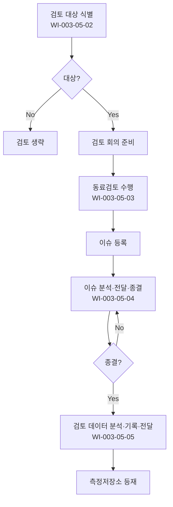

# 동료검토 절차 (PRO-CMMI-305)

> 상위 정책: [[POL-CMMI-003_엔지니어링_정책_v1.0]]

## 1. 목적
주요 작업산출물을 동료가 객관적으로 검토하여 결함을 조기 발견·종결하고, 검토 데이터를 조직 학습으로 환류한다.

## 2. 적용 범위
- 요구사항·설계·코드·시험·인도 산출물
- 검토 대상 결정 기준은 본 절차 §5 적용
- 외부 검토(고객·인증)와 별도 운영

## 3. 역할과 책임 (RACI)
| 단계 | 작성자 | 동료 검토자 | 모더레이터 | QA | PM |
|---|---|---|---|---|---|
| 기본 검토 | **R** | **R** | C | I | A |
| 대상 기준 | C | C | **R** | **C** | A |
| 검토 수행 | **R** | **R** | **R** | C | A |
| 이슈 종결 | **R** | C | A | **C** | A |
| 데이터 분석 | C | C | C | **R** | A |

## 4. 절차 흐름


## 5. 단계별 상세
| # | 단계 | 설명 | 담당 | 입력 | 출력 |
|---|---|---|---|---|---|
| 1 | 대상 결정 | 검토 대상·기준 결정 | 모더레이터 | 산출물 목록 | 검토 대상 |
| 2 | 검토 수행 | 검토 회의·체크리스트 | 모더레이터/검토자 | 산출물 | 검토 기록 |
| 3 | 이슈 종결 | 이슈 분석·전달·종결 추적 | 작성자/QA | 이슈 | 종결 기록 |
| 4 | 데이터 분석 | 검토 데이터 분석·기록·전달 | QA | 검토 기록 | 검토 보고서 |
| 5 | 등재 | 측정저장소 등재 | QA | 보고서 | 저장소 갱신 |

## 6. 연계 업무지침 (WI)
- [[WI-CMMI-003-05-01_기본_동료검토_v1.0]]
- [[WI-CMMI-003-05-02_검토_대상_기준_정의_v1.0]]
- [[WI-CMMI-003-05-03_동료검토_수행_v1.0]]
- [[WI-CMMI-003-05-04_이슈_분석_및_종결_v1.0]]
- [[WI-CMMI-003-05-05_검토_데이터_분석_및_보고_v1.0]]

## 7. 통제점 / KPI
| 통제점 | 지표 | 목표 | 주기 |
|---|---|---|---|
| 동료검토 적용율 | 대상 산출물 중 검토 수행 | 100% | 프로젝트 |
| 검토 결함 밀도 | 검토당 평균 결함 수 | 추세 분석 | 분기 |
| 이슈 종결율 | 발의 대비 종결 | ≥ 95% | 분기 |
| 후공정 누설 결함율 | 검토 후 발견 결함 | 감소 추세 | 분기 |
| 측정저장소 등재율 | 검토 보고서 등재 | 100% | 프로젝트 |

## 8. 표준 매핑 (Traceability)
| Practice | Req-ID | 반영 위치 |
|---|---|---|
| PR 1.1 | CMMI-PR-1.1 | §5-2 기본 검토 |
| PR 2.1 | CMMI-PR-2.1 | §5-1 대상 기준 |
| PR 2.2 | CMMI-PR-2.2 | §5-2 검토 수행 |
| PR 2.3 | CMMI-PR-2.3 | §5-3 이슈 종결 |
| PR 3.1 | CMMI-PR-3.1 | §5-4 데이터 분석 |

## 9. 출처 (source_citation)
```yaml
- type: standard_original
  file: "_inputs/01_표준원문/CMMI-DEV/Core PAs/PR.pdf"
  locator: "Peer Reviews PG1~PG3"
  retrieved_at: "2026-04-29"
  license: "ISACA copyright — paraphrase only"
  paraphrase_only: true
```

## 10. 개정 이력
| 버전 | 일자 | 변경내용 | 승인자 |
|---|---|---|---|
| 1.0 | 2026-04-29 | 최초 승인 (CMMI-DEV-ML3 편입) | CEO |
