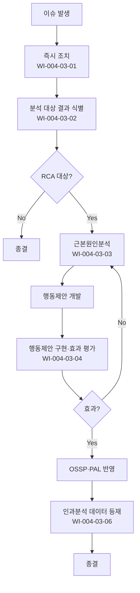

# 근본원인분석 및 해결 절차 (PRO-CMMI-403)

> 상위 정책: [[POL-CMMI-004_품질_구성_및_의사결정_정책_v1.0]]

## 1. 목적
반복·중대 이슈에 대해 근본원인을 분석하고 행동제안을 구현·효과를 평가하여 동일·유사 결과의 재발을 예방한다.

## 2. 적용 범위
- 반복 부적합·중대 결함·일정·비용 편차
- 위험 발현, 보안 사고, 고객 클레임
- 근본원인분석 방법은 본 절차 §5-5 에 정의

## 3. 역할과 책임 (RACI)
| 단계 | QA | 분석팀 | PM | SEPG | CEO |
|---|---|---|---|---|---|
| 즉시 조치 | C | C | **R** | I | A |
| 결과 식별 | **R** | C | C | C | A |
| RCA 수행 | A | **R** | C | C | I |
| 행동제안·구현 | A | **R** | **R** | C | I |
| 효과 평가 | **R** | C | C | C | A |
| 방법 운영 | C | C | I | **R** | A |
| 데이터 등재 | **R** | C | I | C | A |

## 4. 절차 흐름


## 5. 단계별 상세
| # | 단계 | 설명 | 담당 | 입력 | 출력 |
|---|---|---|---|---|---|
| 1 | 즉시 조치 | 결과의 직접 영향 처리 | PM | 이슈 | 즉시 조치 기록 |
| 2 | 결과 식별 | 분석 대상 결과 선택·기록 | QA | 이슈 데이터 | 분석 대상 |
| 3 | RCA | 5Why·Fishbone 등 방법 수행 | 분석팀 | 분석 대상 | 근본원인 |
| 4 | 행동제안·구현 | 제안 개발·구현·효과 평가 | 분석팀/PM | 근본원인 | 행동제안 결과 |
| 5 | 방법 운영 | RCA 방법 결정·갱신 | SEPG | 사례·표준 | RCA 방법 |
| 6 | 데이터 등재 | 인과분석 결과 측정저장소 등재 | QA | 결과 | 저장소 갱신 |

## 6. 연계 업무지침 (WI)
- [[WI-CMMI-004-03-01_이슈_즉시_조치_v1.0]]
- [[WI-CMMI-004-03-02_분석_대상_결과_식별_v1.0]]
- [[WI-CMMI-004-03-03_근본원인분석_수행_v1.0]]
- [[WI-CMMI-004-03-04_행동제안_구현_및_효과_평가_v1.0]]
- [[WI-CMMI-004-03-05_RCA_방법_운영_v1.0]]
- [[WI-CMMI-004-03-06_인과분석_데이터_등재_v1.0]]

## 7. 통제점 / KPI
| 통제점 | 지표 | 목표 | 주기 |
|---|---|---|---|
| RCA 적용율 | 중대/반복 이슈 중 적용 | ≥ 90% | 분기 |
| 행동제안 구현율 | 제안 대비 구현 | ≥ 80% | 분기 |
| 동일 원인 재발률 | 재발 비율 | < 10% | 반기 |
| 효과 평가 수행율 | 구현 대비 평가 | 100% | 분기 |
| 데이터 등재 적시성 | 분석 후 5 영업일 내 | ≥ 95% | 분기 |

## 8. 표준 매핑 (Traceability)
| Practice | Req-ID | 반영 위치 |
|---|---|---|
| CAR 1.1 | CMMI-CAR-1.1 | §5-1 즉시 조치 |
| CAR 2.1 | CMMI-CAR-2.1 | §5-2 결과 식별 |
| CAR 2.2 | CMMI-CAR-2.2 | §5-3 RCA |
| CAR 2.3 | CMMI-CAR-2.3 | §5-4 행동제안 |
| CAR 3.1 | CMMI-CAR-3.1 | §5-5 방법 운영 |
| CAR 3.2 | CMMI-CAR-3.2 | §5-6 데이터 등재 |

## 9. 출처 (source_citation)
```yaml
- type: standard_original
  file: "_inputs/01_표준원문/CMMI-DEV/Core PAs/CAR.pdf"
  locator: "Causal Analysis & Resolution PG1~PG3"
  retrieved_at: "2026-04-29"
  license: "ISACA copyright — paraphrase only"
  paraphrase_only: true
```

## 10. 개정 이력
| 버전 | 일자 | 변경내용 | 승인자 |
|---|---|---|---|
| 1.0 | 2026-04-29 | 최초 승인 (CMMI-DEV-ML3 편입) | CEO |
