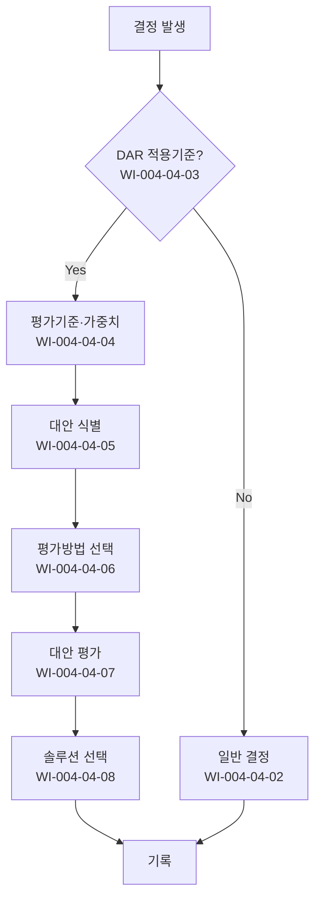

# 의사결정 분석 및 해결 절차 (PRO-CMMI-404)

> 상위 정책: [[POL-CMMI-004_품질_구성_및_의사결정_정책_v1.0]]

## 1. 목적
중대 결정을 적용기준·평가기준·평가방법·평가결과의 4단계로 구조화하여 객관적·재현 가능한 의사결정을 보장한다.

## 2. 적용 범위
- DAR 적용기준에 해당하는 결정 (예: 비용 임계 초과·기술 리스크 高·인터페이스 영향 多·되돌리기 어려운 결정)
- 대안 비교가 필요한 솔루션·도구·아키텍처 선택
- 일상적/저영향 결정은 대상 외

## 3. 역할과 책임 (RACI)
| 단계 | 결정자 | 분석가 | PMO | 이해관계자 | PCB |
|---|---|---|---|---|---|
| 대안 정의 | C | **R** | A | C | I |
| 대안 선택 기본 | **R** | C | A | C | I |
| 적용기준 운영 | C | C | **R** | I | **A** |
| 평가기준·가중치 | C | **R** | A | C | C |
| 대안 식별 | C | **R** | A | C | I |
| 평가방법 선택 | C | **R** | A | I | C |
| 대안 평가 | C | **R** | A | I | C |
| 솔루션 선택 | **R** | C | A | C | C |

## 4. 절차 흐름


## 5. 단계별 상세
| # | 단계 | 설명 | 담당 | 입력 | 출력 |
|---|---|---|---|---|---|
| 1 | 대안 정의 | 대안 후보 정의·기록 | 분석가 | 결정 사안 | 대안 목록 |
| 2 | 대안 선택 기본 | 일반 결정 시 단순 선택 | 결정자 | 대안 | 결정 |
| 3 | 적용기준 | DAR 적용 여부 판정 | PMO | 결정 사안 | 적용 결정 |
| 4 | 평가기준·가중치 | 기준·가중치 정의 | 분석가 | 결정 컨텍스트 | 평가 매트릭스 |
| 5 | 대안 식별 | 대안 식별·기록 | 분석가 | 결정 사안 | 대안 목록 |
| 6 | 평가방법 | 가중평가·시뮬레이션·POC 등 | 분석가 | 매트릭스 | 평가 방법 |
| 7 | 평가 | 대안 평가·결과 기록 | 분석가 | 방법 | 평가 결과 |
| 8 | 선택 | 결과 기반 솔루션 선택 | 결정자 | 평가 결과 | 의사결정평가서 |

## 6. 연계 업무지침 (WI)
- [[WI-CMMI-004-04-01_대안_정의_및_기록_v1.0]]
- [[WI-CMMI-004-04-02_대안_선택_기본_v1.0]]
- [[WI-CMMI-004-04-03_DAR_적용기준_운영_v1.0]]
- [[WI-CMMI-004-04-04_평가_기준_및_가중치_v1.0]]
- [[WI-CMMI-004-04-05_대안_식별_및_기록_v1.0]]
- [[WI-CMMI-004-04-06_평가_방법_선택_v1.0]]
- [[WI-CMMI-004-04-07_대안_평가_및_기록_v1.0]]
- [[WI-CMMI-004-04-08_솔루션_선택_v1.0]]

## 7. 통제점 / KPI
| 통제점 | 지표 | 목표 | 주기 |
|---|---|---|---|
| DAR 적용 결정 비율 | 적용기준 대비 적용 | ≥ 95% | 분기 |
| 평가서 보유율 | 적용 결정 중 평가서 | 100% | 분기 |
| 결정 후 번복 비율 | 6개월 내 번복 | ≤ 10% | 반기 |
| 평가 기준 표준화율 | 정형 매트릭스 사용 | ≥ 80% | 반기 |
| 평가 적시성 | 결정 발의→완료 | ≤ 15 영업일 | 분기 |

## 8. 표준 매핑 (Traceability)
| Practice | Req-ID | 반영 위치 |
|---|---|---|
| DAR 1.1 | CMMI-DAR-1.1 | §5-1 대안 정의 |
| DAR 1.2 | CMMI-DAR-1.2 | §5-2 대안 선택 |
| DAR 2.1 | CMMI-DAR-2.1 | §5-3 적용기준 |
| DAR 2.2 | CMMI-DAR-2.2 | §5-4 평가기준 |
| DAR 2.3 | CMMI-DAR-2.3 | §5-5 대안 식별 |
| DAR 2.4 | CMMI-DAR-2.4 | §5-6 평가방법 |
| DAR 2.5 | CMMI-DAR-2.5 | §5-7 평가 |
| DAR 2.6 | CMMI-DAR-2.6 | §5-8 선택 |

## 9. 출처 (source_citation)
```yaml
- type: standard_original
  file: "_inputs/01_표준원문/CMMI-DEV/Core PAs/DAR.pdf"
  locator: "Decision Analysis & Resolution PG1~PG2"
  retrieved_at: "2026-04-29"
  license: "ISACA copyright — paraphrase only"
  paraphrase_only: true
```

## 10. 개정 이력
| 버전 | 일자 | 변경내용 | 승인자 |
|---|---|---|---|
| 1.0 | 2026-04-29 | 최초 승인 (CMMI-DEV-ML3 편입) | CEO |
