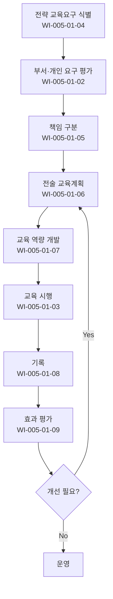

# 조직 훈련 절차 (PRO-CMMI-501)

> 상위 정책: [[POL-CMMI-005_자원_역량_및_공급자_정책_v1.0]]

## 1. 목적
조직의 비즈니스 목표를 지원하는 인적 역량을 식별·계획·시행·평가하여 전략·전술 교육 요구를 충족한다.

## 2. 적용 범위
- 전사 정직원·계약직 교육
- 직무·전략·신규입사자·전문가 양성 등 전 분야
- 조직 책임 교육과 부서·개인 책임 교육의 구분

## 3. 역할과 책임 (RACI)
| 단계 | HR | 부서장 | 강사·교육담당 | 임직원 | CEO |
|---|---|---|---|---|---|
| 직무교육 제공 | **R** | C | C | C | A |
| 요구 평가 | **R** | C | C | C | A |
| 시행 | **R** | C | **R** | **C** | A |
| 전략 교육 식별 | C | C | C | I | **R** |
| 책임 구분 | **R** | C | C | I | **A** |
| 전술 계획 | **R** | C | C | I | A |
| 역량 개발 | **R** | C | C | I | A |
| 기록 | **R** | C | C | C | A |
| 효과 평가 | **R** | C | C | C | A |

## 4. 절차 흐름


## 5. 단계별 상세
| # | 단계 | 설명 | 담당 | 입력 | 출력 |
|---|---|---|---|---|---|
| 1 | 전략 식별 | 전략 교육 요구 식별 | CEO/HR | 전략 | 전략 교육 요구 |
| 2 | 요구 평가 | 부서·작업·인력 요구 평가 | HR | 직무·역량 매트릭스 | 요구 분석 |
| 3 | 책임 구분 | 조직·부서·개인 책임 구분 | HR | 요구 | 책임 매트릭스 |
| 4 | 계획 | 전술 교육계획 수립·갱신 | HR | 요구 | 교육 계획 |
| 5 | 역량 개발 | 강사·과정·플랫폼 개발 | HR | 계획 | 교육 역량 |
| 6 | 시행 | 정규·OJT·외부 교육 시행 | HR/부서장 | 계획 | 시행 결과 |
| 7 | 기록 | 이수·평가·증명 기록 | HR | 시행 결과 | 교육 이력 |
| 8 | 효과 평가 | Kirkpatrick 등 효과 평가 | HR | 시행·이력 | 효과 평가서 |

## 6. 연계 업무지침 (WI)
- [[WI-CMMI-005-01-01_직무교육_제공_v1.0]]
- [[WI-CMMI-005-01-02_교육요구_평가_v1.0]]
- [[WI-CMMI-005-01-03_교육_시행_운영_v1.0]]
- [[WI-CMMI-005-01-04_전략적_교육요구_식별_v1.0]]
- [[WI-CMMI-005-01-05_교육_책임_구분_v1.0]]
- [[WI-CMMI-005-01-06_전술_교육계획_수립_v1.0]]
- [[WI-CMMI-005-01-07_교육_역량_개발_v1.0]]
- [[WI-CMMI-005-01-08_교육_기록_관리_v1.0]]
- [[WI-CMMI-005-01-09_교육_효과_평가_v1.0]]

## 7. 통제점 / KPI
| 통제점 | 지표 | 목표 | 주기 |
|---|---|---|---|
| 필수 교육 이수율 | 의무교육 이수율 | ≥ 95% | 분기 |
| 교육 계획 시행율 | 계획 대비 실시 | ≥ 90% | 반기 |
| 교육 만족도 | 5점 만점 평균 | ≥ 4.0 | 분기 |
| 교육 효과 평가율 | 시행 대비 평가 | ≥ 80% | 반기 |
| 직무 역량 적합율 | 평가 합격율 | ≥ 90% | 연 |

## 8. 표준 매핑 (Traceability)
| Practice | Req-ID | 반영 위치 |
|---|---|---|
| OT 1.1 | CMMI-OT-1.1 | §5-1, §5-6 직무교육 |
| OT 2.1 | CMMI-OT-2.1 | §5-2 요구 평가 |
| OT 2.2 | CMMI-OT-2.2 | §5-6 시행 |
| OT 3.1 | CMMI-OT-3.1 | §5-1 전략 식별 |
| OT 3.2 | CMMI-OT-3.2 | §5-3 책임 구분 |
| OT 3.3 | CMMI-OT-3.3 | §5-4 전술 계획 |
| OT 3.4 | CMMI-OT-3.4 | §5-5 역량 개발 |
| OT 3.5 | CMMI-OT-3.5 | §5-6 시행 |
| OT 3.6 | CMMI-OT-3.6 | §5-7 기록 |
| OT 3.7 | CMMI-OT-3.7 | §5-8 효과 평가 |

## 9. 출처 (source_citation)
```yaml
- type: standard_original
  file: "_inputs/01_표준원문/CMMI-DEV/Core PAs/OT.pdf"
  locator: "Organizational Training PG1~PG3"
  retrieved_at: "2026-04-29"
  license: "ISACA copyright — paraphrase only"
  paraphrase_only: true
```

## 10. 개정 이력
| 버전 | 일자 | 변경내용 | 승인자 |
|---|---|---|---|
| 1.0 | 2026-04-29 | 최초 승인 (CMMI-DEV-ML3 편입) | CEO |
