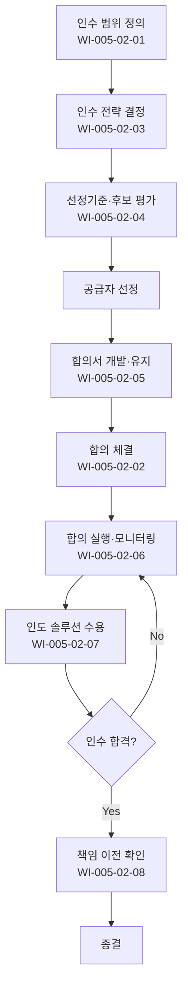

# 공급자 합의 관리 절차 (PRO-CMMI-502)

> 상위 정책: [[POL-CMMI-005_자원_역량_및_공급자_정책_v1.0]]

## 1. 목적
외부 공급자에게 작업·산출물을 인수할 때, 인수 범위 정의 → 인수전략 → 선정 → 합의 → 실행 → 인수 → 책임 이전의 흐름을 통제하여 인도 품질·일정·책임을 보장한다.

## 2. 적용 범위
- SI/SM 외주, SW·HW 부품, 서비스, 컨설팅 인수
- 단발성 표준품 구매는 §5 의 경량 테일러링 적용
- 사내 다른 부문 인수도 합의 형식 갖추어 적용

## 3. 역할과 책임 (RACI)
| 단계 | Procurement | PM | 평가위원회 | 법무 | CEO |
|---|---|---|---|---|---|
| 범위 정의 | C | **R** | I | I | A |
| 합의 체결·관리 | **R** | C | I | **C** | A |
| 인수 전략 | **R** | C | I | C | **A** |
| 선정기준 | C | C | **R** | I | A |
| 합의서 개발 | **R** | C | C | **C** | A |
| 합의 실행 | C | **R** | I | I | A |
| 솔루션 수용 | C | **R** | I | I | A |
| 책임 이전 | **R** | C | I | C | A |

## 4. 절차 흐름


## 5. 단계별 상세
| # | 단계 | 설명 | 담당 | 입력 | 출력 |
|---|---|---|---|---|---|
| 1 | 범위 정의 | 인수할 작업·산출물 식별 | PM | 요구사항 | 인수 범위 |
| 2 | 인수 전략 | 구매·임대·계약 등 결정 | Procurement | 범위 | 인수 전략 |
| 3 | 선정기준 | 평가 기준·가중치 운영 | 평가위원회 | 후보 정보 | 평가 결과 |
| 4 | 합의서 | 합의서 개발·유지 | Procurement | 평가 결과 | 합의서 |
| 5 | 체결 | 합의 체결·기본 관리 | Procurement | 합의서 | 체결 합의 |
| 6 | 실행 | 합의 실행·모니터링 | PM | 체결 합의 | 실행 보고 |
| 7 | 수용 | 인수 솔루션 수용 검사 | PM | 인도 결과물 | 수용 결정 |
| 8 | 책임 이전 | 책임 이전이 합의대로 진행되는지 확인 | Procurement | 수용 결과 | 이전 확인서 |

## 6. 연계 업무지침 (WI)
- [[WI-CMMI-005-02-01_인수_범위_정의_v1.0]]
- [[WI-CMMI-005-02-02_합의_체결_및_기본_관리_v1.0]]
- [[WI-CMMI-005-02-03_인수_전략_결정_v1.0]]
- [[WI-CMMI-005-02-04_공급자_선정기준_운영_v1.0]]
- [[WI-CMMI-005-02-05_공급자_합의서_개발_및_유지_v1.0]]
- [[WI-CMMI-005-02-06_공급자_합의_실행_v1.0]]
- [[WI-CMMI-005-02-07_인수_솔루션_수용_v1.0]]
- [[WI-CMMI-005-02-08_책임_이전_확인_v1.0]]

## 7. 통제점 / KPI
| 통제점 | 지표 | 목표 | 주기 |
|---|---|---|---|
| 합의 체결율 | 인수 건 중 합의 체결 | 100% | 분기 |
| 평가 객관성 | 정형 평가표 사용율 | 100% | 분기 |
| 인수 합격율 | 첫 인수 합격율 | ≥ 90% | 분기 |
| 책임 이전 적시성 | 합의 일정 대비 | ≥ 95% | 반기 |
| 공급자 클레임 건수 | 합의 위반 발생 건수 | 감소 추세 | 반기 |

## 8. 표준 매핑 (Traceability)
| Practice | Req-ID | 반영 위치 |
|---|---|---|
| SAM 1.1 | CMMI-SAM-1.1 | §5-1 범위 정의 |
| SAM 1.2 | CMMI-SAM-1.2 | §5-5 합의 체결 |
| SAM 2.1 | CMMI-SAM-2.1 | §5-2 인수 전략 |
| SAM 2.2 | CMMI-SAM-2.2 | §5-3 선정기준 |
| SAM 2.3 | CMMI-SAM-2.3 | §5-4 합의서 |
| SAM 2.4 | CMMI-SAM-2.4 | §5-6 실행 |
| SAM 2.5 | CMMI-SAM-2.5 | §5-7 수용 |
| SAM 2.6 | CMMI-SAM-2.6 | §5-8 책임 이전 |
| (Interface) ISO 9001 §8.4 | — | §3 정책 / §5 전체 |

## 9. 출처 (source_citation)
```yaml
- type: standard_original
  file: "_inputs/01_표준원문/CMMI-DEV/Supplier PA/SAM.pdf"
  locator: "Supplier Agreement Management PG1~PG2"
  retrieved_at: "2026-04-29"
  license: "ISACA copyright — paraphrase only"
  paraphrase_only: true
```

## 10. 개정 이력
| 버전 | 일자 | 변경내용 | 승인자 |
|---|---|---|---|
| 1.0 | 2026-04-29 | 최초 승인 (CMMI-DEV-ML3 편입) | CEO |
