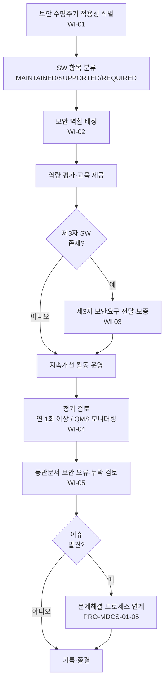

# 보안 거버넌스 및 일반요건 관리 절차 (PRO-MDCS-01-01)

> 상위 정책: [[POL-MDCS-01_헬스SW_제품_보안_거버넌스_방침_v0.1]] · 기준: [[표준프로세스_구성원칙]]

## 1. 목적
헬스SW 제품의 보안 수명주기를 운영하기 위한 **거버넌스 기반 활동**(적용성 식별·역할/역량·제3자 SW 관리·지속개선·정기검토·동반문서·SW 분류)을 통제된 흐름으로 확립한다.

## 2. 적용 범위
보안 수명주기가 적용되는 모든 헬스SW 제품의 거버넌스 활동에 적용한다. 보안 개발·유지보수·문제해결의 세부 활동은 각 하위 PRO 가 담당하며, 본 절차는 이를 가능케 하는 **공통 거버넌스 토대**를 다룬다.

## 3. 역할과 책임 (RACI)
| 단계 | PSO | PSGB | 프로세스 오너 | 인사/교육 | 구매/공급자 관리 | 경영책임자 |
|---|---|---|---|---|---|---|
| 적용성·SW 분류 | **A** | C | **R** | - | I | I |
| 역할 배정·역량 관리 | **A** | C | C | **R** | - | I |
| 제3자 SW 보안 보증 | **A** | C | C | - | **R** | I |
| 지속개선 | **R** | C | C | - | - | **A** |
| 정기 검토(연1회+) | **R** | **A** | C | - | - | I |
| 동반문서 검토 | C | I | **R** | - | - | - |

> Accountable 는 단계당 1명. 정기 검토 결과 보고는 PSGB 가 책임.

## 4. 절차 흐름


## 5. 단계별 상세
| # | 단계 | 설명 | 담당 | 입력 | 출력 |
|---|---|---|---|---|---|
| 1 | 적용성 식별 | 보안 수명주기 적용 제품/제품 일부 범위 결정 | 프로세스 오너 | 제품 목록 | 적용성 기록 |
| 2 | SW 분류 | 각 SW 항목을 MAINTAINED/SUPPORTED/REQUIRED 로 분류 | 프로세스 오너 | SBOM | SW 분류 기록 |
| 3 | 역할 배정 | 표준 요구 활동별 책임 역할 지정·문서화 | PSO | 활동 목록 | RACI/역할 배정표 |
| 4 | 역량 관리 | 역할별 보안 역량 요건·교육·평가 운영 | 인사/교육 | 역할기술서 | 교육 기록·역량 평가 |
| 5 | 제3자 보증 | 제조자 전용·보안영향 SW 항목에 보안요구 전달·활동 보증 | 구매/공급자 관리 | 공급계약 | 전달된 보안요구·공급자 활동 기록 |
| 6 | 지속개선 | 현장 결함 분석 포함 수명주기 개선 활동 | PSO | 결함 보고 | 개선 기록 |
| 7 | 정기 검토 | 보안 이슈 관리 프로세스를 연 1회+ 또는 QMS 일부로 검토 | PSO/PSGB | 이슈 현황 | 검토 보고서(일자 포함) |
| 8 | 동반문서 검토 | 보안 지침 포함 동반문서 오류·누락 식별·종결 추적 | 프로세스 오너 | 동반문서 | 검토 기록·이슈 추적 |

## 6. 연계 업무지침 (WI)
- [[WI-MDCS-01-01-01_보안_수명주기_적용성_식별_및_SW_분류_v0.1]] — 적용성·분류 (4.1.3, 4.3)
- [[WI-MDCS-01-01-02_보안_역할_배정_및_역량_관리_v0.1]] — 역할·역량 (4.1.2, 4.1.4)
- [[WI-MDCS-01-01-03_제3자_SW_공급자_보안요구_전달_v0.1]] — 제3자 SW (4.1.5)
- [[WI-MDCS-01-01-04_보안이슈_관리_정기검토_및_지속개선_v0.1]] — 정기검토·개선 (4.1.6, 4.1.8)
- [[WI-MDCS-01-01-05_동반문서_보안_오류_누락_검토_v0.1]] — 동반문서 (4.1.9)

## 7. 통제점 / KPI
| 통제점 | 지표 | 목표 | 주기 |
|---|---|---|---|
| SW 분류 완전성 | 분류된 SW 항목 비율 | 100% | 릴리스 |
| 역량 교육 이수 | 보안 역할 교육 이수율 | 100% | 반기 |
| 정기 검토 수행 | 연간 검토 실시 횟수 | ≥ 1회 | 연 |
| 제3자 보안요구 전달 | 대상 공급자 전달률 | 100% | 계약 시 |
| 동반문서 이슈 종결 | 식별 이슈 종결률 | 100% | 분기 |

## 8. 표준 매핑 (Traceability)
| 표준 조항 | Req-ID | 반영 위치 |
|---|---|---|
| §4.1.1 | 4.1.1-REQ-001 | §2, §1 |
| §4.1.2 | 4.1.2-REQ-001 | §5 단계3 |
| §4.1.3 | 4.1.3-REQ-001 | §5 단계1 |
| §4.1.4 | 4.1.4-REQ-001 | §5 단계4 |
| §4.1.5 | 4.1.5-REQ-001~002 | §5 단계5 |
| §4.1.6 | 4.1.6-REQ-001~002 | §5 단계6 |
| §4.1.8 | 4.1.8-REQ-001~003 | §5 단계7 |
| §4.1.9 | 4.1.9-REQ-001 | §5 단계8 |
| §4.3 | 4.3-REQ-001 | §5 단계2 |

> 경계면: §4.1.8-REQ-003 은 **ISO 13485:2016 §4.1.3** 모니터링·측정·분석을 직접 인용. 향후 [[ISO 13485 MDQMS]] 빌드 시 hard interface 로 매핑.

## 9. 출처 (source_citation)
```yaml
- type: standard_original
  file: "inputs/01_표준원문/IEC81001-5-1/requirements.yaml"
  locator: "§4.1.1–4.1.6, §4.1.8–4.1.9, §4.3"
  retrieved_at: "2026-06-18"
  license: "IEC copyright — paraphrase only"
  paraphrase_only: true
```

## 10. 개정 이력
| 버전 | 일자 | 변경내용 | 승인자 |
|---|---|---|---|
| v0.1 | 2026-06-18 | 최초 작성 — Clause 4 일반요건 거버넌스 절차 | (미승인 초안) |
