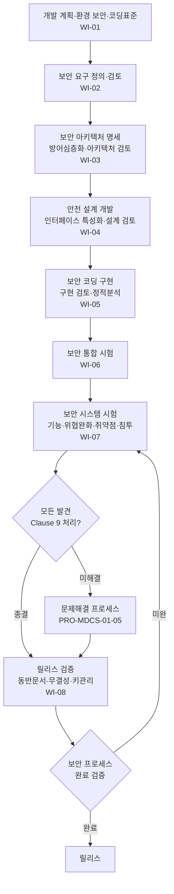

# 보안 SW 개발 프로세스 절차 (PRO-MDCS-01-02)

> 상위 정책: [[POL-MDCS-01_헬스SW_제품_보안_거버넌스_방침_v0.1]] · 기준: [[표준프로세스_구성원칙]]

## 1. 목적
헬스SW 의 **보안 개발 수명주기**를 착수부터 릴리스까지 통제된 단계(계획→보안요구→아키텍처→설계→구현→통합→시스템시험→릴리스)로 수행하여, 보안 요구가 설계·구현·검증에 빠짐없이 반영·검증되고 미해결 보안 이슈 없이 출시됨을 보장한다.

## 2. 적용 범위
보안 수명주기가 적용되는 모든 헬스SW 개발 프로젝트에 적용한다. 통상의 제품 개발 프로세스(구성관리·요구추적성·V&V)와 통합하여 수행한다. *(향후 연계: [[IEC 62304 MDSW]] §5)* 특정 프로젝트에서 본 표준 요구를 미적용(tailoring)할 경우 보안 전문성을 갖춘 인력의 검토·승인을 거쳐 정당성을 문서화한다. (5.1.1-REQ-002)

## 3. 역할과 책임 (RACI)
| 단계 | PSO | 보안 아키텍트 | 개발자 | 보안 테스터 | 검토자(독립) | 릴리스 책임자 |
|---|---|---|---|---|---|---|
| 개발 계획·환경·코딩표준 | **A** | C | C | I | C | I |
| 보안 요구 정의·검토 | **A** | C | C | C | **R** | - |
| 아키텍처 명세·검토 | C | **R** | C | I | **A** | - |
| 안전 설계·인터페이스·설계검토 | C | **R** | **R** | C | A | - |
| 구현·구현검토(SCA) | I | C | **R** | C | A | - |
| 시스템 시험 | I | C | C | **R** | A | - |
| 릴리스 검증 | **A** | C | C | C | C | **R** |

> 검토자 독립성 수준은 문서화한다(5.2.2-REQ-002). 테스터-개발자 이해상충은 관리한다(5.7.5).

## 4. 절차 흐름


## 5. 단계별 상세
| # | 단계 | 설명 | 담당 | 입력 | 출력 |
|---|---|---|---|---|---|
| 1 | 계획 | 수명주기 활동 통합, 개발환경 보안통제, 보안 코딩표준 수립, 테일러링 정당화 | PSO | 제품 요구 | 개발계획·환경통제·코딩표준 |
| 2 | 보안요구 | 설치·운영·유지·폐기 보안능력 요구 문서화, 품질기준 검토(시험가능·무모순), REQUIRED SW 리스크 식별 | 검토자 | 제품 요구·리스크통제 | 보안 요구명세·검토 기록 |
| 3 | 아키텍처 | 안전 아키텍처 명세, 방어심층화 계층 배정, 악조건 거동 검토 | 보안 아키텍트 | 보안 요구 | 아키텍처 명세·검토 보고서 |
| 4 | 상세설계 | 안전 설계·모범사례, 위협 완화 반영, 물리·논리 인터페이스 특성화(신뢰경계), 설계 검토(약점 추적) | 보안 아키텍트/개발자 | 아키텍처·위협모델 | 설계 문서·인터페이스 분석·설계검토 기록 |
| 5 | 구현 | 보안 코딩표준 준수 구현, 구현 검토(SCA·추적성·코딩표준 편차), 이슈 문제해결 연계 | 개발자 | 설계 | 구현·정적분석 보고서·구현검토 기록 |
| 6 | 통합 | 신뢰경계 간 보안정책 차이 고려한 통합 시험 *(should)* | 보안 테스터 | 구현 | 통합 시험 기록 |
| 7 | 시스템시험 | 보안기능 검증·위협완화 효과 시험·취약점 시험(SCA/스캔/동적)·침투 시험·테스터 객관성 문서화 | 보안 테스터 | 통합본·위협모델 | 시험 계획·보고서·스캔/SCA/침투 보고서·객관성 문서 |
| 8 | 릴리스 | 발견사항 Clause 9 종결, 동반문서(운영·계정·잔여리스크), 파일 무결성·코드서명 키보호, 미해결 이슈 미출시 검증, 프로세스 완료·폐기 지침 | 릴리스 책임자 | 시험 결과 | 릴리스 검증 기록·동반문서·무결성/서명 증적 |

## 6. 연계 업무지침 (WI)
- [[WI-MDCS-01-02-01_보안_개발_계획_환경_코딩표준_v0.1]] — (5.1.1~5.1.3)
- [[WI-MDCS-01-02-02_보안_요구사항_정의_및_검토_v0.1]] — (5.2.1~5.2.3)
- [[WI-MDCS-01-02-03_보안_아키텍처_명세_및_검토_v0.1]] — (5.3.1~5.3.3)
- [[WI-MDCS-01-02-04_안전_설계_및_인터페이스_특성화_검토_v0.1]] — (5.4.1~5.4.4)
- [[WI-MDCS-01-02-05_보안_코딩_구현_및_구현_검토_v0.1]] — (5.5.1~5.5.2)
- [[WI-MDCS-01-02-06_보안_통합_시험_v0.1]] — (5.6, should)
- [[WI-MDCS-01-02-07_보안_시스템_시험_v0.1]] — (5.7.1~5.7.5)
- [[WI-MDCS-01-02-08_보안_릴리스_검증_및_동반문서_v0.1]] — (5.8.1~5.8.7)

## 7. 통제점 / KPI
| 통제점 | 지표 | 목표 | 주기 |
|---|---|---|---|
| 보안 요구 추적성 | 요구→설계→시험 추적 커버리지 | 100% | 릴리스 |
| 정적분석(SCA) 수행 | 빌드 대비 SCA 실행률 | 100% | 빌드 |
| 위협 완화 시험 | 완화별 시험 작성·실행률 | 100% | 릴리스 |
| 미해결 보안 이슈 출시 | 출시 시 미종결 이슈 | 0건 | 릴리스 |
| 코드서명 키 보호 위반 | 무단접근 발생 | 0건 | 분기 |

## 8. 표준 매핑 (Traceability)
| 표준 조항 | Req-ID | 반영 위치 |
|---|---|---|
| §5.1.1~5.1.3 | 5.1.1-REQ-001~002, 5.1.2-REQ-001, 5.1.3-REQ-001 | §5 단계1 |
| §5.2.1~5.2.3 | 5.2.1-REQ-001, 5.2.2-REQ-001~002, 5.2.3-REQ-001 | §5 단계2 |
| §5.3.1~5.3.3 | 5.3.1-REQ-001~003, 5.3.2-REQ-001~003, 5.3.3-REQ-001~002 | §5 단계3 |
| §5.4.1~5.4.4 | 5.4.1-REQ-001, 5.4.2-REQ-001, 5.4.3-REQ-001, 5.4.4-REQ-001 | §5 단계4 |
| §5.5.1~5.5.2 | 5.5.1-REQ-001, 5.5.2-REQ-001 | §5 단계5 |
| §5.6 | 5.6-REQ-001 (should) | §5 단계6 |
| §5.7.1~5.7.5 | 5.7.1-REQ-001, 5.7.2-REQ-001, 5.7.3-REQ-001, 5.7.4-REQ-001, 5.7.5-REQ-001 | §5 단계7 |
| §5.8.1~5.8.7 | 5.8.1-REQ-001 ~ 5.8.7-REQ-001 | §5 단계8 |

> 경계면: 본 절차는 [[IEC 62304 MDSW]] §5 SW 개발 프로세스와 짝을 이룸 (향후 연계). 통합 금지, 참조만.

## 9. 출처 (source_citation)
```yaml
- type: standard_original
  file: "inputs/01_표준원문/IEC81001-5-1/requirements.yaml"
  locator: "§5.1–5.8 (Software development PROCESS)"
  retrieved_at: "2026-06-18"
  license: "IEC copyright — paraphrase only"
  paraphrase_only: true
```

## 10. 개정 이력
| 버전 | 일자 | 변경내용 | 승인자 |
|---|---|---|---|
| v0.1 | 2026-06-18 | 최초 작성 — Clause 5 보안 SW 개발 프로세스 | (미승인 초안) |
