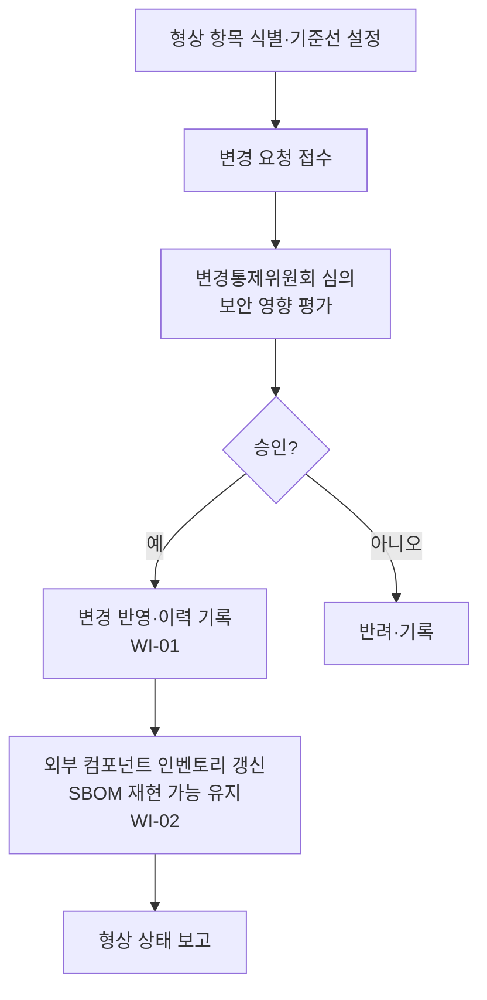

# 보안 형상관리 프로세스 절차 (PRO-MDCS-01-04)

> 상위 정책: [[POL-MDCS-01_헬스SW_제품_보안_거버넌스_방침_v0.1]] · 기준: [[표준프로세스_구성원칙]]

## 1. 목적
헬스SW 의 개발·유지보수·지원 전반에 변경통제와 변경이력을 포함한 형상관리를 적용하고, 출시·시판 중인 헬스SW 의 보안 의무를 위해 취약해질 수 있는 **외부 컴포넌트 목록(SBOM)을 재현**할 수 있는 능력을 보장한다.

## 2. 적용 범위
보안 수명주기가 적용되는 헬스SW 의 모든 구성 항목 및 외부 컴포넌트에 적용한다. *(향후 연계: [[IEC 62304 MDSW]] §8 / [[ISO 13485 MDQMS]] §7.5)*

## 3. 역할과 책임 (RACI)
| 단계 | PSO | 형상관리 담당 | 개발자 | 변경통제위원회(CCB) |
|---|---|---|---|---|
| 변경통제·이력 | C | **R** | C | **A** |
| 외부 컴포넌트 인벤토리(SBOM) | **A** | **R** | C | I |

## 4. 절차 흐름


## 5. 단계별 상세
| # | 단계 | 설명 | 담당 | 입력 | 출력 |
|---|---|---|---|---|---|
| 1 | 변경통제 | 변경 요청·심의(보안 영향)·승인·반영·이력 기록 | 형상관리 담당 | 변경 요청 | 변경통제 기록·변경 이력 |
| 2 | 컴포넌트 인벤토리 | 출시 SW 의 외부 컴포넌트 목록 작성·갱신, 취약점 추적 위한 SBOM 재현 능력 유지 | 형상관리 담당 | 빌드 산출물 | SBOM·구성관리 기록 |

## 6. 연계 업무지침 (WI)
- [[WI-MDCS-01-04-01_보안_변경통제_및_변경이력_v0.1]] — (8-REQ-001)
- [[WI-MDCS-01-04-02_외부_컴포넌트_인벤토리_SBOM_v0.1]] — (8-REQ-002)

## 7. 통제점 / KPI
| 통제점 | 지표 | 목표 | 주기 |
|---|---|---|---|
| 변경 이력 완전성 | 승인 변경 대비 이력 기록률 | 100% | 월 |
| SBOM 최신성 | 출시 SW 대비 SBOM 보유율 | 100% | 릴리스 |
| 컴포넌트 재현 | 과거 릴리스 구성 재현 가능률 | 100% | 분기 |

## 8. 표준 매핑 (Traceability)
| 표준 조항 | Req-ID | 반영 위치 |
|---|---|---|
| §8 | 8-REQ-001 | §5 단계1 |
| §8 | 8-REQ-002 | §5 단계2 |

> 출처 주의: source_map 상 Clause 8 의 페이지 미상(`page: 0`) — 조항은 확정, 페이지는 차후 보정 필요(적용요건 §5 플래그). 경계면: IEC 62304 §8 / ISO 13485 §7.5 (향후 연계).

## 9. 출처 (source_citation)
```yaml
- type: standard_original
  file: "inputs/01_표준원문/IEC81001-5-1/requirements.yaml"
  locator: "§8 (Software CONFIGURATION MANAGEMENT PROCESS) — page 미상"
  retrieved_at: "2026-06-18"
  license: "IEC copyright — paraphrase only"
  paraphrase_only: true
```

## 10. 개정 이력
| 버전 | 일자 | 변경내용 | 승인자 |
|---|---|---|---|
| v0.1 | 2026-06-18 | 최초 작성 — Clause 8 보안 형상관리 프로세스 | (미승인 초안) |
