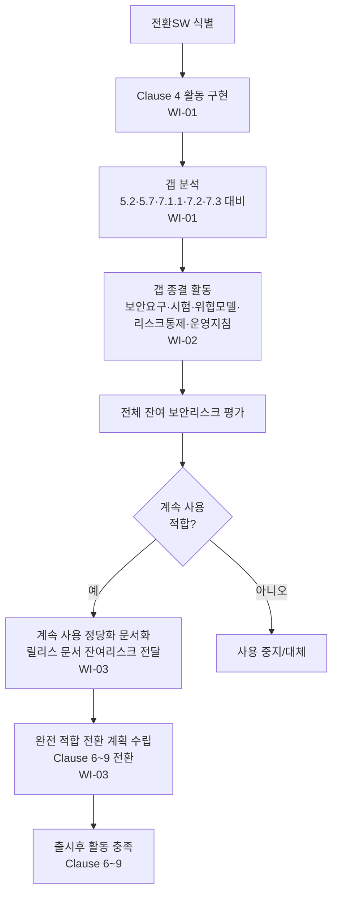

# 과도기 헬스SW(전환SW) 관리 절차 (PRO-MDCS-01-06)

> 상위 정책: [[POL-MDCS-01_헬스SW_제품_보안_거버넌스_방침_v0.1]] · 기준: [[표준프로세스_구성원칙]]

## 1. 목적
본 표준 발효 이전에 개발되었거나 완전 적합하지 않은 **TRANSITIONAL HEALTH SOFTWARE(전환SW)** 에 대해, Clause 4 활동 구현·갭 분석·갭 종결·계속 사용 정당화·완전 적합 전환 계획을 통해 Annex F(normative) 적합성을 확보한다.

## 2. 적용 범위
TRANSITIONAL HEALTH SOFTWARE 로 식별된 제품에 적용한다. (F.1 Overview 는 서론으로 요구사항 없음 → 미커버.) 잔여 리스크 평가는 제품 리스크 관리와 협력한다. *(향후 연계: [[ISO 14971 MDRM]])*

## 3. 역할과 책임 (RACI)
| 단계 | PSO | 갭 분석가 | 개발자 | 제품 리스크 관리자 | PSGB |
|---|---|---|---|---|---|
| Clause 4 구현·갭 분석 | **A** | **R** | C | C | I |
| 갭 종결 활동 | **A** | C | **R** | C | I |
| 계속 사용 정당화·전환 계획 | C | C | C | C | **A** |

## 4. 절차 흐름


## 5. 단계별 상세
| # | 단계 | 설명 | 담당 | 입력 | 출력 |
|---|---|---|---|---|---|
| 1 | Clause 4 구현·갭 분석 | Clause 4 활동 구현 + 5.2·5.7·7.1.1·7.2·7.3 산출물 대비 갭 분석 | 갭 분석가 | 가용 산출물 | Clause 4 기록·갭 분석 보고서 |
| 2 | 갭 종결 | 시스템 보안요구·시스템 시험·보안맥락/위협모델·리스크 통제·운영/계정 지침·전체 잔여리스크 평가 | 개발자 | 갭 분석 | 갭 종결 기록·산출물 |
| 3 | 정당화·전환 계획 | 버전·계속 사용 정당화 문서화, 비업그레이드 컴포넌트 정당성·리스크 반영, 릴리스 문서 잔여리스크 전달, 완전 적합 전환 계획 | PSGB | 잔여리스크 평가 | 정당화 문서·전환 계획·릴리스 문서 |

## 6. 연계 업무지침 (WI)
- [[WI-MDCS-01-06-01_전환SW_Clause4_구현_및_갭분석_v0.1]] — (F.2-REQ-001~002)
- [[WI-MDCS-01-06-02_갭_종결_활동_수행_v0.1]] — (F.2-REQ-003)
- [[WI-MDCS-01-06-03_계속사용_정당화_및_전환계획_v0.1]] — (F.3-REQ-001~004, F.4-REQ-001)

## 7. 통제점 / KPI
| 통제점 | 지표 | 목표 | 주기 |
|---|---|---|---|
| 갭 분석 완전성 | 대상 조항 대비 분석률 | 100% | 전환 시 |
| 갭 종결 | 식별 갭 종결률 | 100% | 전환 시 |
| 전환 계획 보유 | 전환SW 대비 계획 수립률 | 100% | 전환 시 |
| 잔여리스크 전달 | 릴리스 문서 잔여리스크 명시율 | 100% | 릴리스 |

## 8. 표준 매핑 (Traceability)
| 표준 조항 | Req-ID | 반영 위치 |
|---|---|---|
| §F.2 | F.2-REQ-001~003 | §5 단계1~2 |
| §F.3 | F.3-REQ-001~004 | §5 단계3 |
| §F.4 | F.4-REQ-001 | §5 단계3 (출시후 활동) |

> 갭 종결은 §5.2/§5.7/§5.8.2(개발) 및 §7.1.1/§7.2/§7.3/§7.4(RM) 활동을 재사용 — [[PRO-MDCS-01-02_보안_SW_개발_프로세스_절차_v0.1]], [[PRO-MDCS-02-01_보안_리스크_관리_프로세스_절차_v0.1]] 참조.

## 9. 출처 (source_citation)
```yaml
- type: standard_original
  file: "inputs/01_표준원문/IEC81001-5-1/requirements.yaml"
  locator: "Annex F (normative) §F.2–F.4"
  retrieved_at: "2026-06-18"
  license: "IEC copyright — paraphrase only"
  paraphrase_only: true
```

## 10. 개정 이력
| 버전 | 일자 | 변경내용 | 승인자 |
|---|---|---|---|
| v0.1 | 2026-06-18 | 최초 작성 — Annex F 과도기 헬스SW 관리 절차 | (미승인 초안) |
