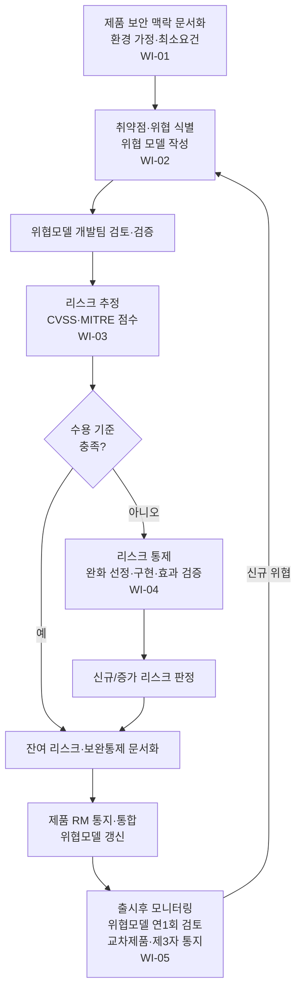

# 보안 리스크 관리 프로세스 절차 (PRO-MDCS-02-01)

> 상위 정책: [[POL-MDCS-02_보안_리스크_관리_방침_v0.1]] · 기준: [[표준프로세스_구성원칙]]

## 1. 목적
헬스SW 보안 리스크를 제품 리스크 관리 접근의 일부로, **보안 맥락 문서화 → 위협 모델링 → 리스크 추정/평가 → 리스크 통제 → 출시후 모니터링** 의 단계로 관리·유지하여, 위협을 식별·평가·통제하고 통제 효과를 지속 모니터링한다.

## 2. 적용 범위
보안 수명주기가 적용되는 모든 헬스SW 제품의 보안 리스크에 적용한다. 안전·유효성 영향 및 잔여 리스크 처리는 제품 리스크 관리와 협력한다. *(향후 연계: [[ISO 14971 MDRM]])*

## 3. 역할과 책임 (RACI)
| 단계 | PSO | 위협 모델링 리드 | 개발팀 | 제품 리스크 관리자 | 보안 검증 인력 |
|---|---|---|---|---|---|
| 보안 맥락 | **A** | **R** | C | C | - |
| 위협 모델링 | C | **R** | **R** | C | - |
| 리스크 추정·평가 | **A** | C | C | C | - |
| 리스크 통제 | **A** | C | **R** | **R** | C |
| 출시후 모니터링 | **R** | C | C | C | **R** |

## 4. 절차 흐름


## 5. 단계별 상세
| # | 단계 | 설명 | 담당 | 입력 | 출력 |
|---|---|---|---|---|---|
| 1 | 보안 맥락 | 의도된 PRODUCT SECURITY CONTEXT·환경 최소요건·가정 문서화 | 위협 모델링 리드 | 제품 요구 | 보안 맥락 문서 |
| 2 | 위협 모델링 | 자산 CIA 영향 취약점·위협 식별, 범위특화 위협모델(데이터흐름·신뢰경계·공격벡터) 작성, 개발팀 검토, 이슈 9.4/9.5 처리 | 위협 모델링 리드 | 보안 맥락 | 위협모델·검토 기록 |
| 3 | 추정·평가 | 취약점 리스크 추정(CVSS/MITRE)·점수 기반 수용 평가·위협모델 갱신 통지 | PSO | 위협모델 | 리스크 추정·평가 기록 |
| 4 | 통제 | 수용 정책 기반 통제 적절성 판정, 완화 선정·구현·효과 검증·신규/증가 리스크 판정·결과 문서화·잔여리스크 제품RM 협력 | 개발팀 | 평가 결과 | 리스크 통제 기록·잔여리스크 |
| 5 | 모니터링 | 위협모델 최소 연1회+신규위협 시 검토·갱신, 출시후 정보 수집·통제 효과 검토, 교차제품·제3자 통지 | 보안 검증 인력 | 출시후 정보 | 모니터링 기록·갱신 로그·통지 기록 |

## 6. 연계 업무지침 (WI)
- [[WI-MDCS-02-01-01_제품_보안맥락_문서화_v0.1]] — (7.1.2)
- [[WI-MDCS-02-01-02_위협_모델링_v0.1]] — (7.2, 4.2)
- [[WI-MDCS-02-01-03_보안_리스크_추정_및_평가_v0.1]] — (7.3)
- [[WI-MDCS-02-01-04_보안_리스크_통제_v0.1]] — (7.4)
- [[WI-MDCS-02-01-05_위협모델_정기검토_및_출시후_모니터링_v0.1]] — (7.2-REQ-004, 7.5)

## 7. 통제점 / KPI
| 통제점 | 지표 | 목표 | 주기 |
|---|---|---|---|
| 위협모델 보유 | 제품 대비 위협모델 보유율 | 100% | 릴리스 |
| 위협모델 정기검토 | 연간 검토 실시 횟수 | ≥ 1회 | 연 |
| 리스크 통제 효과 검증 | 통제별 효과 검증률 | 100% | 릴리스 |
| 잔여리스크 문서화 | 잔존 취약점 문서화율 | 100% | 릴리스 |
| 출시후 모니터링 | 정보원 검토 주기 준수율 | 100% | 분기 |

## 8. 표준 매핑 (Traceability)
| 표준 조항 | Req-ID | 반영 위치 |
|---|---|---|
| §7.1.1 | 7.1.1-REQ-001~002 | §1, §4 |
| §7.1.2 | 7.1.2-REQ-001 | §5 단계1 |
| §7.2 | 7.2-REQ-001~005 | §5 단계2 |
| §7.3 | 7.3-REQ-001 | §5 단계3 |
| §7.4 | 7.4-REQ-001~003 | §5 단계4 |
| §7.5 | 7.5-REQ-001~002 | §5 단계5 |
| §4.2 | 4.2-REQ-001~004 | §5 단계2·4 (위협모델링·수용기준·잔여리스크) — 방침 [[POL-MDCS-02_보안_리스크_관리_방침_v0.1]] |

> 경계면: 보안 리스크 ↔ 제품/안전 리스크 관리는 **ISO 14971** 리스크관리 파일과 통합(향후 연계). 7.4-REQ-003·잔여리스크 협력 지점.

## 9. 출처 (source_citation)
```yaml
- type: standard_original
  file: "inputs/01_표준원문/IEC81001-5-1/requirements.yaml"
  locator: "§7.1–7.5 (Security risk management PROCESS), §4.2 (threat modeling)"
  retrieved_at: "2026-06-18"
  license: "IEC copyright — paraphrase only"
  paraphrase_only: true
```

## 10. 개정 이력
| 버전 | 일자 | 변경내용 | 승인자 |
|---|---|---|---|
| v0.1 | 2026-06-18 | 최초 작성 — Clause 7 + 4.2 보안 리스크 관리 프로세스 | (미승인 초안) |
