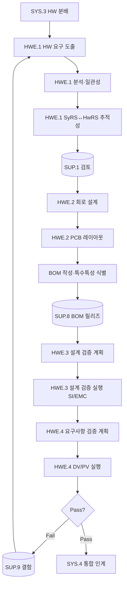

# 하드웨어공학 프로세스 (PRO-SPICE-01-03)

> 상위 정책: [[POL-SPICE-01_ASPICE역량거버넌스정책]]
> 적용요건: [[적용요건]] §1.6 (HWE.1~4)
> 입력: business_flow.yaml SCN-009~010 (SG-1-3 하드웨어 개발)

---

## 1. 목적

ECU/PCB/기구의 **HW 요구사항 분석(HWE.1) → HW 설계(HWE.2: 회로·레이아웃·BOM) → HW 설계 검증(HWE.3) → HW 요구사항 검증(HWE.4)** V-모델 좌·우 사이클을 통제된 흐름으로 수행하여, 양산 PCB 가 시스템 요구사항·HW 요구사항·설계와 일치함을 입증한다. ASPICE 4.0 의 HWE.3 (생산데이터 호환 HW vs 설계) / HWE.4 (HW vs 요구사항) 분리 구조를 그대로 반영한다.

## 2. 적용 범위

VWAY Motors 가 자체 설계하는 ECU PCB, 도메인 컨트롤러 보드, 센서/액추에이터 인터페이스 보드에 적용한다. 외주 HW(공급사 OEM 보드 통합) 는 [[PRO-SPICE-01-06_구매및공급망프로세스]] 적용 후 본 절차의 HWE.4 (요구사항 검증) 만 적용한다.

## 3. 역할과 책임 (RACI)

| 단계 | HW Engineer | EMC/Safety | QA (SUP.1) | CM (SUP.8) | HW Lead |
|---|---|---|---|---|---|
| HW 요구사항 분석 (HWE.1) | **R** | C | C | I | A |
| 회로/PCB 설계 (HWE.2) | **R** | C | C | I | A |
| BOM 작성·릴리즈 | **R** | I | I | **A(CM)** | C |
| HW 설계 검증 (HWE.3) | **R** | C | C | I | A |
| HW 요구사항 검증 (HWE.4) | **R** | C | **A(QA)** | I | C |

## 4. 절차 흐름



## 5. 단계별 상세

| # | 단계 | ASPICE BP | 설명 | 입력 | 출력 |
|---|---|---|---|---|---|
| 1 | HW 요구사항 도출 | HWE.1.BP1 | 시스템 요구·아키텍처에서 HW 요구사항 분해 | SyRS, System Arch | HW Requirements Spec |
| 2 | 일관성·시험가능성 분석 | HWE.1.BP3 | 환경·전기·기능 모순 점검 | HwRS draft | HwRS v1.0 |
| 3 | SyRS↔HwRS 추적성 | HWE.1.BP5 | 양방향 link | HwRS, SyRS | 추적성 매트릭스 |
| 4 | 회로 설계 | HWE.2.BP1 | Schematic, Component selection | HwRS | Schematic |
| 5 | PCB 레이아웃 | HWE.2.BP2 | Layout, SI/PI 시뮬 | Schematic | PCB Layout |
| 6 | BOM·생산데이터·특수특성 | HWE.2.BP2 | BOM, Gerber, AVL, 특수특성 표시 | Layout | BOM, Production Data |
| 7 | 설계 검증 계획·실행 | HWE.3.BP1/3/4 | 시뮬·SI/PI/EMC 검증 (PCB↔설계 일치) | Design Pkg | Design Verification Report |
| 8 | 요구사항 검증 계획·실행 | HWE.4.BP1/3/4 | DV(설계검증) + PV(양산검증), 환경·내구·EMC | HwRS, 시제 PCB | Requirement Verification Report |
| 9 | 결과 보고·이슈 이관 | HWE.4.BP4 | Pass/Fail + 결함 → SUP.9 | Verification Report | 보고 + Problem Tickets |

## 6. 연계 업무지침 (WI)

- [[WI-SPICE-01-03-01_HW요구사항분석]]
- [[WI-SPICE-01-03-02_회로및PCB설계]]
- [[WI-SPICE-01-03-03_BOM관리]]
- [[WI-SPICE-01-03-04_HW설계검증]]
- [[WI-SPICE-01-03-05_HW요구사항검증]]

## 7. 통제점 / KPI

| 통제점 | 지표 | 목표 | 주기 |
|---|---|---|---|
| HwRS↔SyRS 추적성 | 양방향 커버리지 | ≥ 95% | 마일스톤 |
| BOM 정확성 | BOM↔실 PCB 차이 | 0건 | 릴리즈 |
| EMC 1차 통과율 | HWE.3 첫 실행 Pass | ≥ 90% | 시제별 |
| DV/PV 통과율 | HWE.4 종합 Pass | 100% (PV 전 100%) | 마일스톤 |
| 특수특성 누락 | BOM 특수특성 표시 | 0건 누락 | 릴리즈 |

## 8. 표준 매핑 (Traceability)

| ASPICE 조항 | Req-ID | 반영 |
|---|---|---|
| HWE.1 Purpose / BP1 / BP5 | SPICE-HWE1-R-001/002/003 | §5 단계 1~3 |
| HWE.2 Purpose / BP2 | SPICE-HWE2-R-001/002 | §5 단계 4~6 |
| HWE.3 Purpose / BP4 | SPICE-HWE3-R-001/002 | §5 단계 7 |
| HWE.4 Purpose / BP4 | SPICE-HWE4-R-001/002 | §5 단계 8~9 |

## 9. 출처 (source_citation)

```yaml
- type: standard_original
  file: "inputs/01_표준원문/VWAY_Motors/requirements.yaml"
  locator: "VWAY-HWE.1-* ~ VWAY-HWE.4-*"
  retrieved_at: "2026-05-06"
  license: "ASPICE 4.0 © VDA QMC — paraphrase only"
  paraphrase_only: true
- type: standard_original
  file: "inputs/06_목표흐름/business_flow.yaml"
  locator: "SCN-009 ~ SCN-010"
  retrieved_at: "2026-05-06"
```

## 10. 개정 이력

| 버전 | 일자 | 변경내용 | 승인자 |
|---|---|---|---|
| 0.1 | 2026-05-06 | 최초 초안 — HWE.1~4 V-모델 HW 사이드 정의 | (대기) |
